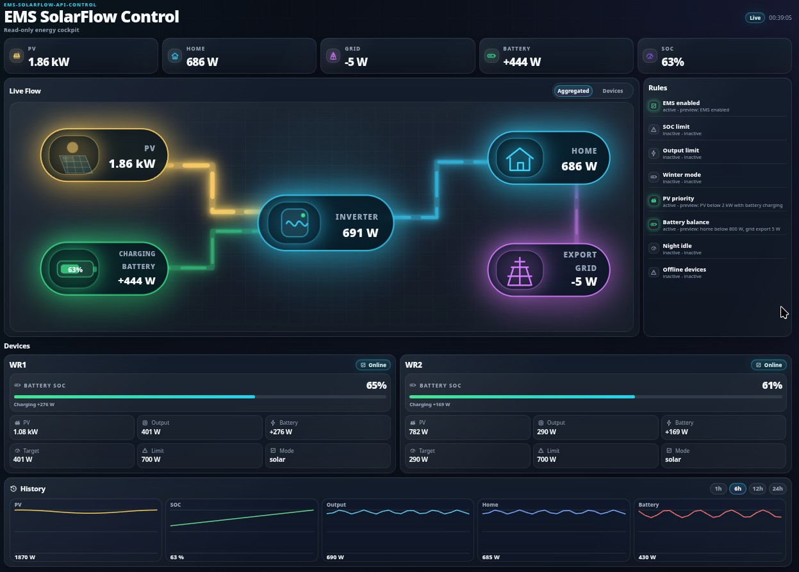
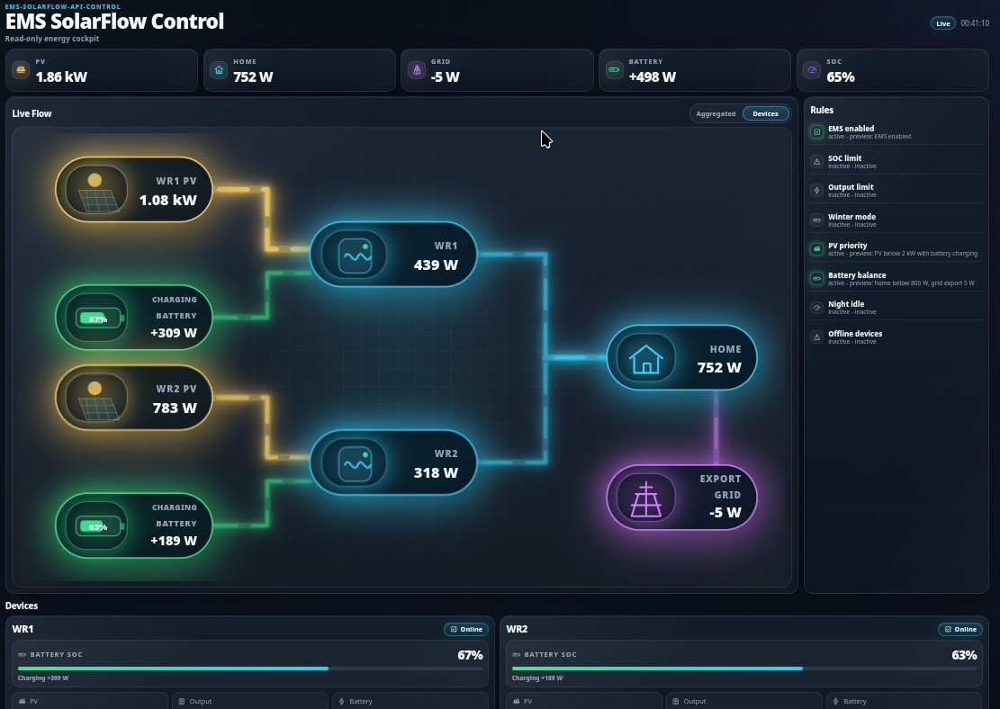
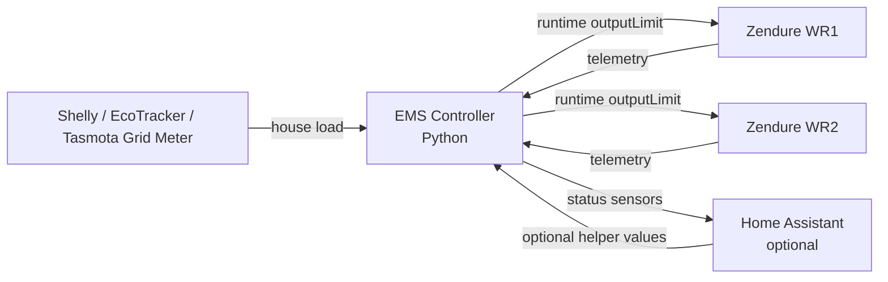

# ems-solarflow-api-control

[](https://github.com/basecubedev/ems-solarflow-api-control/actions/workflows/simulated-regression-tests.yml)


### Dashboard Preview

<table>
  <tr>
    <th>Aggregated Flow</th>
    <th>Device Flow</th>
    <th>Energy Statistics</th>
  </tr>
  <tr>
    <td width="33%"></td>
    <td width="33%"></td>
    <td width="33%"></td>
  </tr>
</table>

#### Control Center


Local-first EMS (Energy Management System) control for Zendure SolarFlow systems.

No YAML automation stack. No cloud dependency for control decisions. Just
Python, JSON configuration, local device telemetry, structured logs, and
transparent runtime control.

This project is designed for stable standalone EMS operation with a
deterministic, inspectable, firmware-aware controller for Zendure SolarFlow
devices.

> **Hardware feedback welcome**
>
> This project cannot be tested by the maintainer with every possible hardware
> and meter setup. Real-world feedback is very welcome.
>
> If you notice incorrect readings, unsupported payloads, or setup-specific
> issues, please open a GitHub issue with your device type, relevant config,
> logs, and, if possible, an anonymized example payload.

---

## Safety And Responsibility

This project is no longer considered experimental. It is intended for stable
EMS control use and has been tested in real-world operation.

It still interacts with real power hardware. Every installation is different:
battery size, PV layout, inverter limits, wiring, meter behavior, firmware
versions, network stability, and local requirements can affect the result.

The template defaults are intended as a practical starting point for standalone
operation after local configuration, not as a guarantee that the configuration
is suitable or safe for every setup.

Users are responsible for reviewing the configuration, validating their own
hardware setup, setting appropriate power and SOC limits, and monitoring the
system during operation. Use of this software is at the user's own
responsibility and risk, within the limits permitted by applicable law.

The template is standalone-first: Home Assistant is disabled, live Zendure
`outputLimit` control is enabled, and required state reconciliation is enabled
after you fill in real device and grid meter values.

For a no-write validation run, set `system.dry_run=true` or use `--dry-run`.
Simulation, replay, and preflight remain available for inspection before normal
operation.

The EMS should not run in parallel with another controller that writes Zendure
`outputLimit`. Monitor the first live run and every run after relevant
configuration changes.

Detailed safety model: [docs/safety.md](docs/safety.md).

---

## Why This Project?

Most SolarFlow control setups become hard to reason about at runtime.

This project favors:

```text
observable > magical
runtime truth > assumed state
simple > complex
```

Core goals:

- direct local Zendure API control
- Shelly, everHome EcoTracker, or Tasmota HTTP household load tracking
- standalone operation without Home Assistant
- optional Home Assistant monitoring and runtime controls
- PV-first allocation with battery top-up
- stable fast output control for short loop intervals
- runtime-state file for mutable operator state
- read-only standalone live dashboard with local SQLite history
- conservative SOC/mode reconciliation
- winter minSoc ramp as state reconciliation
- structured `event=...` logs for validation

---

## Architecture



Home Assistant is optional and is not required for control decisions.

Architecture details: [docs/architecture.md](docs/architecture.md).
Control details: [docs/control-logic.md](docs/control-logic.md).
Visual control-flow map: [docs/control-flow.md](docs/control-flow.md).

---

## Project Structure

The EMS keeps a simple user-facing model:

```text
one start script, one static config
```

You still start the EMS with:

```bash
python3 ems-solarflow-api-control.py
```

and configure the installation through:

```text
config.json
```

The `ems/` package contains internal implementation modules only. This keeps
the main script small and makes future changes easier to review, while
preserving the same operating model.

`data/runtime-state.json` is not a second static config. It is temporary local
runtime data created and updated by the EMS.

More: [docs/architecture.md](docs/architecture.md).

---

## Quick Start

Detailed first live-control setup: [docs/quickstart.md](docs/quickstart.md).

Install dependencies:

```bash
python3 -m venv .venv
source .venv/bin/activate
python -m pip install --upgrade pip
python -m pip install -r requirements.txt
```

Install Python, venv support, and pip first if needed. Debian / Ubuntu /
Raspberry Pi OS:

```bash
sudo apt update
sudo apt install python3 python3-venv python3-pip
```

openSUSE:

```bash
sudo zypper install python3 python3-pip python3-virtualenv
```

Create local config:

```bash
cp config.template.json config.json
```

Edit:

- Zendure device IPs
- Zendure serial numbers
- grid meter type and IP
- optional Shelly `channels` list when only selected clamps should be used
- Home Assistant URL, token, and enable flags if used
- power limits
- SOC limits
- optional safety flags such as `dry_run`

Run preflight:

```bash
python3 -B ems-solarflow-api-control.py --preflight
```

Optional read-only dry-run:

```bash
python3 -B ems-solarflow-api-control.py --dry-run --no-ha --once
```

Start EMS only after reviewing logs:

```bash
python3 -B ems-solarflow-api-control.py
```

Configuration details: [docs/configuration.md](docs/configuration.md).
Copy/paste examples: [docs/configuration-examples.md](docs/configuration-examples.md).

---

## Docker image tags

Docker images are published to GHCR from `main`, release tags, and a weekly
scheduled rebuild of `main`.

| Image tag | Meaning |
|---|---|
| `latest` | current `main` branch build. Rebuilt on every main push and once per week for base image and package security patch refreshes. |
| `v0.5.x` | fixed release image. Recommended for stable deployments. |

Use a fixed version tag for production-like setups if you want predictable
updates:

```yaml
image: ghcr.io/basecubedev/ems-solarflow-api-control:v0.5.6
```

Use `latest` only when you intentionally want the newest build from `main`:

```yaml
image: ghcr.io/basecubedev/ems-solarflow-api-control:latest
```

`latest` is not a fixed release and may include changes that are newer than the
last release notes. Pinned version tags are recommended for stable
installations.

## Docker Quickstart

The improved Docker first-run setup is available in `latest` and releases
after `v0.5.6`. Older image tags, including `v0.5.6` and earlier, keep the
previous manual setup behavior.

New Docker users can start from the official Compose file:

```bash
mkdir ems-solarflow-api-control
cd ems-solarflow-api-control
curl -fsSLo docker-compose.yml https://raw.githubusercontent.com/basecubedev/ems-solarflow-api-control/main/docker-compose.example.yml
docker compose up -d
```

On first start, the container creates `config/config.json` from the built-in
`config.template.json` if it does not exist yet. The file is never overwritten
after creation.

Edit the generated configuration for your installation and restart:

```bash
nano config/config.json
docker compose restart
```

Generated files:

```text
./config/config.json                 user configuration
./data/runtime-state.json            temporary runtime state
./data/ems_dashboard.sqlite          dashboard statistics database
./data/ems_dashboard.sqlite-wal      normal SQLite WAL file
./data/ems_dashboard.sqlite-shm      normal SQLite SHM file
```

Dashboard:

```text
http://localhost:8080
```

The recommended Compose file mounts `./config` to `/app/config` and `./data` to
`/app/data`. Runtime state and the dashboard SQLite database are created
automatically when those paths are writable and persist across container
updates. Do not store runtime state or database files inside the image.

The container does not overwrite existing config files and does not
recursively take ownership of the mounted `./config` and `./data` directories.
If Docker or your host creates files with unexpected ownership, adjust the
directory ownership on the host before starting the container:

```bash
mkdir -p config data
chown "$(id -u):$(id -g)" config data
```

The runtime state file is created automatically on startup if it does not
exist. Older setups may have used `runtime-state.json` in the project root. If
you switch to `data/runtime-state.json`, the old root-level file is no longer
required and may be removed manually. EMS will automatically create a new
runtime-state file if the configured file does not exist.

If `config/config.json` still matches the shipped template, the container logs
a warning:

```text
WARNING: config.json still matches the shipped template.
Please review ./config/config.json and configure your installation.
Startup continues, but device settings may be incomplete.
```

Startup continues after this warning. Existing config validation and runtime
errors still report missing IPs, serial numbers, or invalid device settings.
The EMS will likely not control devices until the required values are
configured.

Existing Docker installations remain supported. A legacy bind mount such as
`./config.json:/app/config/config.json:ro` can keep working, but the recommended
setup for `latest` and releases after `v0.5.6` is the directory-based
`./config:/app/config` mount.

Docker setup has been simplified for images after `v0.5.6`: with the
recommended `docker-compose.yml`, the container creates `./config/config.json`
from the built-in `config.template.json` on first start, stores runtime state
and dashboard database files in `./data`, and never overwrites existing config
files. Older tags, including `v0.5.6` and earlier, still use the previous
manual Docker setup.

Detailed Docker notes: [docs/docker.md](docs/docker.md).

Maintainers publish a new image by tagging a commit that is already on `main`:

```bash
git tag v0.5.6
git push origin v0.5.6
```

Pushes to `main` publish `:latest`; the weekly scheduled rebuild refreshes
`:latest` from the current `main` branch. Only `v*` tags publish version tags,
and the release workflow refuses tags whose commit is not contained in
`origin/main`.

---

## Configuration

Start with `config.template.json`.

Short comments inside the template explain the main sections. Detailed
explanations and copy/paste examples are in:

- [docs/configuration.md](docs/configuration.md)
- [docs/configuration-examples.md](docs/configuration-examples.md)

---

## Runtime State And CLI

Static installation data belongs in `config.json`.

Temporary runtime/operator state belongs in `data/runtime-state.json` for new
generated configs:

```text
enabled
max_total_power
loop_interval
min_output_limit
per-device enabled
per-device max_power
per-device offgrid_socket_mode
per-device pv_priority_factor
```

Safe runtime-state edits:

```bash
python3 emsctl.py status
python3 emsctl.py interactive
python3 emsctl.py examples
python3 emsctl.py system min-output-limit 30
python3 emsctl.py device WR1 pv-priority-factor 1.3
python3 emsctl.py device WR1 offgrid eco
python3 emsctl.py winter enable
python3 emsctl.py ha disable
```

More:

- [docs/runtime-state.md](docs/runtime-state.md)
- [docs/cli.md](docs/cli.md) includes shell completion setup for Bash and Zsh.

## Dashboard

When `dashboard.enabled=true`, the EMS starts a local dashboard server:

```text
http://<ems-host>:8080
```

The built-in standalone dashboard has Aggregated, Devices, Control, and Energy
views. The Energy view includes Today, Yesterday, rolling periods,
monthly/yearly totals, and Lifetime with since date.

It is read-only by default. Optional write mode for allowlisted runtime-state
values is available only after setting a local dashboard password with
`emsctl dashboard set-password`.

Write mode is intended for trusted networks only. The built-in dashboard adds
CSRF checks, browser security headers, request-size limits, SSE connection
limits, and config-aware runtime power limits, but public exposure should still
use a VPN or reverse proxy with strong TLS and external access control.

More: [docs/dashboard.md](docs/dashboard.md).

---

## Home Assistant

Home Assistant can be used for:

- monitoring
- optional runtime-state helper controls
- optional Home Assistant dashboard visualization

Home Assistant dashboard example:

```text
homeassistant-dashboard/dashboard.yaml
```

Home Assistant dashboard preview:

```text
homeassistant-dashboard/dashboard-preview.jpg
```

More: [docs/home-assistant.md](docs/home-assistant.md).

---

## Winter Mode

Winter mode raises `minSoc` gradually through state reconciliation.

It does not alter normal output target calculation.

It can also apply a conservative winter AC `inputLimit` during the winter
adjustment context only.

More: [docs/winter-mode.md](docs/winter-mode.md).

---

## Validation

Compile:

```bash
python3 -m py_compile ems-solarflow-api-control.py ems/*.py emsctl.py scripts/check_log_events.py
```

Self-test:

```bash
python3 -B ems-solarflow-api-control.py --self-test
```

Simulation:

```bash
python3 -B ems-solarflow-api-control.py --simulate --max-cycles 1
```

Replay:

```bash
python3 -B ems-solarflow-api-control.py --replay /path/to/trace.jsonl --once
```

Log event checks:

```bash
python3 scripts/check_log_events.py /tmp/ems-sim.log \
  --require startup \
  --require target_calculation
```

Troubleshooting: [docs/troubleshooting.md](docs/troubleshooting.md).
Safety checks: [docs/safety.md](docs/safety.md).

---

## Hardware Feedback And Issue Reports

This project supports several grid meter and device configurations, but not
every possible hardware setup can be tested directly by the maintainer.

Real-world feedback is therefore very helpful. If you are using this project
with your own hardware setup, please feel free to share your experience.

Please open a GitHub issue if you notice:

- incorrect readings
- unsupported meter payloads
- unexpected control behavior
- setup-specific problems
- documentation gaps

When reporting an issue, please include your device type, relevant
configuration, log output, and, if possible, an anonymized example of the meter
JSON payload.

User feedback helps make the project more robust for different real-world
installations.

---

## Documentation

| Topic | Document |
|---|---|
| Documentation index | [docs/README.md](docs/README.md) |
| Configuration | [docs/configuration.md](docs/configuration.md) |
| Configuration examples | [docs/configuration-examples.md](docs/configuration-examples.md) |
| Power control flow | [docs/control-flow.md](docs/control-flow.md) |
| Runtime state | [docs/runtime-state.md](docs/runtime-state.md) |
| CLI tool | [docs/cli.md](docs/cli.md) |
| Home Assistant | [docs/home-assistant.md](docs/home-assistant.md) |
| Architecture | [docs/architecture.md](docs/architecture.md) |
| Development | [docs/development.md](docs/development.md) |
| Control logic | [docs/control-logic.md](docs/control-logic.md) |
| Winter mode | [docs/winter-mode.md](docs/winter-mode.md) |
| Safety model | [docs/safety.md](docs/safety.md) |
| Troubleshooting | [docs/troubleshooting.md](docs/troubleshooting.md) |
| InfluxDB telemetry capture | [docs/develop-tool-influxdb-telemetry.md](docs/develop-tool-influxdb-telemetry.md) |
| InfluxDB state-transition analysis | [docs/develop-tool-influxdb-state-transition-analysis.md](docs/develop-tool-influxdb-state-transition-analysis.md) |
| Observed firmware behavior | [docs/observed-firmware-no-energy-path.md](docs/observed-firmware-no-energy-path.md) |

---

## Project Files

| Path | Purpose |
|---|---|
| `ems-solarflow-api-control.py` | Main EMS entry script |
| `ems/` | Internal EMS implementation modules |
| `emsctl.py` | Safe runtime-state CLI |
| `config.template.json` | Versioned config template |
| `config.json` | Local config, ignored by Git |
| `data/runtime-state.json` | Temporary runtime state, ignored by Git |
| `homeassistant-dashboard/dashboard.yaml` | Optional HA dashboard example |
| `homeassistant-dashboard/dashboard-preview.jpg` | HA dashboard preview image |
| `scripts/check_log_events.py` | Structured log validator |
| `docs/` | Public documentation |

---

## License

This project is licensed under the GNU Affero General Public License v3.0 or
later.

The AGPLv3 ensures that modified versions of this software, including versions
used to provide a network service, remain available to the community under the
same license terms.

Third-party dependencies remain under their respective upstream licenses.

See [LICENSE](LICENSE) and [THIRD_PARTY_LICENSES.md](THIRD_PARTY_LICENSES.md).
