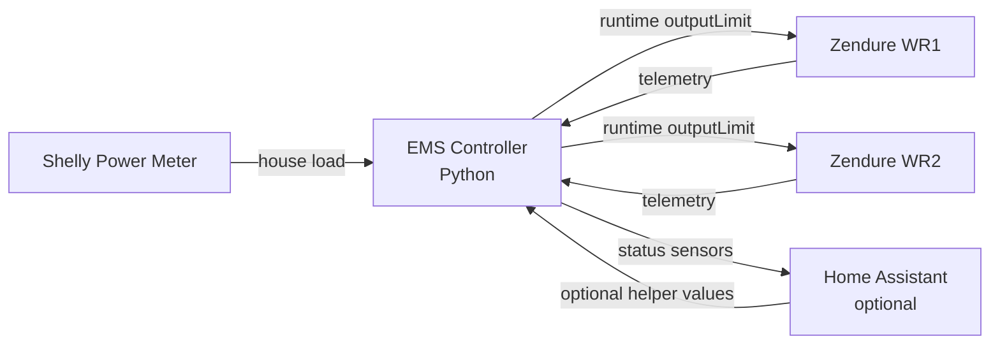

# ems-solarflow-api-control

Local-first EMS (Energy Management System) control for Zendure SolarFlow systems.

No YAML automation stack. No cloud dependency for control decisions. Just
Python, JSON configuration, local device telemetry, structured logs, and
transparent runtime control.

This project is designed for advanced users who want a deterministic,
inspectable, firmware-aware controller for Zendure SolarFlow devices.

---

## Status And Safety Warning

This software interacts with real power hardware.

It is:

- experimental
- under active development
- intended for testing and validation
- designed for advanced users
- not production-certified
- not guaranteed safe for unattended operation

Live hardware writes are disabled by default in the template.

Start with dry-run, simulation, replay, or preflight mode. Inspect the logs.
Only enable live writes after you understand the calculated targets and the
current firmware state of your devices.

The EMS should not run in parallel with another controller that writes Zendure
`outputLimit`.

Detailed safety model: [docs/safety.md](docs/safety.md).

---

## Why This Project?

Most SolarFlow control setups become hard to reason about at runtime.

This project favors:

```text
observable > magical
runtime truth > assumed state
simple > complex
```

Core goals:

- direct local Zendure API control
- Shelly-based household load tracking
- standalone operation without Home Assistant
- optional Home Assistant monitoring and runtime controls
- PV-first allocation with battery top-up
- stable fast output control for short loop intervals
- runtime-state file for mutable operator state
- conservative SOC/mode reconciliation
- winter minSoc ramp as state reconciliation
- structured `event=...` logs for validation

---

## Architecture



Home Assistant is optional and is not required for control decisions.

Control details: [docs/control-logic.md](docs/control-logic.md).

---

## Quick Start

Install dependencies:

```bash
pip install -r requirements.txt
```

Alternative on Debian / Ubuntu:

```bash
sudo apt install python3-requests
```

Create local config:

```bash
cp config.template.json config.json
```

Edit:

- Zendure device IPs
- Zendure serial numbers
- Shelly IP
- Home Assistant URL and token if used
- power limits
- SOC limits
- safety flags

Run preflight:

```bash
python3 -B ems-solarflow-api-control.py --preflight
```

Run read-only dry-run:

```bash
python3 -B ems-solarflow-api-control.py --dry-run --no-ha --once
```

Start EMS only after reviewing logs:

```bash
python3 -B ems-solarflow-api-control.py
```

Configuration details: [docs/configuration.md](docs/configuration.md).

---

## Runtime State And CLI

Static installation data belongs in `config.json`.

Mutable operator state belongs in `runtime-state.json`:

```text
enabled
max_total_power
loop_interval
min_output_limit
per-device enabled
per-device max_power
per-device offgrid_socket intent
```

Safe runtime-state edits:

```bash
python3 emsctl.py status
python3 emsctl.py system min-output-limit 30
python3 emsctl.py device WR1 offgrid on
```

More:

- [docs/runtime-state.md](docs/runtime-state.md)
- [docs/cli.md](docs/cli.md)

---

## Home Assistant

Home Assistant can be used for:

- monitoring
- optional runtime-state helper controls
- dashboard visualization

Dashboard example:

```text
homeassistant-dashboard/dashboard.yaml
```

More: [docs/home-assistant.md](docs/home-assistant.md).

---

## Winter Mode

Winter mode raises `minSoc` gradually through state reconciliation.

It does not alter normal output target calculation.

It can also apply a conservative winter AC `inputLimit` during the winter
adjustment context only.

More: [docs/winter-mode.md](docs/winter-mode.md).

---

## Validation

Compile:

```bash
python3 -m py_compile ems-solarflow-api-control.py emsctl.py
```

Self-test:

```bash
python3 -B ems-solarflow-api-control.py --self-test
```

Simulation:

```bash
python3 -B ems-solarflow-api-control.py --simulate --max-cycles 1
```

Replay:

```bash
python3 -B ems-solarflow-api-control.py --replay /path/to/trace.jsonl --once
```

Log event checks:

```bash
python3 scripts/check_log_events.py /tmp/ems-sim.log \
  --require startup \
  --require target_calculation
```

Troubleshooting: [docs/troubleshooting.md](docs/troubleshooting.md).

---

## Documentation

| Topic | Document |
|---|---|
| Configuration | [docs/configuration.md](docs/configuration.md) |
| Runtime state | [docs/runtime-state.md](docs/runtime-state.md) |
| CLI tool | [docs/cli.md](docs/cli.md) |
| Home Assistant | [docs/home-assistant.md](docs/home-assistant.md) |
| Control logic | [docs/control-logic.md](docs/control-logic.md) |
| Winter mode | [docs/winter-mode.md](docs/winter-mode.md) |
| Safety model | [docs/safety.md](docs/safety.md) |
| Troubleshooting | [docs/troubleshooting.md](docs/troubleshooting.md) |

---

## Project Files

| Path | Purpose |
|---|---|
| `ems-solarflow-api-control.py` | Main EMS controller |
| `emsctl.py` | Safe runtime-state CLI |
| `config.template.json` | Versioned config template |
| `config.json` | Local config, ignored by Git |
| `runtime-state.json` | Mutable runtime state, ignored by Git |
| `homeassistant-dashboard/dashboard.yaml` | HA dashboard example |
| `scripts/check_log_events.py` | Structured log validator |
| `docs/` | Public documentation |

---

## License

See [LICENSE](LICENSE).
