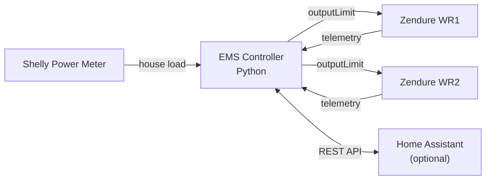
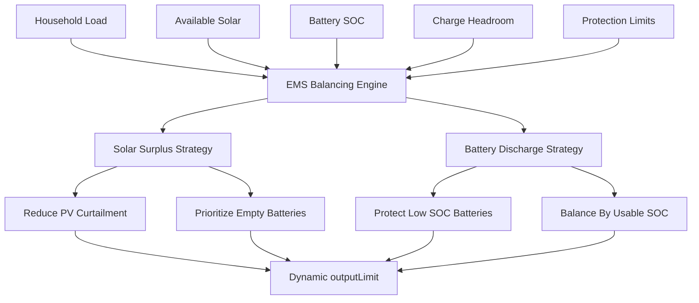
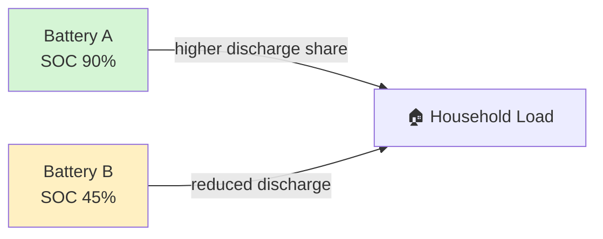
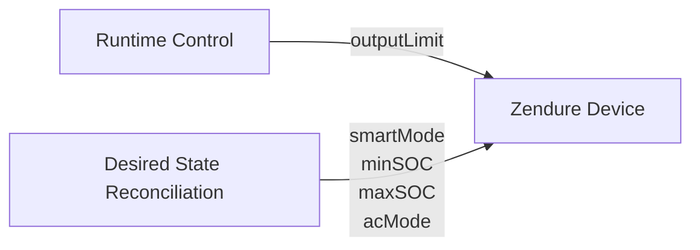
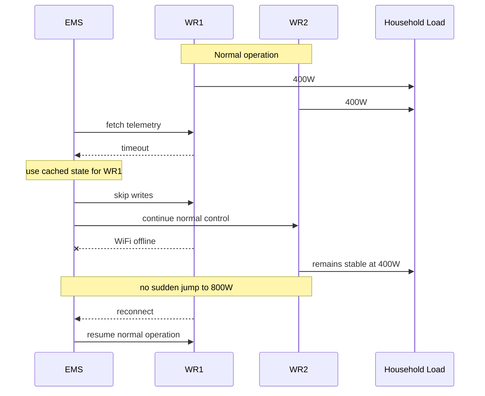

# ems-solarflow-api-control

Simple and lightweight EMS (Energy Management System) for Zendure Solarflow systems.

No YAML. No complex Home Assistant setups.
Just Python + local API control.

---

# 💡 Why this project?

Most Solarflow integrations are:

* complex
* YAML-heavy
* hard to debug
* tightly coupled to Home Assistant

This project is different:

* direct local API control
* easy to understand
* easy to modify
* runs standalone
* Home Assistant optional
* dynamic entities
* no hidden automation logic

---

# 🚀 What it does

The EMS:

* reads house consumption (Shelly)
* reads Solarflow telemetry via local API
* calculates optimal inverter output power
* dynamically distributes energy across multiple devices
* intelligently balances solar and battery usage
* continuously reconciles desired device configuration
* optionally integrates with Home Assistant



---

# ⚙️ Features

### ⚡ Core EMS Control

* ⚡ real-time control loop
* 🔌 multi-device support
* 🧠 intelligent SOC-aware multi-battery balancing
* ☀️ PV curtailment avoidance
* 🪫 low battery protection
* 🔄 mixed battery / non-battery system support

### 🛡️ Runtime Stability & Failsafe

* 🛡️ cached-state failsafe handling
* 📡 offline device detection
* 🚫 automatic write suppression for unreachable devices
* 🔄 automatic reconnect recovery

### 🧭 Device Management

* 🧭 desired-state device reconciliation
* 🧠 idempotent configuration management

### 🏠 Home Assistant Integration

* 🏠 optional Home Assistant integration
* ♻️ dynamic Home Assistant entities
* 🔄 automatic Home Assistant entity cleanup

### 🧩 Project Design

* 🧩 JSON-based configuration
* 🚫 no YAML required
* 🧰 standalone operation possible
* 🐍 pure Python

---

# 🔋 Intelligent Battery Balancing

The EMS dynamically balances power distribution across all connected devices.

Features:

* fuller batteries feed more directly into household load
* batteries with remaining capacity keep more solar energy for charging
* low SOC batteries are protected during discharge
* battery SOC levels naturally converge over time
* mixed systems with and without batteries are supported automatically

This improves:

* PV utilization
* battery lifetime
* charge/discharge symmetry
* multi-device efficiency
* overall energy balancing

---

# ⚖️ Energy Distribution Strategy

The EMS dynamically adjusts inverter output based on:

* household demand
* available solar power
* battery charge headroom
* usable battery SOC
* configured battery protection limits

The control logic operates differently depending on the current energy situation.



---

## ☀️ Solar Surplus

When solar generation exceeds household demand:

* devices with remaining battery charge capacity are prioritized
* fuller batteries feed more energy directly into household consumption
* batteries with more headroom retain more solar charging power
* PV curtailment is reduced

This helps maximize solar utilization while naturally balancing battery charge levels.

---

## 🔋 Battery Discharge

When household demand exceeds available solar power:

* batteries with more usable SOC contribute more output power
* low SOC batteries are automatically protected
* discharge load is distributed proportionally across available batteries
* battery wear is reduced through balanced utilization

The EMS uses usable SOC weighting:

```text
usable_soc = current_soc - configured_min_soc
```

This creates gradual low battery protection without hard switching behavior.

---

## ⚖️ Natural SOC Equalization

Because fuller batteries contribute more during discharge and emptier batteries retain more solar charging power:

* battery SOC levels naturally converge over time
* uneven battery drift is automatically reduced
* mixed battery systems remain balanced without explicit synchronization logic

No dedicated equalization cycle is required.



---

## 🔄 Mixed Device Support

The EMS automatically supports mixed systems:

* devices with batteries
* devices without batteries
* partially managed devices
* unmanaged SOC configurations

Devices without battery management naturally favor direct solar utilization.

---

# 🔄 Device State Reconciliation

The EMS manages operating modes separately from runtime power control.

Runtime control only updates:
- outputLimit

Desired device state reconciliation optionally manages:
- smartMode
- battery SOC limits
- inverter operating mode



Example:
```json
{
  "_comment": "smart_mode: 1 = runtime/RAM mode",

  "smart_mode": 1,

  "_comment2": "min/max soc = 0 = unmanaged / keep Zendure app settings or no battery",

  "min_soc": 15,
  "max_soc": 100
}
```

Behavior:

| Setting          | Meaning                |
| ---------------- | ---------------------- |
| `smart_mode = 1` | volatile runtime mode  |
| `smart_mode = 0` | persistent device mode |
| `min_soc = 0`    | unmanaged              |
| `max_soc = 0`    | unmanaged              |

---

# ⚡ Recommended External EMS Runtime Configuration

The EMS uses several Zendure runtime parameters to improve external inverter control behavior.

Recommended configuration:

| Property | Recommended Value | Purpose |
|---|---|---|
| smartMode | 1 | volatile runtime control / avoid flash writes |
| acMode | 2 | enable inverter output mode |
| gridOffMode | 2 | prioritize AC output behavior |

The EMS automatically reconciles these values during runtime.

---

## 🔍 Observed gridOffMode Behavior

The official Zendure documentation currently only describes:

| Value | Description |
|---|---|
| 0 | Standard Mode |
| 1 | Economic Mode |
| 2 | Closure (observed as direct AC priority behavior) |

During runtime testing on SolarFlow 800 Pro 2 devices, the following behavior was observed:

| Mode | Observed Behavior |
|---|---|
| 1 | stronger battery charging priority / softer AC regulation |
| 2 | improved AC output tracking / more direct external EMS behavior |

With `gridOffMode=2`:

* inverter output follows `outputLimit` more closely
* battery charging behavior becomes less dominant
* external EMS regulation becomes more predictable
* AC output ramps behave more consistently

This behavior was determined experimentally and may vary between firmware versions or device generations.

Possible runtime usage patterns:

| Mode | Potential Use Case |
|---|---|
| gridOffMode = 2 | responsive external EMS / direct AC output tracking |
| gridOffMode = 1 | conservative battery-preserving operation |

Observed during runtime testing:

`gridOffMode=1` appears to prioritize battery charging behavior more strongly and may help preserve battery reserve during low-production winter conditions.

This may be beneficial when:

- PV generation is frequently below household demand
- battery reserve should be preserved overnight
- aggressive AC output tracking is not desired
- minimizing deep discharge cycles is preferred

In contrast, `gridOffMode=2` appears to prioritize more direct AC output behavior and closer `outputLimit` tracking.

Behavior may vary depending on:

- firmware version
- device generation
- battery state
- PV availability
- runtime conditions

---

# ⚡ Runtime Control Behavior

The EMS control loop may run at high frequency (for example every 1 second).

However, the EMS minimizes unnecessary device communication through several mechanisms:

* per-device deadband filtering
* idempotent desired-state reconciliation
* runtime/persistent state separation
* conditional configuration synchronization

This means:

* inverter writes only occur when output changes are meaningful
* unchanged devices are skipped automatically
* desired device configuration is only updated when drift is detected

As a result, fast EMS response times can be achieved without excessive API traffic or continuous device reconfiguration.

---

# 🛡️ Runtime Failsafe Behavior

The EMS includes several runtime stability mechanisms to improve behavior during temporary network outages or unstable WiFi environments.

This is especially important for multi-device balancing systems where abrupt telemetry loss could otherwise cause large inverter output jumps.

---

## 🔄 Cached State Fallback

If a Zendure device becomes temporarily unreachable:

* the last known valid device state is reused
* energy balancing remains stable
* inverter output distribution does not abruptly jump to remaining devices
* write operations to unreachable devices are automatically suspended
* normal operation resumes automatically after reconnect

Example:

```text
WR1 = 400W
WR2 = 400W
```

If WR1 temporarily loses WiFi connectivity, the EMS will continue using the last valid telemetry snapshot instead of immediately assuming:

```text
WR1 = 0W
```

This prevents sudden jumps such as:

```text
WR2 = 800W
```

caused purely by temporary communication loss.



---

## 📡 Offline Device Handling

The EMS differentiates between:

| State | Behavior |
|---|---|
| Device reachable | normal telemetry + writes |
| Temporary communication loss | cached telemetry used |
| Device unreachable | writes suspended |
| Device reconnects | automatic recovery |

This helps:

* maintain stable load balancing
* avoid unnecessary API retries
* prevent excessive timeout accumulation
* keep the control loop responsive

---

## ⚠️ Runtime Communication Behavior

Temporary network instability may produce logs similar to:

```text
2026-05-08 14:37:22,570 | WARNING | WR1 fetch failed: HTTPConnectionPool(host='192.168.1.100', port=80)
2026-05-08 14:37:22,571 | WARNING | WR1: using cached state 13.8s old (output=312W solar=237W soc=78%)
2026-05-08 14:37:23,012 | WARNING | WR1: offline -> skip write
```

This behavior is expected and indicates that:

* the device became temporarily unreachable
* the EMS entered failsafe mode
* the last known telemetry snapshot is being used
* write operations are intentionally suspended

After reconnect, the device automatically resumes normal EMS participation.

---

## 🧠 Stability Philosophy

The EMS prioritizes stable energy balancing behavior over aggressive correction.

Failsafe mechanisms are designed to:

* avoid sudden inverter output jumps
* maintain stable multi-device distribution
* tolerate temporary WiFi instability
* minimize unnecessary API traffic
* recover automatically after reconnect

This helps achieve smoother real-world EMS behavior in unstable network environments.

---

# 🖥️ Dashboard

Ready-to-use Home Assistant dashboard included:

```text
homeassistant-dashboard/dashboard.yaml
```

<p align="center">
  
</p>

---

# 🔌 Zendure API Basics

Zendure Solarflow devices provide a local HTTP API.

## 📥 Read device data

```bash
curl http://DEVICE_IP/properties/report
```

Important fields:

| Field             | Meaning                     |
| ----------------- | --------------------------- |
| `electricLevel`   | battery SOC (%)             |
| `solarInputPower` | solar input power           |
| `outputHomePower` | AC output to home           |
| `outputPackPower` | power sent TO battery       |
| `packInputPower`  | power received FROM battery |

---

## 🔋 Battery Power Semantics

Zendure reports battery values from the controller/inverter perspective.

This means:

| API Field         | Battery Meaning     |
| ----------------- | ------------------- |
| `outputPackPower` | battery charging    |
| `packInputPower`  | battery discharging |

The EMS converts this into a battery-centric model:

| EMS Value              | Meaning     |
| ---------------------- | ----------- |
| positive battery power | charging    |
| negative battery power | discharging |

This applies to all `battery_power` sensors.

---

## 📤 Write output limit

```bash
curl -X POST http://DEVICE_IP/properties/write \
  -H "Content-Type: application/json" \
  -d '{
    "sn": "YOUR_SN",
    "properties": {
      "outputLimit": 300
    }
  }'
  ```
---

# ⚠️ Zendure Cloud / HEMS Requirements

The EMS uses direct local API control.

Zendure devices may remain connected to the Zendure cloud and mobile app.

However:

* devices must NOT be actively managed by Zendure HEMS
* no parallel cloud-side energy management should control the same devices
* local EMS control and cloud HEMS control may otherwise conflict

Recommended setup:

| Component | Allowed |
|---|---|
| Zendure cloud connection | ✅ |
| Zendure mobile app | ✅ |
| Local API access | ✅ |
| Zendure HEMS active control | ❌ |

The EMS assumes exclusive runtime control over inverter output regulation.

---

# ⚠️ Important behavior

* inverter output limits are temporary runtime values
* configured device operating modes and SOC limits may persist on the device
* the EMS continuously reconciles desired SOC configuration
* runtime power control behaves like temporary state
* your script must run continuously
* if the script stops unexpectedly, the last configured output limit remains active
* always use conservative power limits
* additional failsafe mechanisms are recommended

---

# 🔍 How to get your device serial number (SN)

The serial number (SN) is required to send write commands.

## Option 1: via API (recommended)

```bash
curl http://DEVICE_IP/properties/report
```

Look for:

```text
"sn": "EOD1XXXXXXXXXXXX"
```

## Option 2: device label

* printed on device
* visible in Zendure app

---

# 🔘 Standalone Enable / Disable

The EMS can run fully standalone without Home Assistant.

Enable/disable via:

```json
"system": {
  "enabled": true
}
```

---

# 🏠 Home Assistant Integration

Home Assistant support is fully optional.

The EMS can run:

* standalone
* without HA
* only via local Zendure APIs

Enable/disable HA:

```json
"ha": {
  "enabled": true
}
```

The EMS uses the Home Assistant REST API:

```text
GET  /api/states/<entity_id>
POST /api/states/<entity_id>
```

Used for:

* enable/disable control
* max power setting
* loop interval
* telemetry publishing
* dashboard integration

---

# ♻️ Dynamic Home Assistant Entities

Entities are created dynamically via the REST API.

Behavior:

* entities appear automatically while EMS is running
* removed sensors disappear automatically
* no YAML sensor definitions required
* no manual cleanup necessary
* entities are runtime-driven

This keeps the Home Assistant setup minimal and clean.

---

# 🏠 Home Assistant Helpers

Optional HA helper entities.

## 🔘 Enable / Disable EMS

```yaml
input_boolean:
  ems_solarflow_enable:
    name: EMS Solarflow Enable
    icon: mdi:solar-power-variant
```

---

## ⚡ Max Total Power

```yaml
input_number:
  ems_solarflow_max_power:
    name: EMS Max Power
    min: 0
    max: 800
    step: 10
    unit_of_measurement: W
    mode: slider
```

---

## ⏱️ Control Loop Interval

```yaml
input_number:
  ems_solarflow_interval:
    name: EMS Loop Interval
    min: 1
    max: 10
    step: 1
    unit_of_measurement: s
    mode: slider
```

---

# 📊 Global Sensors

Automatically created by the EMS.

| Entity                               | Meaning                      |
| ------------------------------------ | ---------------------------- |
| `sensor.ems_solarflow_load`          | current household load       |
| `sensor.ems_solarflow_target_total`  | calculated EMS output target |
| `sensor.ems_solarflow_solar_total`   | total solar generation       |
| `sensor.ems_solarflow_battery_power` | signed battery power         |
| `sensor.ems_solarflow_home`          | estimated home power         |
| `sensor.ems_solarflow_soc_avg`       | average battery SOC          |

---

# 🔋 Battery Power Convention

All `battery_power` sensors use signed values:

| Value    | Meaning     |
| -------- | ----------- |
| positive | charging    |
| negative | discharging |
| zero     | idle        |

Example:

```text
+250 W  -> charging
-180 W  -> discharging
```

---

# 🔌 Per Device Sensors

For each device:

Example:

```text
WR1
WR2
```

The EMS creates:

## Core Sensors

```text
sensor.ems_solarflow_wr1_soc
sensor.ems_solarflow_wr1_min_soc
sensor.ems_solarflow_wr1_max_soc
sensor.ems_solarflow_wr1_solar
sensor.ems_solarflow_wr1_output
sensor.ems_solarflow_wr1_target
sensor.ems_solarflow_wr1_output_limit
sensor.ems_solarflow_wr1_battery_power
```

---

## Battery / Electrical

```text
sensor.ems_solarflow_wr1_voltage
sensor.ems_solarflow_wr1_remaining_minutes
```

---

## Thermal / Signal

```text
sensor.ems_solarflow_wr1_temp
sensor.ems_solarflow_wr1_rssi
```

---

## Solar Panel Inputs

```text
sensor.ems_solarflow_wr1_panel1
sensor.ems_solarflow_wr1_panel2
sensor.ems_solarflow_wr1_panel3
sensor.ems_solarflow_wr1_panel4
```

---

## Binary Sensors

```text
binary_sensor.wr1_fault
binary_sensor.wr1_ac_active
binary_sensor.wr1_dc_active
binary_sensor.wr1_grid_online
```

---

# 📁 Project Structure

```text
ems-solarflow-api-control/
│
├── homeassistant-dashboard/
├── ems-solarflow-api-control.py
├── config.json
├── config.template.json
├── ems-solarflow.service.template
├── README.md
└── .gitignore
```

---

# 📄 File Overview

## `ems-solarflow-api-control.py`

Main EMS control loop:

* device polling
* power calculation
* intelligent SOC balancing
* PV-aware load distribution
* battery headroom management
* API communication
* Home Assistant integration

---

## `config.json`

User configuration:

* device IPs
* serial numbers
* Shelly IP
* Home Assistant token
* EMS settings
* min_soc
* max_soc
* soc_reconcile_interval

---

## `config.template.json`

Template configuration:

```bash
cp config.template.json config.json
```

---

## `ems-solarflow.service.template`

Systemd service template:

* auto start
* restart on crash
* background execution

---

# ⚙️ Installation

## 1. Clone repository

```bash
git clone https://github.com/basecubedev/ems-solarflow-api-control
cd ems-solarflow-api-control
```

---

## 2. Create config

```bash
cp config.template.json config.json
```

Edit:

* device IPs
* serial numbers
* Home Assistant token
* system limits

---

## 3. Start EMS

```bash
python3 ems-solarflow-api-control.py
```

---

# 🔧 systemd (recommended)

## Install service

```bash
sudo cp ems-solarflow.service.template \
  /etc/systemd/system/ems-solarflow.service
```

---

## Edit service

```bash
sudo nano /etc/systemd/system/ems-solarflow.service
```

---

## Enable + start

```bash
sudo systemctl daemon-reload
sudo systemctl enable ems-solarflow
sudo systemctl start ems-solarflow
```

---

## Logs

```bash
journalctl -u ems-solarflow -f
```

---

# 🧠 Control Logic

1. read house consumption (Shelly)
2. read Zendure solar + battery state
3. calculate required total power
4. prioritize direct solar usage
5. calculate battery charge/discharge headroom
6. prioritize direct solar utilization
7. reduce PV curtailment on full batteries
8. protect low SOC batteries during discharge
9. dynamically balance multi-battery power distribution
10. reconcile desired device state
11. update inverter output limits
12. publish telemetry to Home Assistant

---

# ⚡ Design Philosophy

```text
simple > complex
```

Principles:

* one script
* one config
* local control
* minimal dependencies
* no frameworks
* no hidden logic
* transparent behavior

---

# 📦 Dependencies

## pip

```bash
pip install -r requirements.txt
```

---

## Debian / Ubuntu

```bash
sudo apt install python3-requests
```

---

# 🐍 Requirements

* Python 3.10+
* Linux recommended
* tested on Debian / Ubuntu

---

# 🔄 Configuration Compatibility

The project is currently in active development and pre-release state.

Configuration structure and device management behavior may evolve between releases.

After updating:

* review release notes carefully
* compare your `config.json` with the latest `config.template.json`
* verify newly introduced configuration options
* validate device behavior after upgrades

Especially during early releases, configuration migration may require manual adjustments.

---

# 🚧 Experimental Software

This project is experimental software intended for:

* self-hosting
* development
* experimentation
* private energy systems

Do not use this project in safety-critical environments.

---

# ⚠️ Disclaimer

This project is an unofficial community project and is not affiliated with, endorsed by, or supported by Zendure.

Use this software at your own risk.

The software directly controls power output behavior of connected energy devices.

No guarantee is provided regarding:

* safety
* stability
* reliability
* regulatory compliance
* protection against incorrect device behavior

The author is not responsible for:

* hardware damage
* battery damage
* energy losses
* grid violations
* legal or regulatory issues
* data loss
* direct or indirect damages

Always verify local electrical and grid regulations before using this software.

This project is intended for technically experienced users only.

---

# 📜 License

Licensed under the Apache License 2.0.

See the `LICENSE` file for details.

---

# 🛠️ Roadmap

* serial / parallel inverter control for VDE AR-N 4105:2026 F 1.2
* watchdog / failsafe
* improved dashboard visualization
* historical telemetry -> publish to InfluxDB
