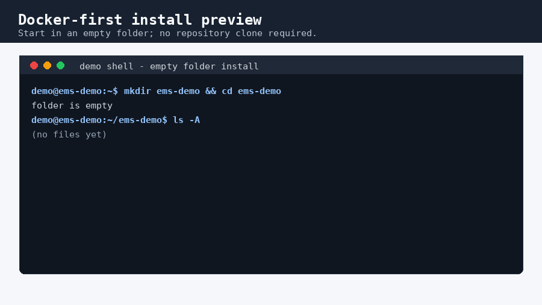
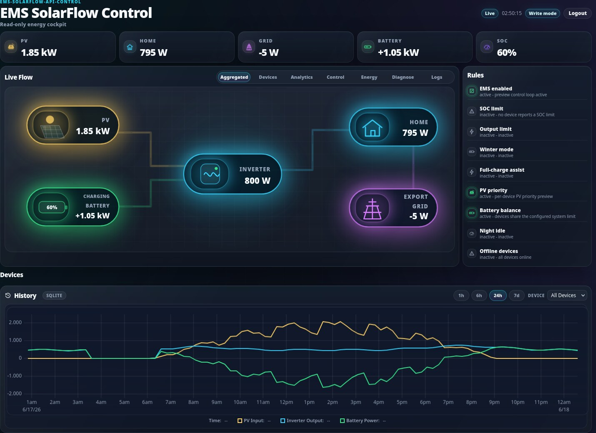
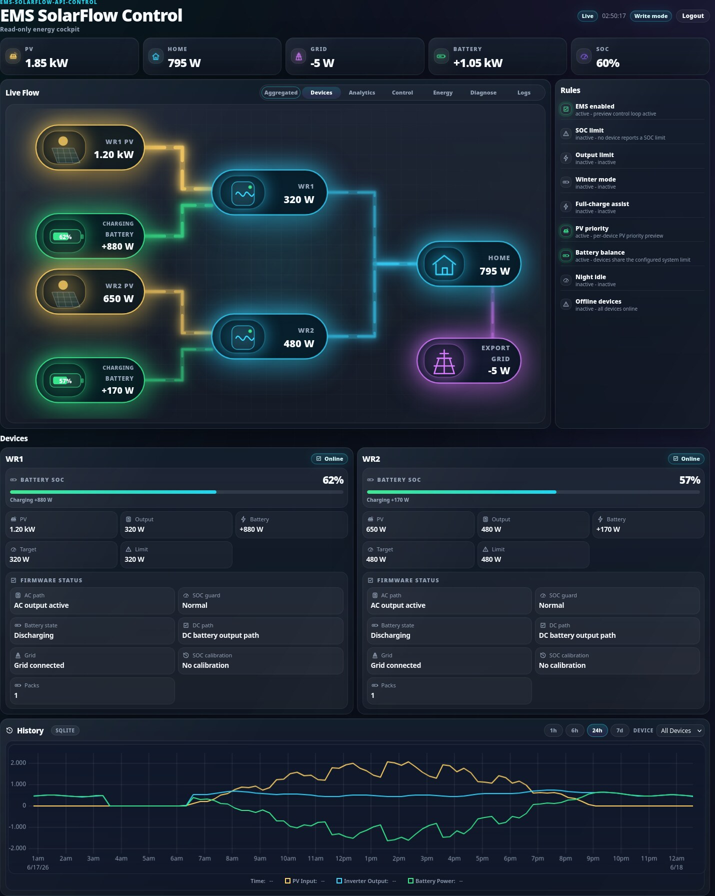
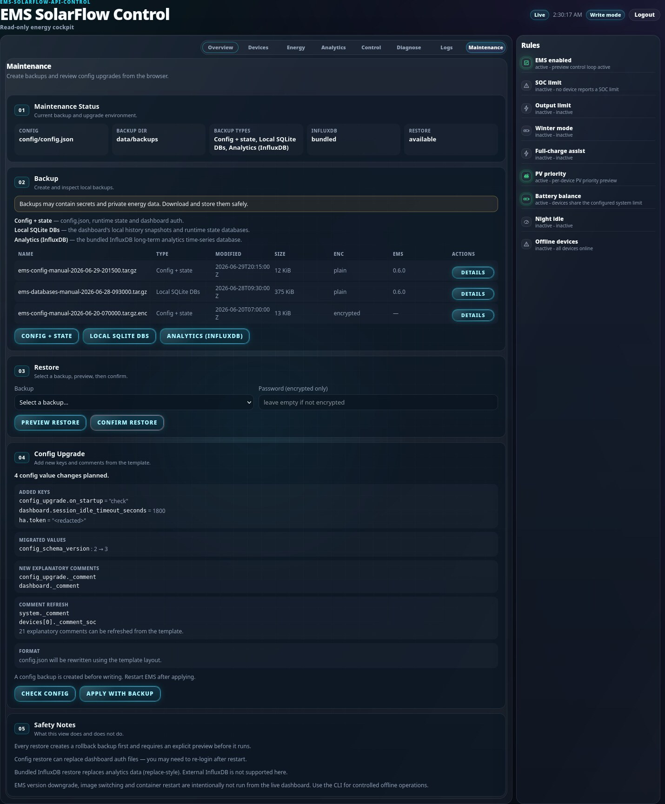

# ems-solarflow-api-control

[](https://github.com/basecubedev/ems-solarflow-api-control/actions/workflows/simulated-regression-tests.yml)


Local-first EMS (Energy Management System) control for Zendure SolarFlow
systems. It reads local meter and device telemetry, controls inverter output,
and provides a local dashboard without requiring Home Assistant.

> This software controls real power hardware.
> Start with Docker, replace all template placeholders, run diagnose, and
> monitor the first live run. Untouched template configs run in safe mode and
> cannot perform hardware writes.

## What This Does

- reads your grid meter
- reads Zendure devices locally
- controls inverter output
- helps reduce grid import and export
- works without Home Assistant
- includes dashboard, diagnostics, backups, and optional InfluxDB analytics

## Recommended Setup: Docker

Docker is the recommended setup for normal users. It keeps Python dependencies
inside the container and stores your important local files in clear folders:

```text
config/config.json   your setup
data/                runtime state, dashboard history, optional analytics data
data/backups/        backup archives
```

Native Python is still supported for developers and advanced/manual installs;
see [docs/native-python.md](docs/native-python.md).

## Quick Start With Docker

Docker is required for the Docker quickstart: Docker with Docker Compose
v2.24.0 or newer. Linux/macOS use `install-docker.sh`; Windows PowerShell uses
`install-docker.ps1`. Full details are in [docs/quickstart.md](docs/quickstart.md)
and [docs/docker.md](docs/docker.md).

Install Docker first if needed:

- [Docker install help](docs/install-docker.md)
- [Supported setups](docs/supported-setups.md)
- [Official Docker Engine docs](https://docs.docker.com/engine/install/)

The installer sets up everything in the current folder. No repository clone is
required. It writes `docker-compose.yml`, creates `config/` and `data/`, and
starts EMS. For EMS-only installs, `config/config.json` is created on first
container start; with Analytics the installer creates it during setup because
it runs `config init --analytics`.

**Linux/macOS — EMS only**

```bash
mkdir -p ems-solarflow-api-control && cd ems-solarflow-api-control
curl -fsSLo install-docker.sh https://raw.githubusercontent.com/basecubedev/ems-solarflow-api-control/main/install-docker.sh
sh install-docker.sh
```

**Linux/macOS — EMS + Analytics**

```bash
mkdir -p ems-solarflow-api-control && cd ems-solarflow-api-control
curl -fsSLo install-docker.sh https://raw.githubusercontent.com/basecubedev/ems-solarflow-api-control/main/install-docker.sh
sh install-docker.sh --analytics
```

**Windows PowerShell — EMS only**

```powershell
mkdir ems-solarflow-api-control
cd ems-solarflow-api-control
irm https://raw.githubusercontent.com/basecubedev/ems-solarflow-api-control/main/install-docker.ps1 -OutFile install-docker.ps1
powershell -ExecutionPolicy Bypass -File .\install-docker.ps1
```

**Windows PowerShell — EMS + Analytics**

```powershell
mkdir ems-solarflow-api-control
cd ems-solarflow-api-control
irm https://raw.githubusercontent.com/basecubedev/ems-solarflow-api-control/main/install-docker.ps1 -OutFile install-docker.ps1
powershell -ExecutionPolicy Bypass -File .\install-docker.ps1 -Analytics
```

The Windows installer needs Docker Desktop with Linux containers and working
`docker compose`. **Analytics** is the long-term charts/history feature; it is
backed by a bundled InfluxDB the installer manages for you.

The generated `docker-compose.yml` uses service name `ems`, publishes the
dashboard as `8080:8080`, mounts `./config:/app/config`, and mounts
`./data:/app/data`. Existing `config/config.json` files are not overwritten.

### Docker-first Install Preview

The short demo below shows the Docker-first Analytics setup from an empty
folder, through a guided `config init`, to the running dashboard.



Video: [MP4](docs/assets/install-demo.mp4) · [WebM](docs/assets/install-demo.webm)

For the manual step-by-step path and what the installer does internally, see
[docs/docker.md](docs/docker.md) and [docs/quickstart.md](docs/quickstart.md).

## Configure EMS

You need:

- grid meter type and endpoint settings
- Zendure device IP address and serial number for each device
- suitable power limits
- suitable SOC limits
- optional Home Assistant details only if you use Home Assistant

### Option A: Guided Setup Assistant

```bash
docker compose exec ems python3 emsctl.py config init
docker compose restart
docker compose exec ems python3 emsctl.py diagnose
```

`config init` is optional. It helps fill the config interactively and does not
blindly replace an existing edited config. Choose your grid meter in the guided
setup assistant. For Zendure SmartMeter D0, select "Zendure SmartMeter D0 via
MQTT".

### Option B: Manual Config Editing

```bash
nano config/config.json
docker compose restart
docker compose exec ems python3 emsctl.py diagnose
```

Template placeholder values such as example IPs or `YOUR_SN` force EMS into
safe mode: control is disabled, dry-run is enabled, and hardware writes are
blocked until the required values are replaced.

Detailed config help:

- [Configuration guide](docs/configuration.md)
- [Configuration examples](docs/configuration-examples.md)
- [Supported setups](docs/supported-setups.md)
- [First-run checklist](docs/first-run-checklist.md)

## First Checks

```bash
docker compose ps
docker compose logs -f
docker compose exec ems python3 emsctl.py diagnose
```

Use hardware checks only when you are ready to probe the configured local
devices and meter. These checks are read-only.

```bash
docker compose exec ems python3 emsctl.py diagnose --hardware
```

## Dashboard

Open:

```text
http://<host-ip>:8080
```

If you run the browser on the same machine:

```text
http://127.0.0.1:8080
```

More dashboard details: [docs/dashboard.md](docs/dashboard.md).

## Updating

Create password-protected backups, pull the current image, restart, check for
new config keys, apply the config upgrade with a normal backup, and run
diagnostics:

```bash
docker compose exec ems python3 emsctl.py backup create --type config --password
docker compose exec ems python3 emsctl.py backup create --type databases --password
docker compose pull
docker compose up -d
docker compose exec ems python3 emsctl.py config upgrade --dry-run
docker compose exec ems python3 emsctl.py config upgrade --yes --backup
docker compose exec ems python3 emsctl.py diagnose
```

If you intentionally keep local unencrypted backups, use:

```bash
docker compose exec ems python3 emsctl.py backup create --type config
docker compose exec ems python3 emsctl.py backup create --type databases
```

For stable deployments, pin a release tag in `docker-compose.yml` instead of
using `latest`, then update that tag intentionally.

Backup and restore details: [docs/backup-restore.md](docs/backup-restore.md).
Password-protected backups are recommended for config archives because they can
contain secrets. Without the password, encrypted backups cannot be restored.
Backups are stored in host path `data/backups/` by default. Bundled InfluxDB
backups are only needed when you use bundled InfluxDB analytics.
Daily command sheet: [docs/common-commands.md](docs/common-commands.md).

## Quality And Maintenance

EMS is tested and maintained with automated checks for the Python code, Docker
image, simulated power-control behavior, optional analytics paths, linting, and
runtime packaging. Dependency updates are checked regularly, and the Docker
image is rebuilt on release/main changes and on a weekly schedule.

See [docs/quality-and-maintenance.md](docs/quality-and-maintenance.md) for the
factual overview and limitations.

## Native Python Setup

Native Python remains supported. Use it when you want to develop locally,
debug without Docker, run under your own service manager, or manage a manual
installation.

Start here: [docs/native-python.md](docs/native-python.md).

## FAQ

Short beginner answers are in [docs/faq.md](docs/faq.md).

## Advanced Documentation

| Topic | Link |
| --- | --- |
| Beginner quickstart | [docs/quickstart.md](docs/quickstart.md) |
| Supported setups | [docs/supported-setups.md](docs/supported-setups.md) |
| First-run checklist | [docs/first-run-checklist.md](docs/first-run-checklist.md) |
| Common commands | [docs/common-commands.md](docs/common-commands.md) |
| Docker reference | [docs/docker.md](docs/docker.md) |
| Docker installation | [docs/install-docker.md](docs/install-docker.md) |
| Native Python | [docs/native-python.md](docs/native-python.md) |
| Configuration reference | [docs/configuration.md](docs/configuration.md) |
| Configuration examples | [docs/configuration-examples.md](docs/configuration-examples.md) |
| CLI and diagnostics | [docs/cli.md](docs/cli.md) |
| Dashboard | [docs/dashboard.md](docs/dashboard.md) |
| Control logic | [docs/control-logic.md](docs/control-logic.md) |
| Control flow | [docs/control-flow.md](docs/control-flow.md) |
| Architecture | [docs/architecture.md](docs/architecture.md) |
| Safety model | [docs/safety.md](docs/safety.md) |
| Quality and maintenance | [docs/quality-and-maintenance.md](docs/quality-and-maintenance.md) |
| Backup and restore | [docs/backup-restore.md](docs/backup-restore.md) |
| InfluxDB analytics | [docs/influxdb.md](docs/influxdb.md) |
| Home Assistant | [docs/home-assistant.md](docs/home-assistant.md) |
| Troubleshooting | [docs/troubleshooting.md](docs/troubleshooting.md) |
| Runtime state | [docs/runtime-state.md](docs/runtime-state.md) |
| Development | [docs/development.md](docs/development.md) |

## Optional Analytics

The dashboard works with local SQLite history by default. **Analytics**
(long-range charts and history) is backed by a bundled InfluxDB.

The simplest way to enable it is the Docker-first installer:

```bash
sh install-docker.sh --analytics
```

This starts EMS plus bundled InfluxDB through the `with-analytics` Compose
profile and generates local secrets in `config/influxdb.env`. To start
Analytics manually later:

```bash
docker compose --profile with-analytics up -d
```

See [docs/influxdb.md](docs/influxdb.md) for the Docker-first, manual, and
external InfluxDB setups.

## Safety And Responsibility

This project is intended for stable EMS control use, but every installation is
different. Battery size, PV layout, inverter limits, wiring, meter behavior,
firmware versions, network stability, and local requirements can affect the
result.

Users are responsible for reviewing configuration, validating hardware setup,
setting suitable power and SOC limits, and monitoring operation. Do not run
EMS in parallel with another controller that writes Zendure `outputLimit`.

For a no-write validation run, set `system.dry_run=true` or use the documented
dry-run commands in the native setup guide. Detailed safety model:
[docs/safety.md](docs/safety.md).

## Dashboard Preview

<table>
  <tr>
    <th>Aggregated Flow</th>
    <th>Device Flow</th>
    <th>Energy Statistics</th>
  </tr>
  <tr>
    <td width="33%"></td>
    <td width="33%"></td>
    <td width="33%"></td>
  </tr>
</table>

<table>
  <tr>
    <th>Analytics (InfluxDB)</th>
    <th>Diagnose</th>
    <th>Logs</th>
    <th>Maintenance</th>
  </tr>
  <tr>
    <td width="25%"></td>
    <td width="25%"></td>
    <td width="25%"></td>
    <td width="25%"></td>
  </tr>
</table>

#### Control Center


## Getting Help

Run diagnostics first:

```bash
docker compose exec ems python3 emsctl.py diagnose
docker compose exec ems python3 emsctl.py diagnose --support-bundle
```

Then see [docs/troubleshooting.md](docs/troubleshooting.md). Hardware feedback
is welcome through GitHub issues, especially for unsupported payloads,
incorrect readings, or setup-specific behavior.
