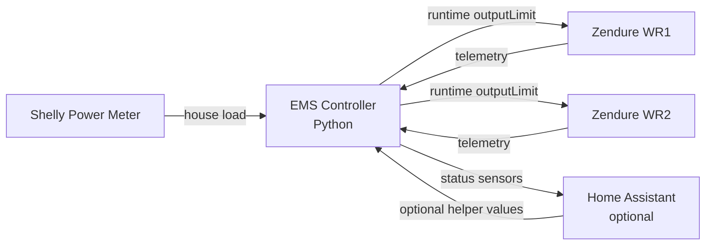
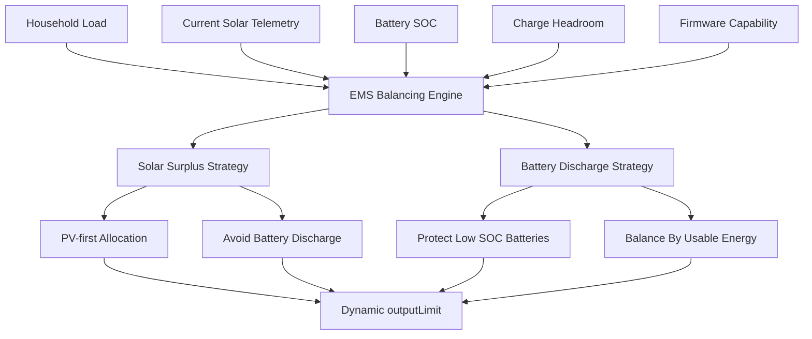
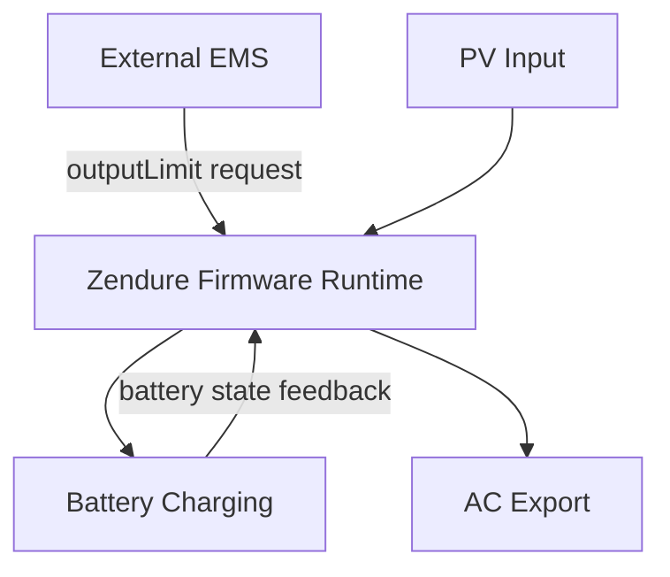
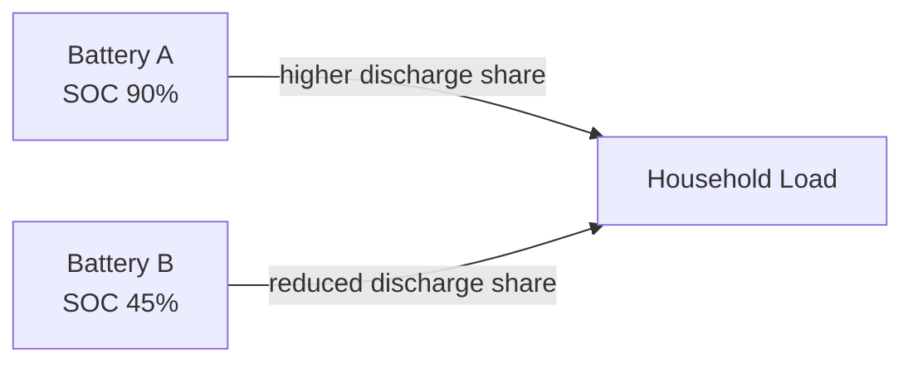
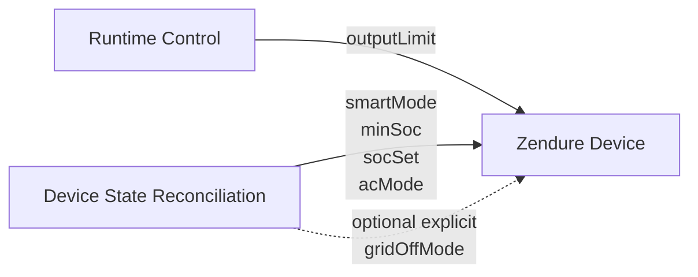
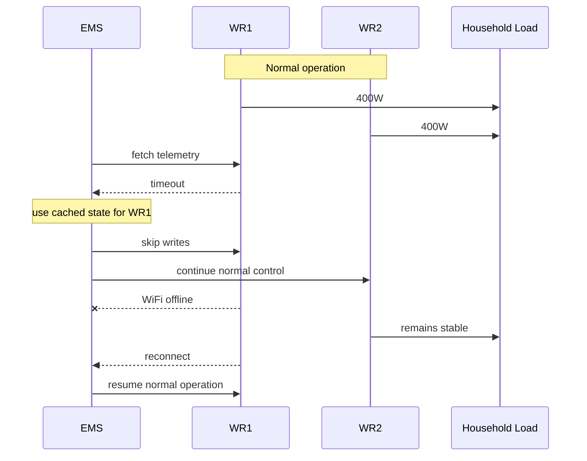

# ems-solarflow-api-control

Local-first EMS (Energy Management System) control for Zendure SolarFlow systems.

No YAML. No cloud dependency. No complex Home Assistant automation stack.  
Just Python, JSON configuration, local device telemetry, and transparent runtime control.

This project is designed for advanced users who want a deterministic, inspectable and firmware-aware controller for Zendure SolarFlow devices.

---

## ⚠️ Status And Safety Warning

This software interacts with real power hardware.

It is:

- experimental
- under active development
- intended for testing and validation
- designed for advanced users
- not production-certified
- not guaranteed safe for unattended operation

Live hardware writes are disabled by default.

Start with dry-run, simulation, replay, or preflight mode. Inspect the logs. Only enable live writes after you understand the calculated targets and the current firmware state of your devices.

Recommended safe defaults:

```json
{
  "dry_run": true,
  "allow_hardware_writes": false,
  "allow_state_reconciliation_writes": false,
  "max_total_power": 800
}
```

The EMS should not run in parallel with another controller that writes Zendure `outputLimit`.

---

## 💡 Why This Project?

Most SolarFlow integrations are:

- complex
- YAML-heavy
- hard to debug
- tightly coupled to Home Assistant
- difficult to reason about during runtime

This project is different:

- direct local API control
- simple Python control loop
- JSON-based configuration
- standalone operation possible
- Home Assistant optional
- structured runtime logging
- transparent balancing logic
- no hidden automation logic
- firmware-aware runtime behavior
- designed for debugging and validation

The goal is not magical automation.  
The goal is observable, deterministic and understandable energy control.

```text
observable > magical
runtime truth > assumed state
simple > complex
```

---

## 🚀 Feature Overview

### ⚡ EMS Control

- Local Zendure SolarFlow control through the device API
- Shelly-based household load tracking
- Multi-device inverter balancing
- Runtime `outputLimit` control
- PV-aware output allocation
- Battery-aware discharge balancing
- PV-first operation when enough solar is available
- Clamp and redistribution logic
- Deadband filtered writes

### 🧠 Firmware Awareness

- Runtime capability detection
- `socLimit`, `dcStatus`, `acStatus`, `packState` evaluation
- Separation of runtime truth and config truth
- Conservative firmware cooperation model
- Handles firmware protection states instead of fighting them

### 🛡️ Safety And Stability

- Dry-run mode
- Preflight validation
- Simulation mode
- Replay mode
- Bounded live tests with `--duration` and `--max-cycles`
- Cached-state fallback during temporary device outages
- Offline write suppression
- Central hardware write guard
- Separate state reconciliation write guard

### 🏠 Home Assistant

- Optional Home Assistant integration
- Dynamic REST-created entities
- HA can be used for monitoring only
- HA helper-based runtime control optional
- Dashboard support

### 🧪 Testing And Debugging

- Structured `event=...` logs
- Simulation without hardware
- Replay of runtime traces
- Preflight check before live operation
- Easy one-shot dry-run testing
- Python syntax validation with `py_compile`

---

## 🧭 Architecture Overview



The EMS operates locally.

Home Assistant is optional and is not required for control decisions.

---

## ⚡ Quick Start

### 1. Clone Repository

```bash
git clone https://github.com/basecubedev/ems-solarflow-api-control
cd ems-solarflow-api-control
```

### 2. Install Dependencies

```bash
pip install -r requirements.txt
```

Alternative on Debian / Ubuntu:

```bash
sudo apt install python3-requests
```

### 3. Create Config

```bash
cp config.template.json config.json
```

Edit:

- Zendure device IPs
- Zendure serial numbers
- Shelly IP
- Home Assistant URL and token if used
- power limits
- SOC limits
- safety flags

### 4. Run Safe Preflight

```bash
python3 -B ems-solarflow-api-control.py --preflight
```

### 5. Run Read-Only Dry-Run

```bash
python3 -B ems-solarflow-api-control.py --dry-run --no-ha --once
```

### 6. Start EMS

Only after reviewing the preflight and dry-run logs:

```bash
python3 -B ems-solarflow-api-control.py
```

---

## 🛡️ Safety First: Preflight Mode

`--preflight` is a read-only live system validation mode.

It checks:

- Shelly connectivity
- Zendure device connectivity
- Home Assistant connectivity if enabled
- device telemetry
- firmware runtime states
- `smartMode`
- `acMode`
- `gridOffMode`
- `socLimit`
- `dcStatus`
- `acStatus`
- `packState`
- derived export capability

It does not run active control dispatch.

It does not write:

- `outputLimit`
- `minSoc`
- `socSet`
- `smartMode`
- `gridOffMode`
- `acMode`

Example:

```bash
python3 -B ems-solarflow-api-control.py --preflight
```

Typical successful events:

```text
event=preflight_start
event=preflight_shelly_ok
event=preflight_ha_ok
event=preflight_device_ok
event=preflight_ok
```

Possible abort events:

```text
event=preflight_abort reason=hardware_writes_enabled
event=preflight_abort reason=ha_unreachable
event=preflight_abort reason=smart_mode_not_1
```

Preflight is intended for:

- first installation
- live-test readiness
- debugging after firmware updates
- verifying network reachability
- checking safe runtime prerequisites

---

## 🧪 Runtime Modes

### Dry-Run Mode

Dry-run calculates targets but blocks hardware writes.

```bash
python3 -B ems-solarflow-api-control.py --dry-run --no-ha --once
```

Expected write event:

```text
event=dry_run_output_limit
```

No Zendure `/properties/write` call should happen.

---

### Simulation Mode

Simulation mode runs deterministic built-in test frames and does not contact real hardware or Home Assistant.

```bash
python3 -B ems-solarflow-api-control.py --simulate
```

---

### Replay Mode

Replay mode processes JSONL runtime traces through the same target calculation path.

```bash
python3 -B ems-solarflow-api-control.py --replay trace.jsonl
```

This is useful for:

- regression testing
- runtime analysis
- firmware behavior investigation
- validating balancing changes before live tests

---

### Bounded Live Test

Use an explicit temporary config and limit runtime.

```bash
python3 -B ems-solarflow-api-control.py \
  --config /tmp/ems-live-test-config.json \
  --duration 60
```

Recommended live-test system flags:

```json
{
  "dry_run": false,
  "simulation_mode": false,
  "allow_hardware_writes": true,
  "allow_state_reconciliation_writes": false,
  "soc_reconcile_interval": 0
}
```

This allows runtime `outputLimit` writes but prevents SOC and mode reconciliation writes.

---

## ⚙️ Configuration Reference

The EMS uses a single JSON config file.

```bash
cp config.template.json config.json
```

---

### `system`

| Option | Description | Example |
|---|---|---|
| `enabled` | Enables or disables EMS control | `true` |
| `dry_run` | Calculates targets but blocks hardware writes | `true` |
| `simulation_mode` | Runs without real hardware | `false` |
| `allow_hardware_writes` | Allows Zendure `/properties/write` calls | `false` |
| `allow_state_reconciliation_writes` | Allows SOC and mode reconciliation writes | `false` |
| `log_level` | Logging verbosity | `"debug"` |
| `max_total_power` | Maximum combined EMS output | `800` |
| `max_device_power` | Default per-device max power | `800` |
| `deadband` | Minimum target delta before writing | `10` |
| `min_output_limit` | Minimum `outputLimit` while EMS control is enabled | `30` |
| `loop_interval` | Control loop interval in seconds | `5` |
| `redistribute_clamped_power` | Redistribute clamped target power | `true` |
| `pv_kwp_weighting` | Use configured PV size for weighting | `true` |
| `battery_kwh_weighting` | Use configured battery size for weighting | `true` |
| `soc_reconcile_interval` | Interval in EMS cycles for SOC/mode checks | `10` |

Safe development example:

```json
{
  "system": {
    "enabled": true,
    "dry_run": true,
    "simulation_mode": false,
    "allow_hardware_writes": false,
    "allow_state_reconciliation_writes": false,
    "log_level": "debug",
    "max_total_power": 800,
    "max_device_power": 800,
    "deadband": 10,
    "min_output_limit": 30,
    "loop_interval": 5
  }
}
```

`min_output_limit=30` is the default guard against writing `outputLimit=0`
during enabled EMS control. This helps keep Zendure inverters out of a
stop/idle-like state where PV or MPPT telemetry may not become visible again
reliably. Set it to `0` only when you intentionally want the previous behavior.
The guard applies only when EMS control is enabled and the device is online,
before deadband handling.

Live runtime control example:

```json
{
  "system": {
    "dry_run": false,
    "allow_hardware_writes": true,
    "allow_state_reconciliation_writes": false
  }
}
```

State reconciliation example:

```json
{
  "system": {
    "allow_state_reconciliation_writes": true,
    "soc_reconcile_interval": 10
  }
}
```

Use this only when you intentionally want the EMS to keep device modes and SOC settings aligned with config.

---

### `devices`

Example:

```json
{
  "name": "WR1",
  "ip": "192.168.100.77",
  "sn": "YOUR_SN",
  "smart_mode": 1,
  "max_power": 800,
  "pv_kwp": 1.0,
  "pv_priority_factor": 1.0,
  "battery_kwh": 1.92,
  "min_soc": 15,
  "max_soc": 100
}
```

| Option | Description |
|---|---|
| `name` | Device name used in logs and HA entities |
| `ip` | Local Zendure device IP |
| `sn` | Zendure device serial number |
| `smart_mode` | Recommended `1` for runtime/RAM mode |
| `grid_off_mode` | Optional manual reconciliation for off-grid socket state; omit to leave Zendure App control untouched |
| `max_power` | Per-device maximum output target |
| `pv_kwp` | Installed PV size connected to this device |
| `pv_priority_factor` | Manual PV-side tuning factor |
| `battery_kwh` | Battery size used for weighting |
| `min_soc` | Desired minimum SOC |
| `max_soc` | Desired maximum SOC |

`pv_priority_factor=1.0` is neutral.

Values above `1.0` increase PV-side priority.  
Values below `1.0` reduce PV-side priority.

---

### `ha`

Home Assistant is optional.

```json
{
  "ha": {
    "enabled": true,
    "control_enabled": false,
    "url": "http://homeassistant.local:8123",
    "token": "YOUR_TOKEN"
  }
}
```

| Option | Description |
|---|---|
| `enabled` | Enables HA status publishing |
| `control_enabled` | Allows HA helper values to steer EMS |
| `url` | Home Assistant base URL |
| `token` | Long-lived access token |

Use:

```json
"control_enabled": false
```

when you want HA monitoring but no HA helper control.

---

### `shelly`

```json
{
  "shelly": {
    "ip": "192.168.100.93"
  }
}
```

The Shelly meter is used as household load feedback source.

---

## 📋 Logging And Debugging

### Loglevels

Supported values:

| Level | Description |
|---|---|
| `debug` | Full runtime analysis |
| `info` | Normal operation and writes |
| `warning` | Temporary issues or fallback behavior |
| `error` | Critical errors |
| `critical` | Severe failures |

Example:

```json
{
  "system": {
    "log_level": "debug"
  }
}
```

Recommended:

| Use Case | Loglevel |
|---|---|
| Development | `debug` |
| Live tuning | `debug` |
| Normal operation | `info` |
| Minimal logs | `warning` |

---

### Important Runtime Events

| Event | Meaning |
|---|---|
| `startup` | Shows active safety flags and runtime mode |
| `preflight_start` | Preflight validation started |
| `preflight_device_ok` | Device passed live-read validation |
| `capability_detection` | Runtime capability detection result |
| `pv_first_limit` | PV-first output limit per device |
| `balance_weight` | Weighting details for target allocation |
| `target_calculation` | Final target calculation |
| `dry_run_output_limit` | Target calculated but not written |
| `write_output_limit` | Target written to device |
| `deadband_skip_write` | Write skipped because target delta was too small |
| `offline_skip_write` | Write skipped because device is offline |
| `dry_run_soc_limits` | SOC write blocked by safety flags |
| `dry_run_device_modes` | Mode write blocked by safety flags |
| `write_device_modes` | Device mode reconciliation write |
| `write_soc_limits` | SOC reconciliation write |

Example:

```text
event=target_calculation current_total=555 final_targets=[96,302] load=-157.0 requested_total=398.0
```

---

## 🔋 Intelligent Battery Balancing

The EMS dynamically balances power distribution across connected devices.

It considers:

- current household load
- current solar production
- runtime firmware capability
- battery SOC
- configured minimum SOC
- runtime maximum SOC
- charge headroom
- usable battery energy
- per-device power limits
- configured PV and battery sizes

The goal is stable and fair energy distribution.

---

## ⚖️ Energy Distribution Strategy

The EMS has two main target calculation branches.




---

## ⚙️ EMS Control Pipeline

The EMS operates as an external supervisory control loop on top of the Zendure firmware runtime.

Unlike traditional inverter controllers, the EMS does not directly control internal energy flow paths.

Instead, the EMS continuously:

1. reads live telemetry
2. detects current runtime capabilities
3. estimates exportable behavior
4. calculates desired AC output targets
5. applies balancing and protection logic
6. requests inverter output changes via `outputLimit`

The internal Zendure firmware still decides how energy is routed between:

- PV generation
- battery charging
- battery discharge
- AC export

This means the EMS behaves as a firmware-aware external regulator rather than a direct power controller.

### Runtime Control Stages

```text
1. Read household load
2. Read Zendure telemetry
3. Detect runtime capabilities
4. Estimate exportable energy
5. Calculate requested total output
6. Select operating strategy:
   - solar surplus mode
   - battery discharge mode
7. Apply weighted balancing
8. Apply PV-first limiting
9. Clamp per-device limits
10. Redistribute remaining headroom
11. Apply configured minimum output limit
12. Apply deadband filtering
13. Write outputLimit
```

### Runtime Capability Detection

The EMS continuously derives runtime behavior from live telemetry.

| Capability | Derived From |
|---|---|
| `can_charge` | `socLimit` |
| `can_discharge` | `socLimit` + DC/battery/output evidence |
| `can_export` | live PV/output/output-limit/AC evidence, otherwise AC/DC path state |
| `can_ac_charge` | `acStatus` |

This is important because configured device state does not always match actual runtime behavior.

`faultLevel` is logged as `fault_observed`, but current live testing showed it is not a reliable fatal export blocker on all firmware states. The EMS therefore treats real PV/output telemetry as stronger runtime evidence than `faultLevel` alone.

The EMS therefore prioritizes:

```text
runtime truth > config truth
```

This helps avoid invalid assumptions during:

- full battery conditions
- inverter standby states
- firmware-imposed limits
- AC/DC path changes
- temporary runtime transitions

---

## 🔬 Runtime Semantics

Zendure devices internally manage several energy routing decisions inside firmware.

As a result:

```text
available PV power
≠
exportable AC power
```

The EMS therefore cannot assume that current solar generation automatically translates into available inverter output capacity.

### Full Battery Behavior

When batteries approach full charge:

- firmware may reduce PV harvesting
- PV input may become internally curtailed
- available AC-follow behavior may change
- inverter response to `outputLimit` may soften

Observed behavior:

```text
battery full
→ firmware prioritizes battery protection
→ PV input becomes limited
→ available export capability decreases
```

This means:

```text
solarInputPower
```

does not always represent physically available PV panel power.

Instead, it represents:

```text
firmware-accepted PV power
```

after internal battery and protection logic.

### `outputLimit` Semantics

The EMS writes:

```text
outputLimit
```

as a requested AC export target.

However:

- the Zendure firmware still controls internal routing
- battery protection logic may override behavior
- charge/discharge priorities may affect tracking
- firmware modes influence output responsiveness

Therefore, `outputLimit` should be interpreted as desired export behavior rather than guaranteed direct inverter output.

---

## ⚠️ Firmware-Controlled Energy Paths

The EMS operates on top of firmware-controlled internal energy paths.



The firmware dynamically decides:

- battery charging priority
- AC export behavior
- PV curtailment
- discharge permission
- passthrough behavior
- runtime protection handling

This behavior may vary depending on:

- firmware version
- battery SOC
- PV availability
- runtime operating mode
- `gridOffMode`
- thermal conditions
- battery protection state

### External EMS Philosophy

The EMS intentionally avoids fighting the internal firmware logic aggressively.

Instead, the project follows a cooperative supervisory control approach.

Goals:

- stable runtime behavior
- predictable balancing
- reduced oscillation
- firmware-compatible control
- minimal unnecessary writes
- graceful degradation during runtime limitations

This results in more stable real-world operation compared to aggressive direct-control strategies.


### ☀️ Solar Surplus / PV-First Mode

When current solar telemetry is sufficient to cover the requested AC output, the EMS prioritizes direct PV usage and avoids battery discharge.

Simplified rule:

```text
if total_solar >= requested_output:
    use PV first
    do not allocate more AC output than PV-only contribution
```

Per-device PV-only contribution:

```text
pv_only = solarInputPower - packInputPower
```

Where:

| Field | Meaning |
|---|---|
| `solarInputPower` | Current PV power reported by device |
| `packInputPower` | Battery discharge power |

This avoids inefficient behavior such as:

```text
Device A charges battery
Device B discharges battery
```

while enough PV exists globally.

---

### 🔋 Battery Discharge Mode

When household demand exceeds available solar power, the EMS uses battery discharge.

Discharge is weighted by usable battery energy:

```text
usable_battery = battery_kwh * (soc - min_soc)
```

This means:

- batteries with more usable energy contribute more
- batteries closer to minimum SOC contribute less
- discharge is gradual, not hard-switched
- larger batteries can contribute proportionally more

---

### ⚖️ Natural SOC Equalization

Over time, the EMS tends to balance battery SOC because:

- batteries with more usable energy discharge more
- batteries with less headroom are less preferred for charging
- low SOC batteries are protected naturally



---

### 🔄 Mixed Device Support

The EMS can handle mixed systems:

- devices with batteries
- devices without batteries
- partially managed devices
- unmanaged SOC configurations

Devices without battery management naturally favor direct solar utilization.

---


## 🧩 Runtime Truth vs Config Truth

Configured values are not always equal to runtime behavior.

| Type | Meaning |
|---|---|
| Config truth | What the EMS or user requested |
| Runtime truth | What the firmware currently allows |

Example:

```text
Configured outputLimit = 300 W
Runtime outputHomePower = 0 W
socLimit = 2
dcStatus = 0
```

Meaning:

The firmware blocked discharge due to SOC protection.

The EMS therefore follows a cooperation model:

1. calculate desired targets
2. write runtime values if allowed
3. observe actual firmware behavior
4. adapt next cycle

---

## 🌤️ Zendure Firmware Runtime Behavior

### PV Curtailment At Full Battery

Current `solarInputPower` is not always the physically available PV power.

When a battery is full or charge-limited, the Zendure firmware may internally reduce PV harvesting.

This means:

```text
solarInputPower != physically available PV
```

Example:

```text
Battery reaches 100%
Firmware enters charge inhibit
PV is curtailed
solarInputPower drops
EMS sees lower current PV
```

This is important for understanding target allocation.

The EMS currently uses runtime telemetry as source of truth.  
Future versions may add estimated available PV based on historical peaks, curtailment detection and runtime state.

---

### Passthrough Behavior

Zendure devices expose a `pass` state, but passthrough behavior is firmware-controlled.

Important implications:

- passthrough may not be fully controlled by `outputLimit`
- power flow may be affected by firmware state
- behavior can depend on SOC, PV, grid mode and device generation
- runtime observation is required

The EMS logs runtime state so passthrough-related behavior can be investigated.

---

### MPPT And Response Lag

Zendure output and PV telemetry may react with delay.

After changing `outputLimit`:

- PV may ramp slowly
- battery charge/discharge state may lag
- output may take seconds to stabilize
- firmware hysteresis may delay state transitions

When `outputLimit=0`, some inverters may enter an idle or standby-like state
where PV telemetry remains hidden even when sun is available.
`min_output_limit=30` avoids that blind state during enabled EMS control
without weather models, time-based probing or per-cycle mode writes.

This is expected behavior.

---

## 🔄 Device State Reconciliation

Runtime power control is separate from device-state reconciliation.

Runtime control writes:

```text
outputLimit
```

Device-state reconciliation may write:

```text
smartMode
minSoc
socSet
acMode
gridOffMode only when grid_off_mode is explicitly configured
```



This separation is important.

Runtime output may change frequently.  
SOC and mode settings should change rarely and only when explicitly allowed.

---

### Recommended External EMS Runtime Settings

| Property | Recommended Value | Purpose |
|---|---:|---|
| `smartMode` | `1` | Runtime/RAM mode, avoids flash writes |
| `acMode` | `2` | Normal / discharge output mode |

`smartMode=1` means runtime parameters are not written to flash.

`gridOffMode` reflects the off-grid socket state. The EMS leaves it unmanaged by default so manual changes in the Zendure App are not overwritten. Only set per-device `grid_off_mode` if you intentionally want reconciliation to control that socket state later.

---

### State Reconciliation Safety Flag

```json
{
  "allow_state_reconciliation_writes": false
}
```

When false:

- `outputLimit` writes may still be allowed
- SOC writes are blocked
- mode writes are blocked

When true:

- EMS may restore configured `smartMode`
- EMS may restore configured `acMode`
- EMS may restore configured `gridOffMode` only if `grid_off_mode` is explicitly configured for the device
- EMS may restore configured SOC limits

Use with care.

---

## 🔍 Observed `gridOffMode` Behavior

Official documentation describes:

| Value | Description |
|---|---|
| `0` | Standard Mode |
| `1` | Economic Mode |
| `2` | Closure |

Observed behavior on SolarFlow 800 Pro 2:

| Mode | Observed Behavior |
|---|---|
| `1` | Stronger battery charging priority / softer AC regulation |
| `2` | Improved AC output tracking / more direct external EMS behavior |

With `gridOffMode=2`:

- inverter output follows `outputLimit` more closely
- battery charging behavior becomes less dominant
- external EMS regulation becomes more predictable
- AC output ramps behave more consistently

This behavior is based on runtime observation and may vary by firmware version or device generation.

---

## 🛡️ Runtime Failsafe Behavior

The EMS includes runtime stability mechanisms for temporary network outages.

### Cached State Fallback

If a Zendure device becomes temporarily unreachable:

- the last known valid state is reused
- balancing remains stable
- output distribution does not abruptly jump
- writes to unreachable devices are suspended
- normal operation resumes after reconnect

Example:

```text
WR1 = 400 W
WR2 = 400 W
```

If WR1 temporarily loses connectivity, the EMS does not immediately assume:

```text
WR1 = 0 W
```

This avoids sudden jumps such as:

```text
WR2 = 800 W
```



---

### Offline Device Handling

| State | Behavior |
|---|---|
| Device reachable | Normal telemetry and writes |
| Temporary communication loss | Cached telemetry used |
| Device unreachable | Writes suspended |
| Device reconnects | Automatic recovery |

---

## 🏠 Home Assistant Integration

Home Assistant support is optional.

The EMS can run:

- standalone
- without Home Assistant
- only via local Shelly and Zendure APIs

Enable HA:

```json
{
  "ha": {
    "enabled": true
  }
}
```

The EMS uses the Home Assistant REST API:

```text
GET  /api/states/<entity_id>
POST /api/states/<entity_id>
```

Used for:

- telemetry publishing
- dashboard integration
- optional enable/disable control
- optional max power control
- optional interval control

---

### Monitoring-Only HA Mode

```json
{
  "ha": {
    "enabled": true,
    "control_enabled": false
  }
}
```

This publishes sensors but does not read HA helper values for control.

---

### Dynamic Home Assistant Entities

Entities are created dynamically via REST API.

Behavior:

- entities appear automatically while EMS is running
- no YAML sensor definitions required
- no manual sensor cleanup needed
- sensors are runtime-driven

---

### Optional HA Helpers

#### Enable / Disable EMS

```yaml
input_boolean:
  ems_solarflow_enable:
    name: EMS Solarflow Enable
    icon: mdi:solar-power-variant
```

#### Max Total Power

```yaml
input_number:
  ems_solarflow_max_power:
    name: EMS Max Power
    min: 0
    max: 800
    step: 10
    unit_of_measurement: W
    mode: slider
```

#### Control Loop Interval

```yaml
input_number:
  ems_solarflow_interval:
    name: EMS Loop Interval
    min: 1
    max: 10
    step: 1
    unit_of_measurement: s
    mode: slider
```

---

### Global Sensors

| Entity | Meaning |
|---|---|
| `sensor.ems_solarflow_load` | Current household load |
| `sensor.ems_solarflow_target_total` | Calculated EMS output target |
| `sensor.ems_solarflow_solar_total` | Total current solar telemetry |
| `sensor.ems_solarflow_battery_power` | Signed total battery power |
| `sensor.ems_solarflow_home` | Estimated home power |
| `sensor.ems_solarflow_soc_avg` | Average battery SOC |

---

### Per-Device Sensors

For each device such as `WR1`, the EMS creates:

```text
sensor.ems_solarflow_wr1_soc
sensor.ems_solarflow_wr1_min_soc
sensor.ems_solarflow_wr1_max_soc
sensor.ems_solarflow_wr1_solar
sensor.ems_solarflow_wr1_output
sensor.ems_solarflow_wr1_target
sensor.ems_solarflow_wr1_output_limit
sensor.ems_solarflow_wr1_battery_power
sensor.ems_solarflow_wr1_fault_level
sensor.ems_solarflow_wr1_voltage
sensor.ems_solarflow_wr1_remaining_minutes
sensor.ems_solarflow_wr1_temp
sensor.ems_solarflow_wr1_rssi
sensor.ems_solarflow_wr1_panel1
sensor.ems_solarflow_wr1_panel2
sensor.ems_solarflow_wr1_panel3
sensor.ems_solarflow_wr1_panel4
```

Binary sensors:

```text
binary_sensor.wr1_fault
binary_sensor.wr1_ac_active
binary_sensor.wr1_dc_active
binary_sensor.wr1_grid_online
```

`faultLevel` is observed firmware telemetry. It is published as a numeric
sensor because current live testing showed it is not a guaranteed fatal error
state on all firmware/runtime conditions.

---

### Battery Power Convention

All EMS battery power sensors use signed values:

| Value | Meaning |
|---:|---|
| Positive | Charging |
| Negative | Discharging |
| Zero | Idle |

Example:

```text
+250 W -> charging
-180 W -> discharging
```

Zendure API fields are interpreted as:

| API Field | Meaning |
|---|---|
| `outputPackPower` | Battery charging power |
| `packInputPower` | Battery discharge power |

---

## 🖥️ Dashboard

A Home Assistant dashboard can be included in:

```text
homeassistant-dashboard/dashboard.yaml
```

Optional preview:

```md

```

---

## 🔌 Zendure API Basics

### Read Device Data

```bash
curl http://DEVICE_IP/properties/report
```

Important fields:

| Field | Meaning |
|---|---|
| `electricLevel` | Battery SOC |
| `solarInputPower` | Current PV input power |
| `outputHomePower` | AC output to home |
| `outputPackPower` | Battery charging power |
| `packInputPower` | Battery discharge power |
| `socLimit` | Firmware SOC limit state |
| `dcStatus` | DC runtime state |
| `acStatus` | AC runtime state |
| `packState` | Battery pack runtime state |
| `outputLimit` | Runtime inverter output target |
| `smartMode` | Runtime/flash write behavior |

---

### Write Output Limit

```bash
curl -X POST http://DEVICE_IP/properties/write \
  -H "Content-Type: application/json" \
  -d '{
    "sn": "YOUR_SN",
    "properties": {
      "outputLimit": 300
    }
  }'
```

---

### Get Device Serial Number

```bash
curl http://DEVICE_IP/properties/report
```

Look for:

```text
"sn": "EOD1XXXXXXXXXXXX"
```

The SN is also printed on the device and visible in the Zendure app.

---

## ⚠️ Zendure Cloud / HEMS Requirements

The EMS uses direct local API control.

Zendure devices may remain connected to Zendure cloud and the mobile app.

However:

- devices must not be actively controlled by Zendure HEMS at the same time
- no parallel cloud-side energy management should control the same devices
- no second local EMS should write `outputLimit`

Recommended setup:

| Component | Allowed |
|---|---|
| Zendure cloud connection | yes |
| Zendure mobile app | yes |
| Local API access | yes |
| Zendure HEMS active control | no |
| Parallel local EMS output control | no |

The EMS assumes exclusive runtime control over inverter output regulation.

---

## 🛠️ Installation As systemd Service

### Install Service

```bash
sudo cp ems-solarflow.service.template \
  /etc/systemd/system/ems-solarflow.service
```

### Edit Service

```bash
sudo nano /etc/systemd/system/ems-solarflow.service
```

### Enable And Start

```bash
sudo systemctl daemon-reload
sudo systemctl enable ems-solarflow
sudo systemctl start ems-solarflow
```

### Logs

```bash
journalctl -u ems-solarflow -f
```

or:

```bash
sudo journalctl -u ems-solarflow.service -n 100 --no-pager
```

---

## 🧰 Development And Testing

### Syntax Check

```bash
python3 -m py_compile ems-solarflow-api-control.py
```

### One-Shot Dry Run

```bash
python3 -B ems-solarflow-api-control.py --dry-run --no-ha --once
```

### Simulation

```bash
python3 -B ems-solarflow-api-control.py --simulate
```

### Replay

```bash
python3 -B ems-solarflow-api-control.py --replay trace.jsonl
```

### Bounded Test

```bash
python3 -B ems-solarflow-api-control.py --duration 60
```

### Bounded Cycle Count

```bash
python3 -B ems-solarflow-api-control.py --max-cycles 12
```

---

## 📁 Project Structure

```text
ems-solarflow-api-control/
│
├── ems-solarflow-api-control.py
├── config.json
├── config.template.json
├── ems-solarflow.service.template
├── requirements.txt
├── README.md
├── LICENSE
├── docs/
└── homeassistant-dashboard/
```

---

## 📄 File Overview

### `ems-solarflow-api-control.py`

Main EMS controller:

- device polling
- Shelly load reading
- runtime capability detection
- target calculation
- PV-first logic
- battery balancing
- output limit dispatch
- Home Assistant integration

### `config.json`

User configuration:

- device IPs
- serial numbers
- Shelly IP
- Home Assistant settings
- EMS safety flags
- power limits
- weighting options

### `config.template.json`

Template configuration.

```bash
cp config.template.json config.json
```

### `ems-solarflow.service.template`

Systemd service template.

### `docs/`

Development notes, runtime observations and firmware state research.

---

## 🧯 Troubleshooting

### No Power Changes

Check logs for:

```text
event=dry_run_output_limit
```

If present, writes are blocked.

Check:

```json
{
  "dry_run": false,
  "allow_hardware_writes": true
}
```

---

### EMS Calculates Targets But Device Keeps Old `outputLimit`

Possible causes:

- `dry_run=true`
- `allow_hardware_writes=false`
- another EMS is overwriting values
- deadband skipped write
- device offline
- firmware ignored command temporarily

Look for:

```text
event=write_output_limit
event=deadband_skip_write
event=offline_skip_write
```

---

### Device Ignores Output Limit

Possible causes:

- firmware protection state
- `socLimit=2`
- `dcStatus=0`
- passthrough behavior
- AC/DC path inactive
- device recovering from standby

Check:

```text
event=capability_detection
```

---

### PV Lower Than Expected

Possible causes:

- battery full
- charge inhibit active
- firmware PV curtailment
- MPPT ramp delay
- shading
- panel orientation

Important:

```text
solarInputPower is current harvested PV, not guaranteed available PV.
```

---

### Device Offline

Expected logs:

```text
fetch failed
using cached state
event=offline_skip_write
```

The EMS will use the last valid telemetry state and avoid writes to the offline device.

---

### Home Assistant Entities Missing

Check:

- HA URL
- long-lived access token
- `ha.enabled`
- network reachability
- service logs

---

### Unexpected SOC Or Mode Changes

Check:

```json
{
  "allow_state_reconciliation_writes": true
}
```

When enabled, the EMS may restore configured SOC and mode values.

---

## 🔄 Configuration Compatibility

The project is under active development.

Configuration structure and runtime behavior may evolve.

After updating:

- compare your `config.json` with `config.template.json`
- review changed safety flags
- validate with `--preflight`
- run `--dry-run --no-ha --once`
- inspect logs before enabling live writes

---

## 🧠 Design Philosophy

```text
simple > complex
local > cloud
observable > magical
runtime truth > config assumption
stability > aggressiveness
```

Principles:

- one script
- one config
- local control
- minimal dependencies
- no frameworks
- no hidden automation logic
- deterministic behavior
- firmware cooperation
- structured logs
- reproducible tests

The EMS should cooperate with Zendure firmware behavior, not pretend to replace the firmware protection logic.

---

## 🚧 Known Limitations

Known limitations and open areas:

- `solarInputPower` may be lower than physically available PV during firmware curtailment
- full batteries may internally reduce PV harvesting
- passthrough behavior is firmware-controlled
- output changes may take seconds to stabilize
- MPPT behavior is not instantaneous
- firmware hysteresis around SOC limits still needs more validation
- runtime trace recording is still evolving
- ramp/damping may need further tuning
- external control should not run in parallel with another writer
- unattended long-term operation needs careful validation

---

## 🛣️ Roadmap

Possible future improvements:

- better available PV estimation
- passthrough-aware regulation
- improved runtime trace recording
- adaptive ramp limiting
- firmware state replay tests
- watchdog / failsafe enhancements
- historical telemetry export
- InfluxDB publishing
- improved dashboard visualization
- VDE AR-N 4105:2026 F 1.2 related inverter control research

---

## 🚧 Experimental Software

This project is experimental software intended for:

- self-hosting
- development
- testing
- experimentation
- private energy systems

Do not use this project in safety-critical environments.

---

## ⚠️ Disclaimer

This project is an unofficial community project and is not affiliated with, endorsed by, or supported by Zendure.

Use this software at your own risk.

The software directly controls power output behavior of connected energy devices.

No guarantee is provided regarding:

- safety
- stability
- reliability
- regulatory compliance
- correct device behavior
- protection against firmware changes

The author is not responsible for:

- hardware damage
- battery damage
- energy losses
- grid violations
- legal or regulatory issues
- data loss
- direct or indirect damages

Always verify local electrical and grid regulations before using this software.

This project is intended for technically experienced users only.

---

## 📜 License

Licensed under the Apache License 2.0.

See the `LICENSE` file for details.
