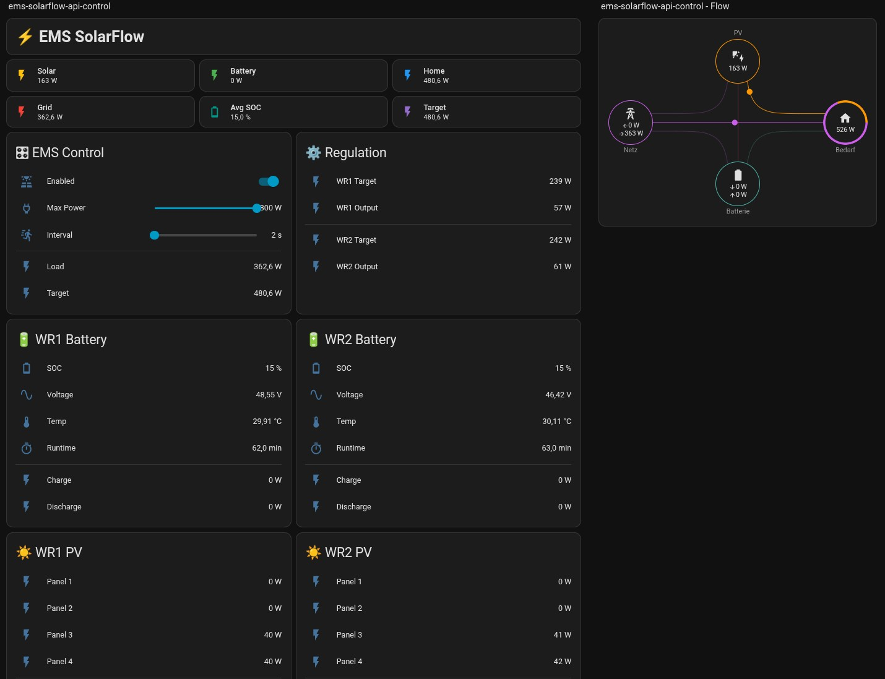

# ems-solarflow-api-control

Simple and lightweight EMS (Energy Management System) for Zendure Solarflow systems.

No YAML. No complex Home Assistant setups.
Just Python + direct API control.


## 💡 Why this project?

Most Solarflow integrations are:

* complex
* YAML-heavy
* hard to debug

This project is different:

* direct API control
* easy to understand
* easy to modify
* runs standalone


## 🚀 What it does

* reads house consumption (Shelly)
* reads Solarflow data (local API)
* calculates optimal output power
* distributes load across multiple devices
* optionally integrates with Home Assistant


## ⚙️ Features

* ⚡ real-time control loop
* 🔌 multi-device support
* 🧠 SOC-based load distribution
* 🏠 Home Assistant integration (optional)
* 🧩 JSON-based configuration
* 🚫 no YAML required


## 🖥️ Dashboard

Ready-to-use Home Assistant dashboard included:

```text
homeassistent-dashboard/dashboard.yaml
```

<p align="center">
  
</p>


---


## 🔌 Zendure API Basics

Zendure Solarflow devices provide a local HTTP API.

### 📥 Read device data

```bash
curl http://DEVICE_IP/properties/report
```

Important fields:

* `electricLevel` → battery SOC (%)
* `solarInputPower` → solar input (W)
* `outputHomePower` → current output (W)
* `packInputPower` → battery charging power (W)
* `outputPackPower` → battery discharge power (W)

---

### 📤 Write output limit

```bash
curl -X POST http://DEVICE_IP/properties/write \
  -H "Content-Type: application/json" \
  -d '{
    "sn": "YOUR_SN",
    "properties": {
      "acMode": 2,
      "outputLimit": 300,
      "smartMode": 0
    }
  }'
```

### ⚠️ Important behavior

* values are **not persistent**
* control works like RAM (temporary state)
* your script must run continuously
* if the script stops → last value remains active

---

## 🔍 How to get your device serial number (SN)

The serial number (SN) is required to send write commands to your Zendure device.

### Option 1: via API (recommended)

```bash
curl http://DEVICE_IP/properties/report
```

Look for:

```
"sn": "EOD1XXXXXXXXXXXX"
```

### Option 2: device label

* printed on the device
* visible in the Zendure app

### ⚠️ Important

* required for write commands
* without SN → no output control possible

---

## 🏠 Home Assistant Integration (optional)

Uses the REST API.

Home Assistant is fully optional.

The EMS can run:

- standalone
- without HA
- only via local Zendure APIs

Enable/disable HA via:

```json
"ha": {
  "enabled": false
}
```

### Read state

```
GET /api/states/<entity_id>
```

### Write state

```
POST /api/states/<entity_id>
```

Used for:

* enable/disable control
* max power setting
* loop interval
* telemetry (solar, battery, load)


---

## 🔘 Enable / Disable EMS (standalone)

config.json
```json
"system": {
  "enabled": true
}
```


---

## 🏠 Home Assistant Helpers

The EMS can be controlled via local configuration or Home Assistant helpers.

## 🔘 Enable / Disable HA

```json
"ha": {
  "enabled": true
}
```

Create the following entities in Home Assistant:

### 🔘 Enable / Disable EMS

```yaml
input_boolean:
  ems_solarflow_enable:
    name: EMS Solarflow Enable
    icon: mdi:solar-power-variant
```

### ⚡ Max Total Power (W)

```yaml
input_number:
  ems_solarflow_max_power:
    name: EMS Max Power
    min: 0
    max: 800
    step: 10
    unit_of_measurement: W
    mode: slider
```

### ⏱️ Control Interval (seconds)

```yaml
input_number:
  ems_solarflow_interval:
    name: EMS Loop Interval
    min: 1
    max: 10
    step: 1
    unit_of_measurement: s
    mode: slider
```

---

## 📊 Sensors (created by the script)

The script publishes the following entities automatically:

```text
sensor.ems_solarflow_load
sensor.ems_solarflow_target_total
sensor.ems_solarflow_solar_total
sensor.ems_solarflow_battery_power
sensor.ems_solarflow_home
sensor.ems_solarflow_battery_charge
sensor.ems_solarflow_battery_discharge
```


### 🔌 Per Device Sensors

For each device (e.g. WR1, WR2):

```text
sensor.ems_solarflow_wr1_target
sensor.ems_solarflow_wr1_solar
sensor.ems_solarflow_wr1_output

sensor.ems_solarflow_wr2_target
sensor.ems_solarflow_wr2_solar
sensor.ems_solarflow_wr2_output
```

---

## 💡 Notes

* All sensors are created via the Home Assistant REST API
* No manual sensor configuration required
* Entities appear automatically once the script is running
* Restart of Home Assistant may reset temporary states


---

## 📁 Project Structure

```
ems-solarflow-api-control/
│
├── /homeassistent-dashboard/
├── ems-solarflow-api-control.py
├── config.json
├── config.template.json
├── ems-solarflow.service.template
├── README.md
└── .gitignore
```

---

## 📄 File Overview

### `ems-solarflow-api-control.py`

Main control loop:

* device polling
* power calculation
* load distribution
* API communication
* HA integration

### `config.json`

User configuration (not in git):

* IPs
* serial numbers
* HA token
* system settings

### `config.template.json`

Template:

```bash
cp config.template.json config.json
```

### `ems-solarflow.service.template`

Systemd service for:

* auto start
* background execution
* restart on crash

### `.gitignore`

```
config.json
```

---

## ⚙️ Installation

### 1. Clone

```bash
git clone <YOUR_REPO_URL>
cd ems-solarflow-api-control
```

### 2. Config

```bash
cp config.template.json config.json
```

Edit:

* HA URL + token
* device IPs
* SN

### 3. Run

```bash
python3 ems-solarflow-api-control.py
```

---

## 🔧 systemd (recommended)

### Install service

```bash
sudo cp ems-solarflow.service.template /etc/systemd/system/ems-solarflow.service
```

### Edit

```bash
sudo nano /etc/systemd/system/ems-solarflow.service
```

### Start + enable

```bash
sudo systemctl daemon-reload
sudo systemctl start ems-solarflow
sudo systemctl enable ems-solarflow
```

### Logs

```bash
journalctl -u ems-solarflow -f
```

---

## 🧠 Control Logic

1. read load (Shelly)
2. read solar + battery (Zendure)
3. calculate total power
4. distribute power:

   * solar first
   * battery by SOC
5. write output limits

---

## ⚡ Design Philosophy

* one script
* one config
* no frameworks
* no hidden magic

```
simple > complex
```

---

## 📦 Dependencies

### pip

```bash
pip install -r requirements.txt
```

### apt (Debian/Ubuntu)

```bash
sudo apt install python3-requests
```

---

## 🛠️ Roadmap

* serial/parallel controll mode for VDE AR-N 4105:2026 (Germany <7000W PV)
* watchdog / failsafe
* better visualization

---

## 📜 License

MIT
