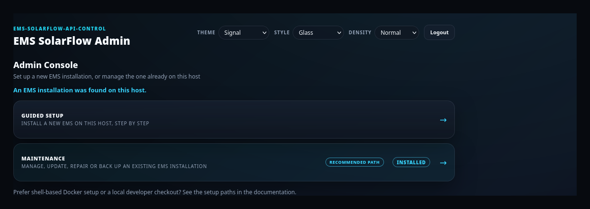

# ems-solarflow-api-control

[](https://github.com/basecubedev/ems-solarflow-api-control/actions/workflows/simulated-regression-tests.yml)
[](https://github.com/basecubedev/ems-solarflow-api-control/actions/workflows/playwright-e2e.yml)
[](https://github.com/basecubedev/ems-solarflow-api-control/actions/workflows/github-code-scanning/codeql)
[](.github/dependabot.yml)

[](docs/developer/testing.md#development-approach)

[](LICENSE)

Local-first EMS control for Zendure SolarFlow systems.
It reads local grid meter and Zendure telemetry, controls inverter output,
and provides a local dashboard.

> [!TIP]
> **New to EMS SolarFlow?**
> Read the [Project Overview](docs/user/project-overview.md) for a non-technical introduction to the main features, supported setups, dashboards, energy management, and system administration.

> EMS controls real power hardware.
> Read the [safety guide](docs/user/safety.md) before enabling live writes.

[](docs/dashboard.md)

## Supported hardware at a glance

Each device carries one status — **Validated**, **Family-supported**,
**Reverse-engineered** or **User-reported**. The maintainer validates on a
SolarFlow 800 Pro 2 and a Shelly Pro; wider coverage needs community
reports. Definitions and the full matrix live in
[docs/user/supported-setups.md](docs/user/supported-setups.md).

| Hardware / integration | Connection | Status |
| --- | --- | --- |
| SolarFlow ZenSDK inverters — 800 Pro 2, plus 800 / 800 Plus / 800 Pro / 1600 AC+ / 2400 AC / 2400 AC+ / SolarFlow 2400 Pro / 4000 AC+ | Local API (ZenSDK) + Zendure cloud MQTT | 800 Pro 2 Validated; rest Family-supported |
| Older Hub / Hyper / AIO / Ace MQTT devices — Hub 1200/2000, Hyper 2000, AIO 2400, Ace 1500 | Local or Zendure cloud MQTT | Reverse-engineered |
| Any Zendure device via API key | Zendure cloud MQTT | Telemetry for any device; control needs an exact supported model |
| Zendure & Shelly grid meters — Shelly Pro, Zendure Smart Meter 3CT / Smart Meter D0 (Local API) | HTTP | Shelly Pro Validated; Zendure meters Reverse-engineered |
| Other HTTP / MQTT grid meters — Shelly Plus/Gen2/Gen3, Shelly 3EM Gen1, everHome EcoTracker, Tasmota, generic MQTT, D0 over local MQTT | HTTP / MQTT | Family-supported / Reverse-engineered |
| Home Assistant entity as a load signal | HA API | Legacy; not recommended for new setups |

**MQTT control is an implemented EMS transport**, not a future feature: a
supported inverter joins the same control loop, target calculation and safety
gates as the Local API, over a local broker or Zendure cloud MQTT. ZenSDK cloud
control is **Validated** on the SolarFlow 800 Pro 2; the older legacy-JSON write
path is **Reverse-engineered** and still needs broader hardware validation — the
**Roadmap** is confirming it on more device generations, not building the
feature. Every write still requires an exact supported model, a verified write
protocol, the per-device control capability and the transport write gate.
[Device compatibility reports](https://github.com/basecubedev/ems-solarflow-api-control/issues/new?template=device_compatibility_report.yml)
(working *or* broken) are very welcome.

## Hardware requirements

The machine EMS runs *on* — 64-bit `arm64` or `amd64`.

| RAM | Recommended configuration |
|-----|---------------------------|
| 512 MB | EMS without InfluxDB |
| 1 GB | EMS with InfluxDB |
| >1 GB | Additional headroom |

InfluxDB stores energy history and is optional — control does not need it.
[Pi matrix](docs/user/hardware-requirements.md).

## Get started

### On a dedicated Raspberry Pi

The **appliance image** turns the board into a box that runs EMS and nothing
else: flash one card, plug in Ethernet, power on. No shell to learn and no
operating system to maintain by hand.

One writable root, patched in place by `apt`, on a 16 GB card or larger. Built
for the **Raspberry Pi 3, 3B+, 4 and 5** — one image file per board. A failed
operating-system update is recovered by you, at the machine, or by writing the
card again and restoring a backup, which is why the backup matters more than the
update does.

The image is **not confirmed on physical hardware** yet; read what that means
before you rely on it.

**[Download the newest image →](https://github.com/basecubedev/ems-solarflow-api-control/releases/tag/appliance-image-latest)**
— one file per board, always the current build. Not under *Packages*: that
holds the container images the appliance fetches by itself.

[Flashing the card](docs/user/appliance/install.md) ·
[First start](docs/user/appliance/first-start.md) ·
[All appliance guides](docs/user/appliance/index.md)

### On a machine you already run

> [!TIP]
> **New here? Start with the Admin Console — the recommended path for most
> users.** Browser-guided setup, hardware discovery, updates, backups and
> maintenance, with no shell or config-file editing. It finds your devices and
> sets up the connection for you.

Install and start it in a local EMS folder:

```bash
mkdir -p ems-solarflow-api-control
cd ems-solarflow-api-control
curl -fsSLO https://raw.githubusercontent.com/basecubedev/ems-solarflow-api-control/main/deploy/admin/install-admin-console.sh
sh install-admin-console.sh
```

Then open `http://127.0.0.1:8090` and create the shared EMS/Admin password in
the browser. Host networking is the default (best for local discovery); add
`--bridge` only if you need Docker bridge networking.



Full guide, with demo videos of a fresh install and a guided update:
[docs/user/admin-console.md](docs/user/admin-console.md#what-the-admin-console-looks-like)

### Other ways to install

Prefer the shell? These converge on the same `config/config.json`, so you can
switch later.

| Path | Choose this if |
| --- | --- |
| [Docker Bootstrap](docs/user/docker-bootstrap.md) | Shell-only Docker setup |
| [Developer Setup](docs/developer/developer-setup.md) | Develop, debug or build from source |

### Connection types (reference)

The Admin Console picks the right one during discovery — you don't choose
upfront. EMS reaches your devices over any one of:

- **[Local API (ZenSDK)](docs/user/connection-types.md#local-api-zensdk)** — newer SolarFlow / ZenSDK models on your LAN. Fastest, fully local.
- **[Local MQTT](docs/user/connection-types.md#local-mqtt)** — devices re-pointed to your own broker. Low latency, no cloud.
- **[Zendure MQTT (cloud)](docs/user/connection-types.md#zendure-mqtt-cloud)** — any Zendure device via your Zendure API key. Higher latency over the internet.

## Documentation

- Step-by-step guides: [Admin Console](docs/user/admin/index.md) · [EMS Dashboard](docs/user/dashboard/index.md)
- [Hardware requirements](docs/user/hardware-requirements.md) · [Raspberry Pi compatibility](docs/user/hardware-requirements.md#raspberry-pi-compatibility)
- [Appliance installation](docs/appliance/installation.md) · [Administration](docs/user/admin-console.md) · [Troubleshooting](docs/user/troubleshooting.md)
- [User documentation](docs/user/)
- [Technical reference](docs/technical/)
- [Developer documentation](docs/developer/)
- [Full documentation map](docs/README.md)

## Getting help

- [FAQ](docs/user/faq.md)
- [Troubleshooting](docs/user/troubleshooting.md)
- [GitHub issues](https://github.com/basecubedev/ems-solarflow-api-control/issues)
