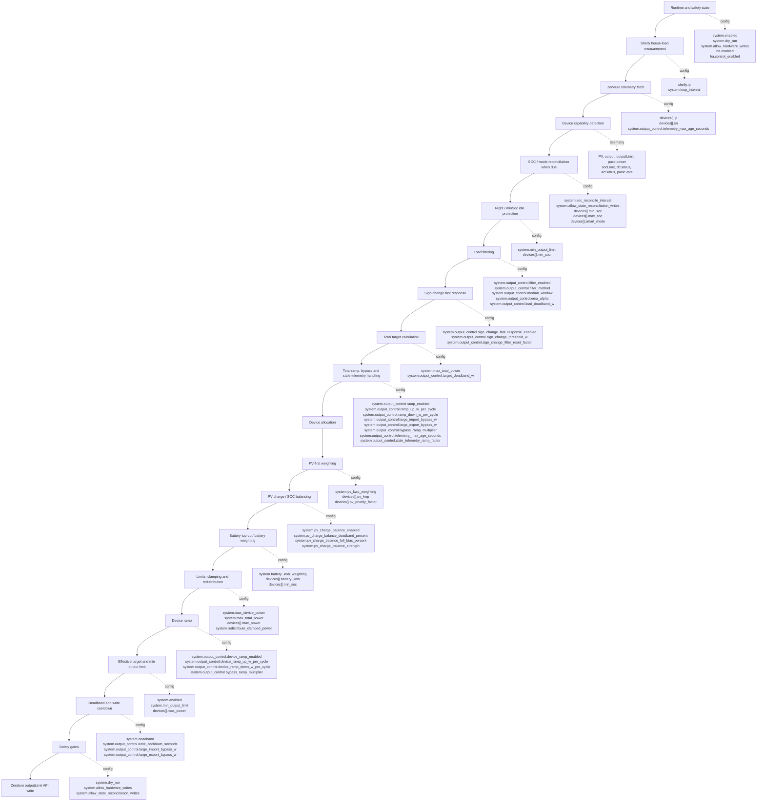

# EMS Power Control Flow

## Purpose

This page shows where `config.json` values affect the EMS power regulation
chain. Use it as a map when tuning a value and asking:

> If I change this config value, where exactly does it affect power control?

It does not replace the detailed configuration reference. For exact value
descriptions and examples, see [configuration.md](configuration.md) and
[configuration-examples.md](configuration-examples.md).

Some operator values can also be changed through runtime state or Home
Assistant. In that case the runtime value is used during the cycle, but the
control block shown here is the same.

## How To Read This Diagram

Read the main path from top to bottom. Solid arrows show the order of one EMS
cycle, from measurements to a possible Zendure `outputLimit` write.

Dotted side arrows list the config values that influence that block. A value
listed next to a block does not necessarily force a write; it only affects the
decision made at that point.

## Power Control Flow Diagram



## Parameter Map

| Parameter | Control Block | What It Changes | Details |
|---|---|---|---|
| `system.enabled` | Runtime state / effective target | Enables or disables EMS output control. When disabled, effective targets become `0` and output writes are skipped. | [configuration.md](configuration.md), [runtime-state.md](runtime-state.md) |
| `system.dry_run` | Safety gates | Blocks real Zendure writes while still calculating targets and logging intended writes. | [configuration.md](configuration.md), [safety.md](safety.md) |
| `system.allow_hardware_writes` | Safety gates | Allows Zendure `/properties/write` calls only when dry-run and simulation/replay gates also allow them. | [configuration.md](configuration.md), [safety.md](safety.md) |
| `system.allow_state_reconciliation_writes` | SOC / mode reconciliation | Allows SOC, mode, runtime device state, and winter reconciliation writes after hardware writes are also allowed. | [configuration.md](configuration.md), [safety.md](safety.md) |
| `system.max_total_power` | Total target calculation / limits | Caps the combined EMS target before allocation. Runtime state can override it. | [configuration.md](configuration.md), [runtime-state.md](runtime-state.md) |
| `system.max_device_power` | Limits, clamping and redistribution | Default per-device output cap used when a device has no stronger configured cap. | [configuration.md](configuration.md) |
| `system.deadband` | Final write suppression | Skips small per-device `outputLimit` changes compared with current `outputLimit`, or current output when `outputLimit` is missing. | [control-logic.md](control-logic.md) |
| `system.min_output_limit` | Night / minSoc idle and effective target | Sets the enabled-control output floor, no-export standby total, and night/minSoc parking value. Runtime state can override it. | [configuration.md](configuration.md), [control-logic.md](control-logic.md), [runtime-state.md](runtime-state.md) |
| `system.loop_interval` | Loop timing | Sets the time between EMS cycles, which also controls how often per-cycle ramps can step. Runtime state can override it. | [configuration.md](configuration.md), [runtime-state.md](runtime-state.md) |
| `system.redistribute_clamped_power` | Limits, clamping and redistribution | Redistributes target watts that were clamped from one device to other devices with headroom. | [configuration.md](configuration.md), [control-logic.md](control-logic.md) |
| `system.pv_kwp_weighting` | PV-first weighting | Enables use of configured PV size in PV-first allocation weights. If disabled, `devices[].pv_kwp` is not applied to that weight. | [configuration.md](configuration.md), [control-logic.md](control-logic.md) |
| `system.pv_charge_balance_enabled` | PV charge / SOC balancing | Enables the SOC-spread bias in PV-first allocation. | [configuration.md](configuration.md), [control-logic.md](control-logic.md) |
| `system.pv_charge_balance_deadband_percent` | PV charge / SOC balancing | Defines the SOC gap below which PV-first charge balancing stays inactive. | [configuration.md](configuration.md), [control-logic.md](control-logic.md) |
| `system.pv_charge_balance_full_bias_percent` | PV charge / SOC balancing | Defines the SOC gap where the configured balancing strength reaches full effect. | [configuration.md](configuration.md), [control-logic.md](control-logic.md) |
| `system.pv_charge_balance_strength` | PV charge / SOC balancing | Controls the maximum charge-balance multiplier applied to PV-first weights. | [configuration.md](configuration.md), [control-logic.md](control-logic.md) |
| `system.battery_kwh_weighting` | Battery top-up / battery weighting | Enables use of configured battery size in discharge and PV-first top-up weights. If disabled, usable SOC percent is used without kWh scaling. | [configuration.md](configuration.md), [control-logic.md](control-logic.md) |
| `system.soc_reconcile_interval` | SOC / mode reconciliation | Controls how often SOC/mode reconciliation is checked, measured in EMS cycles. `0` disables cyclic reconciliation. | [configuration.md](configuration.md), [safety.md](safety.md) |
| `system.output_control.load_deadband_w` | Load filtering / total target stabilization | Holds the current total target when the filtered load is within this small-load band. | [configuration.md](configuration.md), [control-logic.md](control-logic.md) |
| `system.output_control.target_deadband_w` | Total target calculation | Holds the current commanded total when the newly desired total is only slightly different. This is earlier than final `system.deadband`. | [configuration.md](configuration.md), [control-logic.md](control-logic.md) |
| `system.output_control.filter_enabled` | Load filtering | Enables or disables load filtering before total target calculation. | [configuration.md](configuration.md) |
| `system.output_control.filter_method` | Load filtering | Selects the filter method. The current tuned method is `median_ema`. | [configuration.md](configuration.md) |
| `system.output_control.median_window` | Load filtering | Sets how many load samples are used by the median stage. | [configuration.md](configuration.md) |
| `system.output_control.ema_alpha` | Load filtering | Controls how quickly the EMA follows the median load value. Higher reacts faster. | [configuration.md](configuration.md) |
| `system.output_control.sign_change_fast_response_enabled` | Sign-change fast response | Lets the filter react faster when raw load has crossed zero but the smoothed value still points the other way. | [configuration.md](configuration.md), [control-logic.md](control-logic.md) |
| `system.output_control.sign_change_threshold_w` | Sign-change fast response | Sets the minimum import/export magnitude needed to trigger fast response. | [configuration.md](configuration.md) |
| `system.output_control.sign_change_filter_reset_factor` | Sign-change fast response | Sets how strongly the filtered load is pulled toward raw load during a sign-change mismatch. | [configuration.md](configuration.md) |
| `system.output_control.ramp_enabled` | Total ramp / bypass / stale telemetry | Enables per-cycle ramp limits for the combined target. | [configuration.md](configuration.md), [control-logic.md](control-logic.md) |
| `system.output_control.ramp_up_w_per_cycle` | Total ramp / bypass / stale telemetry | Limits how quickly the combined target can rise per EMS cycle. | [configuration.md](configuration.md) |
| `system.output_control.ramp_down_w_per_cycle` | Total ramp / bypass / stale telemetry | Limits how quickly the combined target can fall per EMS cycle. | [configuration.md](configuration.md) |
| `system.output_control.device_ramp_enabled` | Device ramp | Enables per-device target ramping after allocation. | [configuration.md](configuration.md), [control-logic.md](control-logic.md) |
| `system.output_control.device_ramp_up_w_per_cycle` | Device ramp | Limits how quickly each device target can rise per EMS cycle. | [configuration.md](configuration.md) |
| `system.output_control.device_ramp_down_w_per_cycle` | Device ramp | Limits how quickly each device target can fall per EMS cycle. | [configuration.md](configuration.md) |
| `system.output_control.write_cooldown_seconds` | Deadband and write cooldown | Prevents repeated writes to the same device until the cooldown has passed, except during large import/export bypass. | [configuration.md](configuration.md), [control-logic.md](control-logic.md) |
| `system.output_control.large_import_bypass_w` | Total ramp / write cooldown | Detects large import situations. The controller increases ramp speed and bypasses final write cooldown. | [configuration.md](configuration.md), [control-logic.md](control-logic.md) |
| `system.output_control.large_export_bypass_w` | Total ramp / write cooldown | Detects large export situations. The controller increases ramp speed and bypasses final write cooldown. | [configuration.md](configuration.md), [control-logic.md](control-logic.md) |
| `system.output_control.bypass_ramp_multiplier` | Total ramp and device ramp | Multiplies total and per-device ramp limits during large import/export bypass situations. | [configuration.md](configuration.md), [control-logic.md](control-logic.md) |
| `system.output_control.telemetry_max_age_seconds` | Telemetry freshness / stale ramp | Marks device telemetry as stale after this age. Stale telemetry reduces ramp speed. | [configuration.md](configuration.md), [troubleshooting.md](troubleshooting.md) |
| `system.output_control.stale_telemetry_ramp_factor` | Total ramp / stale telemetry | Multiplies total ramp speed when telemetry is stale. Lower values make stale-telemetry changes more conservative. | [configuration.md](configuration.md), [troubleshooting.md](troubleshooting.md) |
| `devices[].max_power` | Limits, clamping and redistribution | Sets the per-device output cap used during allocation, final target clamping, and effective target calculation. Runtime state can override it. | [configuration.md](configuration.md), [runtime-state.md](runtime-state.md) |
| `devices[].pv_kwp` | PV-first weighting | Represents the configured PV size for this device and scales the PV-first allocation weight when `system.pv_kwp_weighting=true`. | [configuration.md](configuration.md), [control-logic.md](control-logic.md) |
| `devices[].pv_priority_factor` | PV-first weighting | Amplifies or reduces this device's PV-first allocation weight. It does not create real PV power. | [configuration.md](configuration.md), [control-logic.md](control-logic.md) |
| `devices[].battery_kwh` | Battery top-up / battery weighting | Represents configured battery size and scales discharge/top-up allocation when `system.battery_kwh_weighting=true`. | [configuration.md](configuration.md), [control-logic.md](control-logic.md) |
| `devices[].min_soc` | SOC reconciliation / battery weighting / idle protection | Sets the discharge floor used for SOC reconciliation, usable battery weighting, top-up eligibility, and night/minSoc idle detection. | [configuration.md](configuration.md), [control-logic.md](control-logic.md) |
| `devices[].max_soc` | SOC reconciliation | Sets the upper SOC boundary used by reconciliation and remaining-time context. | [configuration.md](configuration.md), [safety.md](safety.md) |

## Notes On Weights, Limits, Filters, And Writes

Measurements are real runtime inputs: Shelly import/export, Zendure PV
telemetry, SOC, current output, current `outputLimit`, pack power, and detected
capability state. Config values do not replace these measurements; they shape
how the EMS reacts to them.

Filters and smoothing reduce noise or slow changes. `load_deadband_w` suppresses
small filtered load changes before the total target moves. `target_deadband_w`
suppresses small total-target changes against the controller's current
commanded total. Ramps limit how far the total target or device targets can move
per cycle. `write_cooldown_seconds` suppresses frequent final API writes.

Weighting values influence distribution between devices, but do not create
additional PV or battery power. PV-first weighting uses this simplified signal:

```text
pv_weight = pv_only * pv_kwp * pv_priority_factor * charge_balance_multiplier
```

If `system.pv_kwp_weighting=false`, the configured `pv_kwp` size is not applied
to the PV-first weight. `devices[].pv_priority_factor` still acts only as an
allocation amplifier inside the available PV-only limit.

Battery weighting uses this simplified signal:

```text
usable_percent = max(0, soc - min_soc)
battery_weight = battery_kwh * usable_percent / 100
```

If `system.battery_kwh_weighting=false`, the configured `battery_kwh` size is
not applied and the EMS weights discharge by usable SOC percent instead.

Limits and clamps constrain output. `system.max_total_power` limits the combined
target. `devices[].max_power` and the default `system.max_device_power` limit
individual devices. `system.min_output_limit` can raise an enabled device target
to the configured floor. `devices[].min_soc` and `devices[].max_soc` constrain
SOC reconciliation and battery eligibility.

Write suppression and write safety happen near the end of the cycle.
`system.deadband` is the final per-device write suppression threshold and is
separate from `system.output_control.target_deadband_w`. Real Zendure writes
also require the safety gates described in [safety.md](safety.md): no dry-run,
no simulation/replay, and `system.allow_hardware_writes=true`. State
reconciliation writes additionally require
`system.allow_state_reconciliation_writes=true`.

## Related Documentation

- [configuration.md](configuration.md)
- [configuration-examples.md](configuration-examples.md)
- [control-logic.md](control-logic.md)
- [runtime-state.md](runtime-state.md)
- [safety.md](safety.md)
- [troubleshooting.md](troubleshooting.md)
