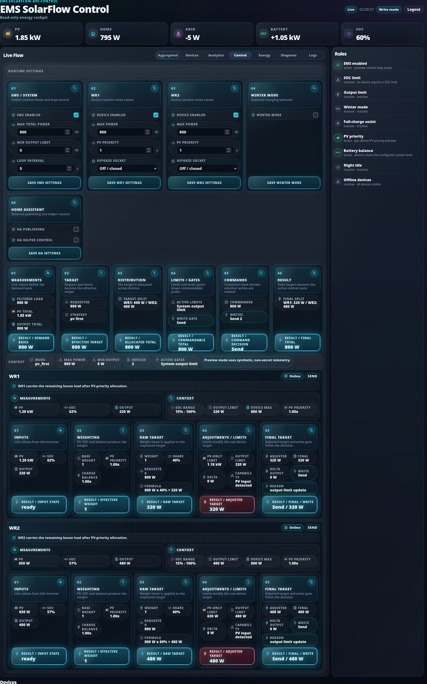
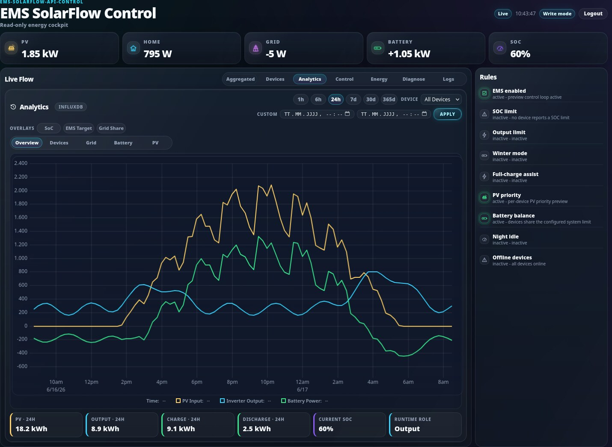
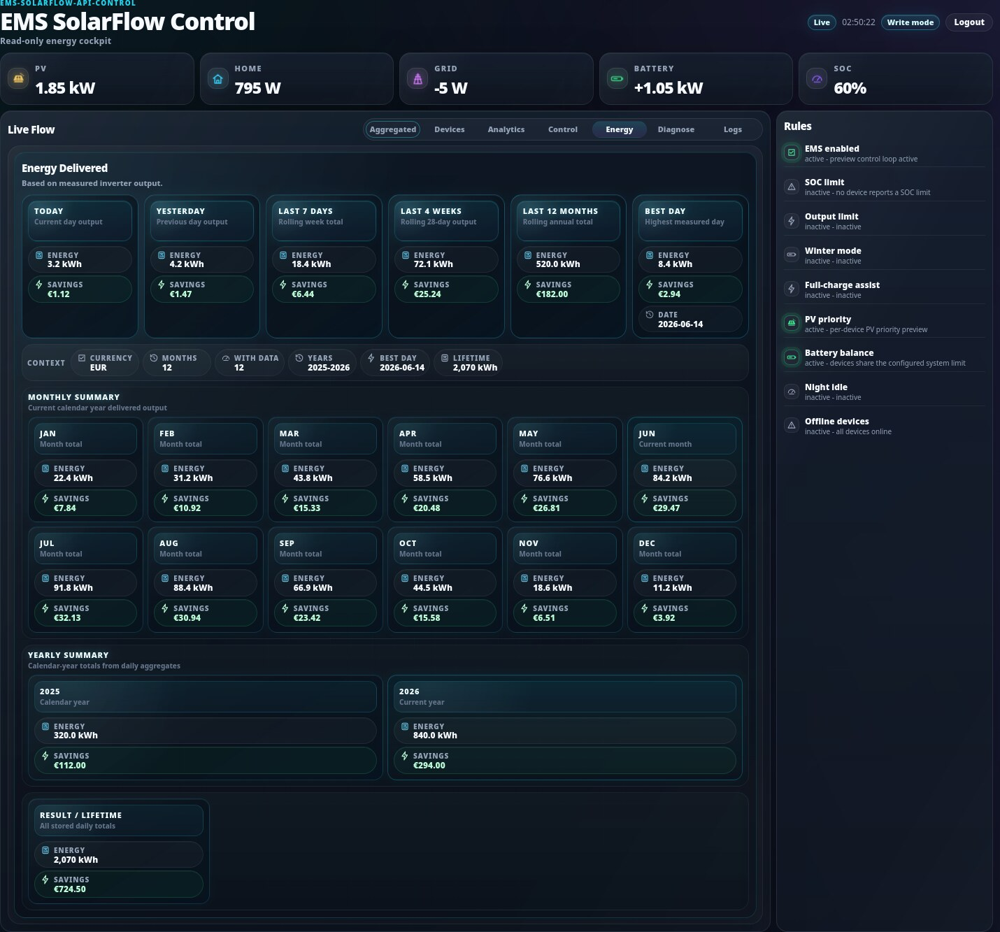
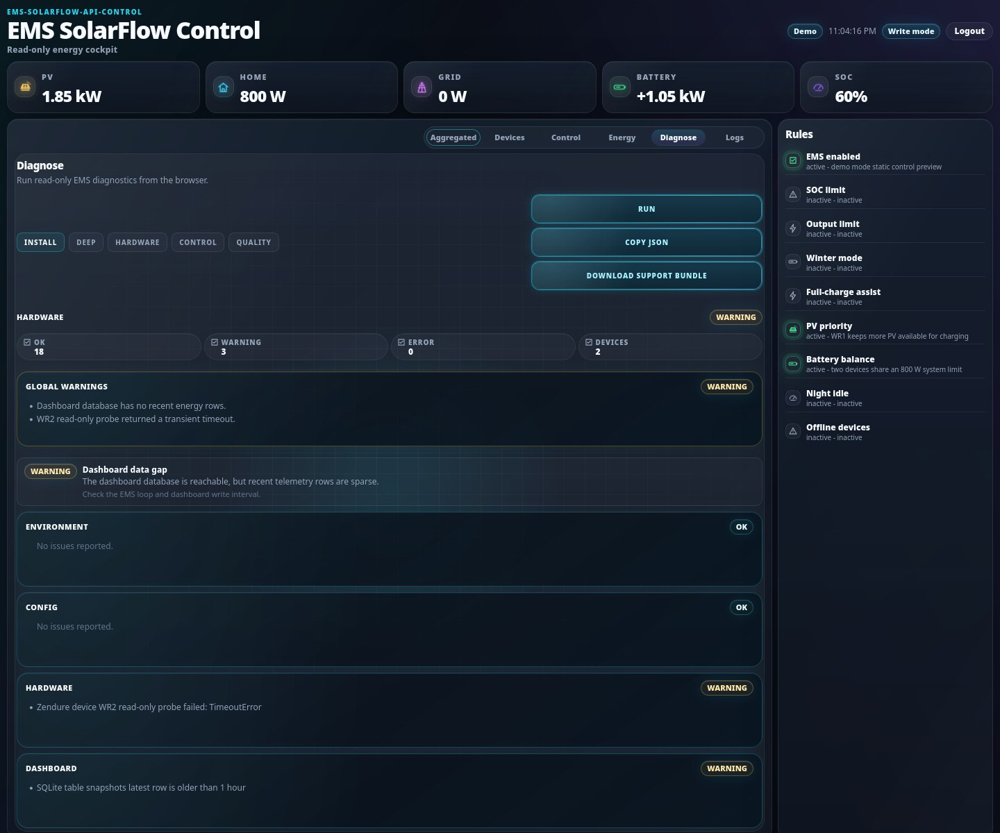
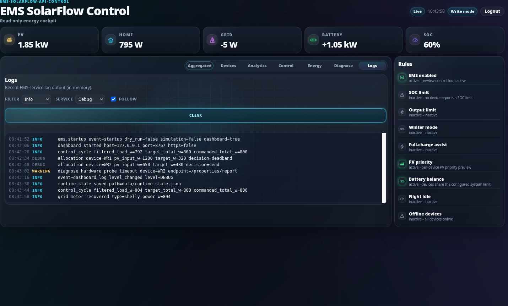

# Live Dashboard

The EMS includes an optional standalone dashboard at:

```text
http://<ems-host>:8080
```

The dashboard is read-only by default. Runtime write mode is unavailable until
a local dashboard admin password is configured with `emsctl`. There is no
default password and password setup is not available from the web UI.

## Control Explain View

The Control view shows the detailed calculation flow from measurements to final
handoff, so the control decision can be followed step by step.



## Devices View

Each device card carries a compact **Firmware status** block below the main
power tiles. It translates selected Zendure firmware status values into readable
labels instead of raw numbers:

- **AC path** — reported from `acStatus`, using `acMode` to clarify the standby
  direction: `AC output active`, `AC charge active`, `AC output standby`,
  `AC charge standby`, or `AC standby`.
- **SOC guard** — from `socLimit`: `Normal`, `Max-SoC reached`, or
  `Min-SoC protection`.
- **Battery state** — from `packState`: `Standby`, `Charging`, or
  `Discharging`.
- **DC path** — from `dcStatus`: `DC standby`, `DC battery input path`, or
  `DC battery output path`.
- **Grid** — from `gridState`: `Grid connected` or `Grid disconnected`.

When present, SOC calibration state, battery pack count, and the AC input limit
are shown as additional facts. Unknown firmware values are still shown with
their raw value for debugging, for example `Unknown AC state (value 9)`.

When [battery full-charge assist](battery-full-charge-assist.md) is enabled
and a battery-backed device has known assist state, the device card also shows
a compact "Full-charge assist" section with the current status (active,
assist window active, restore pending, or scheduled), last full-charge and
next due timestamps, and pending restore flags. Devices without a detected
battery, and devices when the feature is globally disabled, do not show this
section.

## Analytics View

The Analytics tab is the home for long-term, InfluxDB-backed analysis: a single
large primary chart with custom date ranges, drag-zoom, series overlays,
sub-tabs and KPI cards. It is optional — when InfluxDB is not configured the tab
shows a clean "InfluxDB analytics is not configured" info state, and the
Aggregate/Devices history (SQLite) keeps working unchanged. See
[Two history sources](#two-history-sources-sqlite-operational-vs-influxdb-analytics)
for the SQLite vs InfluxDB split and the endpoints involved.



## Energy Statistics View

The Energy tab shows historical inverter output totals and savings estimates
from the local SQLite aggregates.



## Diagnose View

The Diagnose tab runs the read-only `emsctl diagnose` profiles
(Install / Deep / Hardware / Control / Quality) from the browser and renders the
versioned report contract (status pills, sections, root causes). It can also
download a redacted support bundle as a ZIP.



This tab is **operator-only**: it requires a configured dashboard password and an
authenticated session. With no password configured it shows a "configure a
password" empty state; logged out it shows "login required". Runs are
snapshot-only (no `--sample-seconds` sleeping over HTTP), single-flighted so they
cannot be hammered, and the served report is passed through secret redaction as
defense-in-depth.

## Logs View

The Logs tab tails the EMS service log from an in-memory ring buffer (the stock
service writes no log file). It polls incrementally, supports a display **Filter**
(severity), a follow/auto-scroll toggle, and bounds the rendered rows. A separate
**Service** level selector changes the running service's log verbosity live
(e.g. switch to Debug to surface debug lines that are otherwise not emitted); the
display Filter only hides what is already in the buffer, so raising the Service
level is what actually produces more lines. The Service selector is a write
action (session + CSRF) and is disabled until authenticated. Like Diagnose it is
**operator-only** behind an authenticated session. Lines are control-character
sanitized server-side and HTML-escaped in the browser; an optional redaction
toggle (`dashboard.log_redaction`) masks secret-looking values for shared/remote
deployments (raw by default for authenticated operators).



## Local Preview (No Hardware)

For local UI development you can run the dashboard with deterministic, synthetic,
non-secret data — no hardware, MQTT, cloud access, SQLite history, passwords, or
running EMS loop required:

```bash
python3 scripts/serve_dashboard_preview.py
python3 scripts/serve_dashboard_preview.py --scenario firmware-status
python3 scripts/serve_dashboard_preview.py --scenario write-mode
```

It serves the real dashboard assets on `http://127.0.0.1:8767`. Open the landing
page at `http://127.0.0.1:8767/preview` for links to every view, or go straight to
a view (`/preview/aggregated`, `/preview/devices`, `/preview/control`,
`/preview/energy`, `/preview/diagnose`, `/preview/logs`). Scenarios cover a healthy
system, mixed firmware-status values (including unknown values), an offline device,
and read-only/write-mode authentication states. See
[developer.md](developer.md#local-dashboard-preview) for details.

## Configuration

The dashboard section in `config.json` controls startup:

```json
{
  "dashboard": {
    "enabled": true,
    "host": "0.0.0.0",
    "port": 8080,
    "database_path": "data/ems_dashboard.sqlite",
    "history_hours": 48,
    "write_interval_seconds": 5,
    "auth_file": "config/dashboard-auth.json",
    "ssl_enabled": false,
    "ssl_cert_file": "config/dashboard.crt",
    "ssl_key_file": "config/dashboard.key",
    "ssl_auto_generate": true,
    "session_idle_timeout_seconds": 1800,
    "session_absolute_max_seconds": 43200,
    "log_buffer_lines": 5000,
    "log_redaction": false
  },
  "energy_savings": {
    "enabled": true,
    "price_per_kwh": 0.0,
    "currency": "EUR",
    "max_sample_delta_seconds": 20,
    "timezone": "Europe/Berlin"
  }
}
```

`database_path` is relative to the project directory unless an absolute path is
used. The SQLite database stores short-term live dashboard snapshots and
telemetry. Those short-term rows are cleaned according to
`dashboard.history_hours`. `write_interval_seconds` keeps database writes low
even when the EMS loop runs with a short interval.

Daily energy statistics are stored in `daily_energy_stats` in the same database.
They are persistent daily aggregates and are not removed by the short-term
snapshot/telemetry cleanup.

Energy statistics integrate measured inverter AC output over real elapsed time.
Intervals above `energy_savings.max_sample_delta_seconds` are skipped and the
integration baseline is advanced. This avoids false energy jumps after
restarts, downtime, or longer outages.

`energy_savings.timezone` defines the calendar timezone used for daily
statistics and period lookups such as Today and Yesterday.

## Dashboard Write Mode

Write mode is optional and only changes allowlisted runtime-state values from
the Control tab. Live metric tiles remain read-only.

Dashboard write mode can change live EMS behavior. Enable it only on trusted
networks and only for operators who should be able to change runtime settings.

Enable write mode by setting a local admin password:

```bash
python3 emsctl.py dashboard set-password
```

Change the password:

```bash
python3 emsctl.py dashboard change-password
```

Disable dashboard authentication and write mode:

```bash
python3 emsctl.py dashboard disable-auth
```

Check status:

```bash
python3 emsctl.py dashboard auth-status
```

The password file stores PBKDF2-SHA256 hash metadata only. Missing
`config/dashboard-auth.json` means authentication is not configured and write
mode is unavailable.

Authenticated writes require the dashboard session cookie and a per-session
CSRF token. The backend validates every writable field with explicit allowlists.
Power limits are checked against the configured EMS and device limits, not only
generic type ranges.

## Security Hardening

The dashboard applies several local hardening measures:

- JSON API request bodies are capped at 16 KiB.
- Authenticated write requests require a server-side session and CSRF token.
- Login attempts are rate-limited in memory and old entries are pruned.
- Runtime-state updates are locked in-process before saving atomically.
- Browser responses include `no-store` caching, CSP, frame blocking, referrer
  restrictions, and common feature-denial headers.
- Server-Sent Events are limited globally and per client address, with a
  maximum connection lifetime.

These controls reduce accidental exposure and local abuse, but they are not a
substitute for a real internet-facing access layer.

## Optional HTTPS

The built-in dashboard can serve HTTPS directly for LAN usage:

```json
{
  "dashboard": {
    "ssl_enabled": true
  }
}
```

When HTTPS is enabled and the configured certificate/key are missing, EMS
auto-generates a self-signed certificate if `ssl_auto_generate=true`. Browsers
will show a warning for self-signed certificates; this is expected unless you
install or replace the certificate with one trusted by your clients.

Direct HTTPS is intended for local LAN access. Public internet exposure should
be handled with a VPN, reverse proxy, strong TLS, and external access control.
Do not expose the built-in dashboard directly to the public internet.

## API

Live snapshot:

```text
GET /api/live
```

The live snapshot includes `energy_stats` with:

```text
energy_stats.enabled
energy_stats.currency
energy_stats.price_per_kwh
energy_stats.today
energy_stats.yesterday
energy_stats.last_7_days
energy_stats.last_4_weeks
energy_stats.last_12_months
energy_stats.best_day
energy_stats.monthly_current_year
energy_stats.yearly
energy_stats.lifetime
energy_stats.lifetime.since_date
```

`lifetime.since_date` is the first date in `daily_energy_stats` with
`sample_count > 0`. It is day-accurate and uses the stored local statistics
date, not the current runtime timestamp.

Energy statistics only:

```text
GET /api/energy-stats
```

Short-term history (legacy snapshot list, used by older clients):

```text
GET /api/history?range=6h
```

Supported ranges are `1h`, `6h`, `12h`, and `24h`.

### Two history sources: SQLite (operational) vs InfluxDB (analytics)

The dashboard deliberately keeps two **independent** time-series sources so the
operational views stay fast and dependency-free while long-term analysis lives
in its own workspace:

| Source       | Backed by                         | Drives                                 | Endpoint               |
|--------------|-----------------------------------|----------------------------------------|------------------------|
| **SQLite**   | local snapshot store (always on)  | the **History** chart in Aggregate / Devices | `/api/history/series`  |
| **InfluxDB** | optional InfluxDB 2.x (opt-in)    | the dedicated **Analytics** tab        | `/api/analytics/series`|

InfluxDB never silently replaces the SQLite history: `/api/history/series` is
**always** SQLite-backed, so the Aggregate and Devices views work with zero
external dependencies and remain the default experience. Enabling InfluxDB only
adds the Analytics tab; it does not change the operational charts.

#### How analytics data gets into InfluxDB (ingestion)

The recommended, out-of-the-box setup needs **no separate collector process**:

```text
config.json (influxdb.enabled = true)
docker compose up -d        # InfluxDB
# Analytics works
```

When `influxdb.enabled` is true and the EMS is reading real hardware (not
simulation/replay), the control loop writes the telemetry it already collects
each cycle directly into the `{prefix}_raw` bucket via the native writer
(`ems/history/influx_writer.py`). There is **one** telemetry collection per
cycle, fanned out to multiple storage targets:

```text
Telemetry snapshot ── runtime state
                   ├─ SQLite history
                   ├─ dashboard data
                   └─ InfluxDB writer ─> {prefix}_raw ─> 1m ─> 5m ─> 1h
```

The native writer is **non-blocking and failure-isolated**: it only enqueues
line protocol onto a bounded queue that a background daemon thread drains, so a
slow, offline or misconfigured InfluxDB never blocks or stops the control loop;
errors are logged as rate-limited warnings and the writer reconnects
automatically. It writes only to the raw bucket — the downsampling tasks
reconciled by `emsctl.py influx sync` handle raw -> 1m -> 5m -> 1h. The hardware
is never polled a second time.

**Advanced usage — the standalone collector.** The collector
(`scripts/capture_runtime_to_influx.py`, see
[develop-tool-influxdb-telemetry.md](develop-tool-influxdb-telemetry.md)) is no
longer required for normal operation. It remains available for development,
diagnostics, experiments and backfill. It writes the same measurement/field
schema (`zendure_device` / `shelly_meter`, numeric fields as float), so it is
interchangeable with the native writer.

#### `/api/history/series` — operational history (SQLite)

```text
GET /api/history/series?range=24h&series=pv,output,battery&devices=WR1
GET /api/history/series?start=1717200000&end=1717286400&series=pv
```

Supported ranges are `1h`, `6h`, `24h`, `7d`, `30d`, `365d`. `series` and
`devices` are optional comma-separated lists; an empty/invalid `series` falls
back to the default `pv,output,battery`. For a **custom range**, pass `start`
and `end` (epoch seconds or ISO 8601) instead of `range`; the response then
reports `"range": "custom"`. `start >= end` or unparseable bounds return
`400 invalid_range`. The response is columnar
(`time`, `series`, `devices`, `source`, `window`, `range`, `meta`) so the
front-end uPlot chart can plot every series on one shared time axis. The
`source` is always `sqlite`.

The lightweight **History** panel (shown only on the Aggregate and Devices
views) uses this endpoint for one combined chart of the default
PV / Inverter Output / Battery series with a range selector and a device
filter. It is intentionally minimal — no overlays, sub-tabs, zoom or KPIs — so
these operational views stay quick to load.

#### `/api/analytics/series` and `/api/analytics/status` — analytics (InfluxDB)

```text
GET /api/analytics/status
GET /api/analytics/series?range=30d&series=pv,output,battery&devices=WR1
GET /api/analytics/series?start=1717200000&end=1717286400&series=pv
```

These are served exclusively by the InfluxDB `HistoryProvider` and are only
active when `influxdb.enabled` is set in config. `/api/analytics/status` returns
`{"available": <bool>, "provider": "influxdb", "reason": ...}` so the front-end
can render a clean state. When InfluxDB is **not** configured, both endpoints
respond with HTTP 200 and `{"available": false, "reason": "not_configured"}`
(never a broken chart or a JavaScript error); the Analytics tab then shows an
"InfluxDB analytics is not configured" info panel. The series response shares the
same columnar shape as `/api/history/series`, with `source` set to `influxdb`.

The **Analytics** tab is a dedicated, larger analysis workspace (the primary
chart is ~560px tall on desktop) reusing the existing PV/Output/Battery/Grid
colors, with a period selector, a device filter, custom date ranges, drag-zoom,
overlays, sub-tabs, and KPI cards — one combined chart, never a chart explosion.

The Analytics tab has sub-tabs that keep the same single chart and only change
the visible series and KPI cards (no extra chart pages):

- **Overview** / **Devices** — PV, Inverter Output, Battery Power; KPIs PV,
  Output, Charge, Discharge, Current SoC, Runtime Role.
- **Grid** — Grid and Home Load; KPIs Grid Import, Grid Export, Home, SoC.
- **Battery** — Battery Power; KPIs Charge, Discharge, SoC, Runtime Role.
- **PV** — PV Input; KPIs PV, PV Peak, Output, SoC.

Energy KPIs are integrated from the selected period; Current SoC and Runtime
Role come from the live snapshot.

Overlay toggles add optional series on top of the active tab without changing
it: **SoC** (drawn on a secondary right-hand percentage axis), **EMS Target**,
and **Grid Share** (grid power). Overlays render as dashed lines and the
crosshair/live legend reports every visible series at the cursor. A custom date
range (from/to pickers + Apply) replaces the period selector when set.

Performance and refresh behavior:

- The endpoint decimates each response to at most ~2000 points per series, so
  long ranges stay fast (a 365d query over 100k+ raw snapshots returns in well
  under a second). Zoom/custom ranges request a narrower window and so return
  finer detail.
- The Analytics tab auto-refreshes every 30s, but only while it is the active
  view; other views and a backgrounded browser tab do not trigger analytics
  fetches. Each sub-tab loads only its own series. The lightweight History panel
  refreshes on the same cadence while Aggregate/Devices is on screen.
- Both panels are mobile-friendly (controls, overlay chips, sub-tabs and KPI
  cards reflow; charts use reduced heights on small screens) and show explicit
  loading and empty/unavailable states.

End-to-end tests (`tests/test_history_analytics_e2e.py`) cover the whole path.
The SQLite variant always runs (records snapshots through the real
`DashboardStore`, serves the real dashboard, and asserts the
`/api/history/series` payload). The InfluxDB variant is opt-in and runs against a
live InfluxDB 2.x when these are set (e.g. with the bundled Docker InfluxDB from
`develop/influxdb/`), asserting the `/api/analytics/series` payload:

```bash
EMS_INFLUX_E2E_URL=http://localhost:8086 \
EMS_INFLUX_E2E_TOKEN=<token> \
EMS_INFLUX_E2E_ORG=ems-e2e \
pytest tests/test_history_analytics_e2e.py
```

It reconciles the schema, writes telemetry line protocol, and reads it back
through the HTTP endpoint with InfluxDB as the active provider (test-scoped
`emse2e_*` buckets).

Live updates:

```text
GET /api/events
```

The event stream uses Server-Sent Events and emits `telemetry` events.

Auth and runtime APIs:

```text
GET  /api/auth/status
POST /api/auth/login
POST /api/auth/logout
POST /api/auth/refresh
GET  /api/runtime
PATCH /api/runtime/system
PATCH /api/runtime/ha
PATCH /api/runtime/winter
PATCH /api/runtime/device/<name>
```

The `PATCH` endpoints and `POST /api/auth/refresh` require a valid login session
and `X-CSRF-Token`.

Operator-only diagnostics and logs (require an authenticated session; GET-only,
no CSRF since they are side-effect-free):

```text
GET /api/diagnose?profile=install|deep|hardware|control|control_quality
GET /api/diagnose/support-bundle
GET /api/logs?after=<seq>&limit=<n>&level=<min-level>
```

Changing the service's runtime log verbosity is a state change and uses the
write-auth path (session + `X-CSRF-Token`):

```text
POST /api/logs/level   body {"level": "DEBUG|INFO|WARNING|ERROR|CRITICAL"}
```

`/api/logs` returns `{lines, cursor, dropped}`; pass the returned `cursor` as the
next `after` for incremental polling. `dropped` is `true` when the ring buffer
rolled past the caller's cursor.

## Session Lifetime

A login session's idle timeout slides on genuine user interaction (a throttled
`POST /api/auth/refresh` heartbeat; background polling does not count), bounded
by an absolute maximum lifetime measured from login. Closing the browser logs
out immediately (the session cookie has no `Max-Age`); walking away with the tab
open logs out within the idle timeout.

Both timeouts are configurable; `0` disables a bound (an explicit "infinite"
opt-in) and negative values are rejected back to the secure default:

- `dashboard.session_idle_timeout_seconds` — default `1800` (30 min)
- `dashboard.session_absolute_max_seconds` — default `43200` (12 h)

The secure defaults are 30 min / 12 h. Setting either to `0` weakens the
"walk away → logged out" property and the stolen-cookie bound; it is an explicit
per-deployment operator choice.
