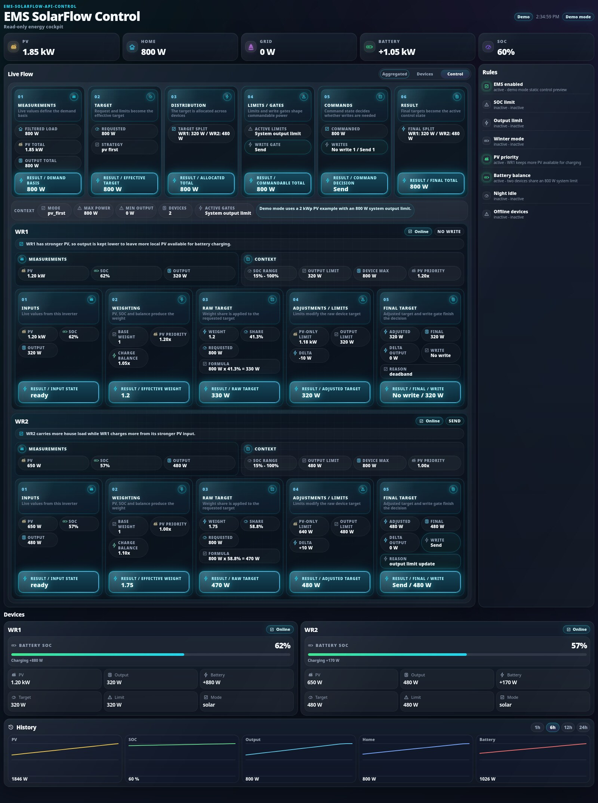

# Live Dashboard

The EMS includes an optional standalone dashboard at:

```text
http://<ems-host>:8080
```

The dashboard is read-only by default. Runtime write mode is unavailable until
a local dashboard admin password is configured with `emsctl`. There is no
default password and password setup is not available from the web UI.

## Control Explain View

The Control view shows the detailed calculation flow from measurements to final
handoff, so the control decision can be followed step by step.



## Devices View

The Devices view includes a compact AC tile on each device card. It shows the
reported AC path state from `acStatus` and uses `acMode` to clarify standby
direction:

- `Output` when the AC output path is active.
- `Charge` when the AC input/charge path is active.
- `Output standby`, `Charge standby`, or `Standby` when the AC path is idle.

When [battery full-charge assist](battery-full-charge-assist.md) is enabled
and a battery-backed device has known assist state, the device card also shows
a compact "Full-charge assist" section with the current status (active,
assist window active, restore pending, or scheduled), last full-charge and
next due timestamps, and pending restore flags. Devices without a detected
battery, and devices when the feature is globally disabled, do not show this
section.

## Energy Statistics View

The Energy tab shows historical inverter output totals and savings estimates
from the local SQLite aggregates.


## Diagnose View

The Diagnose tab runs the read-only `emsctl diagnose` profiles
(Install / Deep / Hardware / Control / Quality) from the browser and renders the
versioned report contract (status pills, sections, root causes). It can also
download a redacted support bundle as a ZIP.

This tab is **operator-only**: it requires a configured dashboard password and an
authenticated session. With no password configured it shows a "configure a
password" empty state; logged out it shows "login required". Runs are
snapshot-only (no `--sample-seconds` sleeping over HTTP), single-flighted so they
cannot be hammered, and the served report is passed through secret redaction as
defense-in-depth.

## Logs View

The Logs tab tails the EMS service log from an in-memory ring buffer (the stock
service writes no log file). It polls incrementally, supports a level filter and
a follow/auto-scroll toggle, and bounds the rendered rows. Like Diagnose it is
**operator-only** behind an authenticated session. Lines are control-character
sanitized server-side and HTML-escaped in the browser; an optional redaction
toggle (`dashboard.log_redaction`) masks secret-looking values for shared/remote
deployments (raw by default for authenticated operators).

## Configuration

The dashboard section in `config.json` controls startup:

```json
{
  "dashboard": {
    "enabled": true,
    "host": "0.0.0.0",
    "port": 8080,
    "database_path": "data/ems_dashboard.sqlite",
    "history_hours": 48,
    "write_interval_seconds": 5,
    "auth_file": "config/dashboard-auth.json",
    "ssl_enabled": false,
    "ssl_cert_file": "config/dashboard.crt",
    "ssl_key_file": "config/dashboard.key",
    "ssl_auto_generate": true
  },
  "energy_savings": {
    "enabled": true,
    "price_per_kwh": 0.0,
    "currency": "EUR",
    "max_sample_delta_seconds": 20,
    "timezone": "Europe/Berlin"
  }
}
```

`database_path` is relative to the project directory unless an absolute path is
used. The SQLite database stores short-term live dashboard snapshots and
telemetry. Those short-term rows are cleaned according to
`dashboard.history_hours`. `write_interval_seconds` keeps database writes low
even when the EMS loop runs with a short interval.

Daily energy statistics are stored in `daily_energy_stats` in the same database.
They are persistent daily aggregates and are not removed by the short-term
snapshot/telemetry cleanup.

Energy statistics integrate measured inverter AC output over real elapsed time.
Intervals above `energy_savings.max_sample_delta_seconds` are skipped and the
integration baseline is advanced. This avoids false energy jumps after
restarts, downtime, or longer outages.

`energy_savings.timezone` defines the calendar timezone used for daily
statistics and period lookups such as Today and Yesterday.

## Dashboard Write Mode

Write mode is optional and only changes allowlisted runtime-state values from
the Control tab. Live metric tiles remain read-only.

Dashboard write mode can change live EMS behavior. Enable it only on trusted
networks and only for operators who should be able to change runtime settings.

Enable write mode by setting a local admin password:

```bash
python3 emsctl.py dashboard set-password
```

Change the password:

```bash
python3 emsctl.py dashboard change-password
```

Disable dashboard authentication and write mode:

```bash
python3 emsctl.py dashboard disable-auth
```

Check status:

```bash
python3 emsctl.py dashboard auth-status
```

The password file stores PBKDF2-SHA256 hash metadata only. Missing
`config/dashboard-auth.json` means authentication is not configured and write
mode is unavailable.

Authenticated writes require the dashboard session cookie and a per-session
CSRF token. The backend validates every writable field with explicit allowlists.
Power limits are checked against the configured EMS and device limits, not only
generic type ranges.

## Security Hardening

The dashboard applies several local hardening measures:

- JSON API request bodies are capped at 16 KiB.
- Authenticated write requests require a server-side session and CSRF token.
- Login attempts are rate-limited in memory and old entries are pruned.
- Runtime-state updates are locked in-process before saving atomically.
- Browser responses include `no-store` caching, CSP, frame blocking, referrer
  restrictions, and common feature-denial headers.
- Server-Sent Events are limited globally and per client address, with a
  maximum connection lifetime.

These controls reduce accidental exposure and local abuse, but they are not a
substitute for a real internet-facing access layer.

## Optional HTTPS

The built-in dashboard can serve HTTPS directly for LAN usage:

```json
{
  "dashboard": {
    "ssl_enabled": true
  }
}
```

When HTTPS is enabled and the configured certificate/key are missing, EMS
auto-generates a self-signed certificate if `ssl_auto_generate=true`. Browsers
will show a warning for self-signed certificates; this is expected unless you
install or replace the certificate with one trusted by your clients.

Direct HTTPS is intended for local LAN access. Public internet exposure should
be handled with a VPN, reverse proxy, strong TLS, and external access control.
Do not expose the built-in dashboard directly to the public internet.

## API

Live snapshot:

```text
GET /api/live
```

The live snapshot includes `energy_stats` with:

```text
energy_stats.enabled
energy_stats.currency
energy_stats.price_per_kwh
energy_stats.today
energy_stats.yesterday
energy_stats.last_7_days
energy_stats.last_4_weeks
energy_stats.last_12_months
energy_stats.best_day
energy_stats.monthly_current_year
energy_stats.yearly
energy_stats.lifetime
energy_stats.lifetime.since_date
```

`lifetime.since_date` is the first date in `daily_energy_stats` with
`sample_count > 0`. It is day-accurate and uses the stored local statistics
date, not the current runtime timestamp.

Energy statistics only:

```text
GET /api/energy-stats
```

Short-term history:

```text
GET /api/history?range=6h
```

Supported ranges are `1h`, `6h`, `12h`, and `24h`.

Live updates:

```text
GET /api/events
```

The event stream uses Server-Sent Events and emits `telemetry` events.

Auth and runtime APIs:

```text
GET  /api/auth/status
POST /api/auth/login
POST /api/auth/logout
POST /api/auth/refresh
GET  /api/runtime
PATCH /api/runtime/system
PATCH /api/runtime/ha
PATCH /api/runtime/winter
PATCH /api/runtime/device/<name>
```

The `PATCH` endpoints and `POST /api/auth/refresh` require a valid login session
and `X-CSRF-Token`.

Operator-only diagnostics and logs (require an authenticated session; GET-only,
no CSRF since they are side-effect-free):

```text
GET /api/diagnose?profile=install|deep|hardware|control|control_quality
GET /api/diagnose/support-bundle
GET /api/logs?after=<seq>&limit=<n>&level=<min-level>
```

`/api/logs` returns `{lines, cursor, dropped}`; pass the returned `cursor` as the
next `after` for incremental polling. `dropped` is `true` when the ring buffer
rolled past the caller's cursor.

## Session Lifetime

A login session's idle timeout slides on genuine user interaction (a throttled
`POST /api/auth/refresh` heartbeat; background polling does not count), bounded
by an absolute maximum lifetime measured from login. Closing the browser logs
out immediately (the session cookie has no `Max-Age`); walking away with the tab
open logs out within the idle timeout.

Both timeouts are configurable; `0` disables a bound (an explicit "infinite"
opt-in) and negative values are rejected back to the secure default:

- `dashboard.session_idle_timeout_seconds` — default `1800` (30 min)
- `dashboard.session_absolute_max_seconds` — default `43200` (12 h)

The secure defaults are 30 min / 12 h. Setting either to `0` weakens the
"walk away → logged out" property and the stolen-cookie bound; it is an explicit
per-deployment operator choice.
