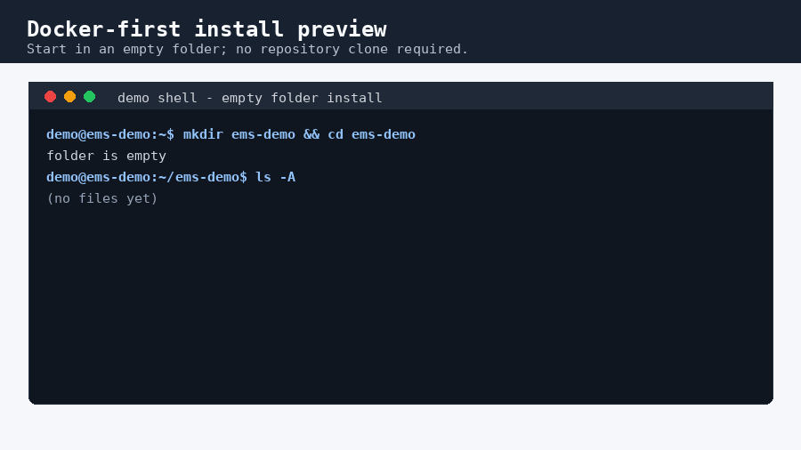

# Install Docker

Required dependency: Docker with Docker Compose v2.24.0 or newer. The EMS
quickstart uses `docker compose`, not the old standalone `docker-compose` v1
command.

**Linux / Raspberry Pi:** Install Docker Engine and the Docker Compose plugin
(see the OS sections below).

**macOS:** Install Docker Desktop, then verify `docker compose version`.

**Windows:** Install Docker Desktop, use Linux containers, and verify
`docker compose version`. Run the PowerShell installer from PowerShell.

For full, current instructions, use the official Docker docs:

- Docker Desktop (macOS/Windows): <https://docs.docker.com/desktop/>
- Debian: <https://docs.docker.com/engine/install/debian/>
- Ubuntu: <https://docs.docker.com/engine/install/ubuntu/>
- Raspberry Pi OS: <https://docs.docker.com/engine/install/raspberry-pi-os/>
- Linux post-install: <https://docs.docker.com/engine/install/linux-postinstall/>

After Docker is installed, the EMS Analytics quickstart flow looks like this:



Video: [MP4](assets/install-demo.mp4) · [WebM](assets/install-demo.webm)

## Debian

Docker's official Debian path is:

```bash
sudo apt update
sudo apt install ca-certificates curl
sudo install -m 0755 -d /etc/apt/keyrings
sudo curl -fsSL https://download.docker.com/linux/debian/gpg -o /etc/apt/keyrings/docker.asc
sudo chmod a+r /etc/apt/keyrings/docker.asc
sudo tee /etc/apt/sources.list.d/docker.sources <<EOF
Types: deb
URIs: https://download.docker.com/linux/debian
Suites: $(. /etc/os-release && echo "$VERSION_CODENAME")
Components: stable
Architectures: $(dpkg --print-architecture)
Signed-By: /etc/apt/keyrings/docker.asc
EOF
sudo apt update
sudo apt install docker-ce docker-ce-cli containerd.io docker-buildx-plugin docker-compose-plugin
```

## Ubuntu

Docker's official Ubuntu path is:

```bash
sudo apt update
sudo apt install ca-certificates curl
sudo install -m 0755 -d /etc/apt/keyrings
sudo curl -fsSL https://download.docker.com/linux/ubuntu/gpg -o /etc/apt/keyrings/docker.asc
sudo chmod a+r /etc/apt/keyrings/docker.asc
sudo tee /etc/apt/sources.list.d/docker.sources <<EOF
Types: deb
URIs: https://download.docker.com/linux/ubuntu
Suites: $(. /etc/os-release && echo "${UBUNTU_CODENAME:-$VERSION_CODENAME}")
Components: stable
Architectures: $(dpkg --print-architecture)
Signed-By: /etc/apt/keyrings/docker.asc
EOF
sudo apt update
sudo apt install docker-ce docker-ce-cli containerd.io docker-buildx-plugin docker-compose-plugin
```

## Raspberry Pi OS

Use **64-bit** Raspberry Pi OS: the EMS images are published for `arm64` and
`amd64` only, so a 32-bit system can run Docker but not EMS. On 64-bit
Raspberry Pi OS, follow Docker's Debian instructions above (`arm64` packages).

For reference only, Docker's 32-bit Raspberry Pi OS path uses the `raspbian`
repository:

```bash
sudo apt-get update
sudo apt-get install ca-certificates curl
sudo install -m 0755 -d /etc/apt/keyrings
sudo curl -fsSL https://download.docker.com/linux/raspbian/gpg -o /etc/apt/keyrings/docker.asc
sudo chmod a+r /etc/apt/keyrings/docker.asc
echo \
  "deb [arch=$(dpkg --print-architecture) signed-by=/etc/apt/keyrings/docker.asc] https://download.docker.com/linux/raspbian \
  $(. /etc/os-release && echo "$VERSION_CODENAME") stable" | \
  sudo tee /etc/apt/sources.list.d/docker.list > /dev/null
sudo apt-get update
sudo apt-get install docker-ce docker-ce-cli containerd.io docker-buildx-plugin docker-compose-plugin
```

## Verify

```bash
docker --version
docker compose version
```

If Docker requires `sudo`, complete the post-install step below before you
install EMS. Do not run the EMS installers with `sudo`: they refuse to run as
root, and an EMS container started as root refuses to start.

## Run Docker Without Sudo

Docker's post-install guide uses:

```bash
sudo groupadd docker
sudo usermod -aG docker "$USER"
newgrp docker
```

The `docker` group grants root-level privileges on the host. Use it only if
that fits your local security model.

## Common Errors

### `docker: command not found`

Docker Engine is not installed, or your shell cannot find it. Install Docker
from the official docs for your OS and open a new shell.

### `docker compose: command not found`

The Compose plugin is missing or too old. Install
`docker-compose-plugin`. The EMS docs use `docker compose`, not
`docker-compose`.

### Permission Denied On Docker Socket

Your user cannot access the Docker daemon socket. Complete the Docker
post-install group step above, then open a new login session. Running the EMS
installers with `sudo` instead does not work: they refuse to run as root.

### Old `docker-compose` v1

Use the current plugin command:

```bash
docker compose version
```

If only `docker-compose --version` works, install Docker's Compose plugin.
