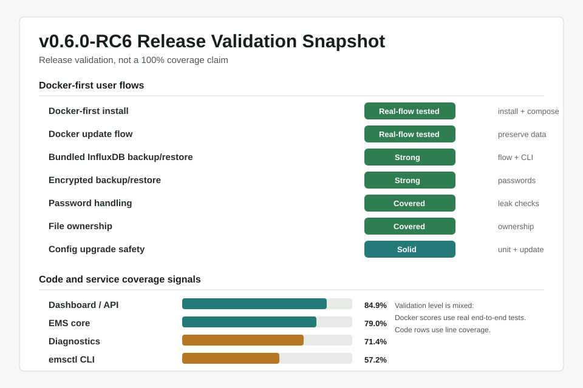

# Release Quality Status

This document tracks the current release-candidate quality status for EMS SolarFlow API Control.

It is not a marketing document. It is a short technical status overview for users and contributors who want to understand how well the current release candidate has been tested.

## Current RC status

`v0.6.0-RC6` is in release-candidate validation. The Docker-first user path is covered by a small set of broad end-to-end and contract checks, while the Python codebase is covered by a larger non-Docker test suite.

The current branch was checked on 2026-06-24. Test collection reports `1110` tests total: `1104` non-Docker tests and `6` Docker-marked tests. A non-Docker coverage run passed with `1101 passed`, `3 skipped`, and `6 deselected`. The Docker-marked E2E suite passed with `6 passed` and `1104 deselected`.

## Quality snapshot

The graphic is a mixed release-validation view, not a pure code-coverage chart. Docker-first rows are based on E2E and contract validation. EMS, Dashboard/API, Diagnostics, and `emsctl` values include Python line coverage from the non-Docker suite.

## Compact test summary

| Metric | Current value | Source |
|---|---:|---|
| Total collected tests | 1110 | `python3 -m pytest --collect-only -q` |
| Docker-marked tests | 6 | `python3 -m pytest --collect-only -q -m docker` |
| Non-Docker tests | 1104 | `python3 -m pytest --collect-only -q -m 'not docker'` |
| Non-Docker suite result | 1101 passed, 3 skipped, 6 deselected | `.venv/bin/python -m pytest -m 'not docker' ...` |
| Docker E2E suite result | 6 passed, 1104 deselected | `.venv/bin/python -m pytest -m docker -q` |
| Overall production coverage | 74.9% | non-Docker coverage JSON |
| EMS core coverage | 79.0% | `ems/`, excluding `ems/history/` |
| Dashboard/API coverage | 84.9% | `dashboard/` |
| Backup/restore core coverage | 92-94% | `ems/backup.py`, `ems/backup_crypto.py` |
| Diagnostics coverage | 71.4% | `ems/diagnostics.py` |
| `emsctl` CLI coverage | 57.2% | `emsctl.py` |

The first coverage attempt inside the restricted sandbox failed only in preview-server tests because local socket creation was blocked. The same non-Docker suite passed when rerun without that sandbox restriction.

## Docker-first validation

Docker-first validation includes real end-user flows, not only isolated unit tests.

Current validation covers:

- fresh Docker-first install
- Docker update flow
- bundled InfluxDB init, sync, and status
- encrypted config backup and restore checks
- encrypted database backup checks
- encrypted bundled InfluxDB backup and restore dry-run checks
- password handling checks
- password leak checks
- file ownership checks after `docker compose exec ems ...` flows
- no Docker socket required in the EMS container
- no Docker CLI required in the EMS container for backup and restore

`emsctl.py` commands executed through `docker compose exec ems ...` drop privileges. This does not mean that every arbitrary command executed through `docker compose exec ems ...` drops privileges.

The Docker E2E count is intentionally small because each test covers a broad installed-system scenario. For release confidence, one full install or update flow can be more useful than many narrow tests that never exercise compose files, bind mounts, entrypoint behavior, or in-container CLI behavior.

## Technical notes

### Test types

| Type | Purpose | Examples |
|---|---|---|
| Unit tests | Validate isolated logic | config upgrade, backup encryption, runtime helpers |
| CLI tests | Validate command behavior and error handling | `emsctl.py backup`, `emsctl.py influx`, diagnostics |
| Integration tests | Validate connected internal flows | dashboard API, analytics providers, config upgrade |
| Docker E2E tests | Validate real Docker-first user flows | install, update, backup/restore, bundled InfluxDB |
| Docs/contract tests | Keep documented commands aligned with tested behavior | Docker docs command coverage |

Line coverage is one useful signal, but it is not the release criterion by itself. Docker setup, compose behavior, shell entrypoints, file ownership, and in-container backup/restore behavior are validated through scenario and contract tests rather than Python line coverage.

Some entry points run through subprocesses during tests, so Python line coverage can under-report exercised behavior. The release decision should consider the test type that matches the risk: write-control math needs deterministic unit/regression checks, while Docker-first setup and backup/restore need installed-system checks.

Lower `emsctl.py` coverage is tracked as a future improvement because the CLI has many subcommands and error branches. Diagnostics coverage can also improve later with more table-driven root-cause cases, but no current release-blocking diagnostics gap is identified by this snapshot.

## Known limitations / caveats

- This snapshot is for `v0.6.0-RC6` and should be regenerated before a stable release.
- The graphic mixes E2E, contract, and line-coverage signals; it must not be read as 100% project coverage.
- Docker E2E tests are broad and valuable, but their count is intentionally low.
- The InfluxDB restore path has strong CLI/unit and dry-run E2E validation; a full live-container restore round trip remains a good stable-release follow-up.
- `emsctl.py` and diagnostics have lower line coverage than the backup, config, InfluxDB, and dashboard areas.
- Automated tests reduce release risk but do not prove that every hardware, firmware, network, and installation variant is covered.

## Stable release checklist

- [ ] Full non-Docker test suite passing
- [ ] Docker-first install E2E passing
- [ ] Docker update E2E passing
- [ ] Encrypted backup/restore E2E passing
- [ ] Bundled InfluxDB backup/restore E2E passing
- [ ] Documentation reviewed for Docker-first users
- [ ] No known release-blocking issues
