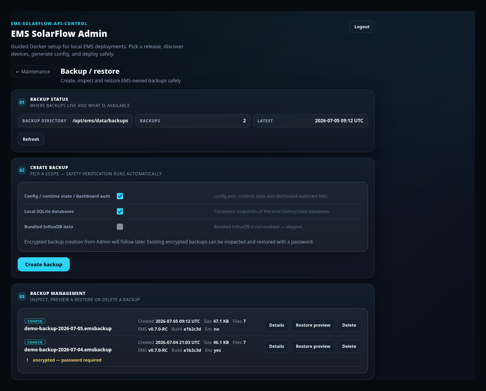

# Backup and restore

## Purpose

Create a snapshot of your installation, inspect what a backup contains, and roll
one back safely.

## When to use this workflow

- Before any change you are unsure about.
- Before an upgrade (Guided Upgrade does this for you, and you should leave it
  enabled).
- To recover after a bad change or a failed upgrade.

## Prerequisites

- An installed EMS and the Admin Console logged in.
- Free disk space under `data/backups/`.
- For an **encrypted** backup: the password it was created with.

## Creating a backup

**Where:** Maintenance → **Backup / restore**.

### 1 — Check the status

**What you see:** *01 Backup status* — the **backup directory**, how many backups
exist, and the **latest** timestamp. **Refresh** re-reads it.

### 2 — Pick a scope

**What you see:** *02 Create backup* — *pick a scope; safety verification runs
automatically.*

| Scope | Contents |
| --- | --- |
| **Config / runtime state / dashboard auth** | `config.json`, runtime state, dashboard auth/cert files |
| **Local SQLite databases** | Consistent snapshots of the local history/state databases |
| **Bundled InfluxDB data** | The bundled analytics time-series database |

Scopes you cannot use are disabled with the reason shown — for example *Bundled
InfluxDB is not enabled — skipped.*

**What you select:** the scopes you want, then **Create backup**.

**What it changes:** a new archive is written under the backup directory.
**Nothing in your running system is modified** — creating a backup is not a
write to config, containers or hardware.

**Expected result:** the new archive appears in *03 Backup management* with its
creation time, size, file count, EMS version and build.

### 3 — Where backups live

Backups are normal **EMS backup archives** under `data/backups/`. They are the
same format the CLI produces — the Admin Console orchestrates, EMS/Core owns the
format.

> **Backups may contain secrets and private energy data.** Copy them somewhere
> safe off this host, and treat them like credentials.

## Inspecting and restoring

### 4 — Inspect a backup

**What you see:** in *03 Backup management*, each backup lists its type
(`CONFIG`, …), name, created time, size, file count, the EMS version and build it
came from, and whether it is encrypted.

**What you select:** **Details**.

**What it changes:** nothing. This is a read.

### 5 — Preview the restore

**What you select:** **Restore preview**.

**What it changes:** **nothing.** Restore is preview-first: the preview reports
what would be replaced and runs the compatibility checks *before* you can
confirm.

**Expected result:** a clear statement of what the restore would do.

**If it differs:** an encrypted backup is marked *encrypted — password required*
and needs its password to be inspected or restored. Without it, the archive
cannot be read — there is no recovery path for a lost backup password.

### 6 — Confirm the restore

**What you select:** confirm the previewed restore.

**What it changes:** the previewed contents are written back. **Every restore
creates a rollback backup first**, so the state you restored *over* is still
recoverable.

**Expected result:** the restored config/state is in place. A config restore can
replace the dashboard auth files, so **you may need to log in again** after a
restart.

**If it differs:** if the preview and the current state no longer agree, the
restore is refused rather than applied to a state you did not review.

## No hidden EMS downgrade

**A restore never silently changes your EMS image.** EMS version downgrade, image
switching and container restart are intentionally **not** performed by a restore.

If you need to go back to an older EMS version as well, that is a separate,
deliberate operation — use the CLI for controlled offline operations. Guided
Upgrade only ever moves forward; see
[Guided Upgrade](guided-upgrade.md#recovery-or-next-steps).

## Deleting a backup

**Delete** removes an archive permanently. There is no undo, and a deleted backup
cannot be used for a rollback later. Keep at least one known-good backup.

## Encryption — what is available today

- **Existing encrypted backups can be inspected and restored** with their
  password.
- **Creating an encrypted backup from the Admin Console is not available yet.**
  The panel states this: *"Encrypted backup creation from Admin will follow
  later."*

To create an encrypted backup today, use the CLI — see
[Backup/restore internals](../../technical/backup-restore.md).

> This page documents what the current buttons do. Anything not listed here as
> available is future work, not a hidden feature.

## Rollback and recovery

| Situation | What to use |
| --- | --- |
| A config change went wrong | Restore the config backup made before the change |
| An upgrade misbehaves | Restore the backup the upgrade created (leave *Create backup* enabled so it exists) |
| An upgrade failed mid-way | **Workflow recovery** first — Resume, or Return to running build. See [Diagnostics and recovery](diagnostics-recovery.md) |
| A workflow was abandoned | **Workflow recovery**; it never deletes a file it cannot prove it owns |

**Rollback backups** are made automatically by restores and by config applies, so
the state you replaced is recoverable even when you did not think to save it.

## What happens in the background

- Backup and restore semantics are owned by **EMS/Core**, not by the Admin
  Console. The console orchestrates and shows progress; the archive format,
  verification and restore rules come from the same implementation the CLI uses.
- Safety verification runs automatically on creation.
- Restore compatibility is checked against the running system before you can
  confirm.

## Warnings and common problems

| Symptom | Meaning | What to do |
| --- | --- | --- |
| *encrypted — password required* | The archive is encrypted | Supply its password. A lost password cannot be recovered |
| Restore refused after preview | State changed since the preview | Preview again and review |
| Logged out after a config restore | Auth files were part of the restore | Log in with the password from the restored backup |
| Backup scope greyed out | That data source is not enabled | Expected — e.g. bundled InfluxDB is off |
| Disk full during backup | No space under `data/backups/` | Free space or delete an old archive |

## Recovery or next steps

- Failed workflow → [Diagnostics and recovery](diagnostics-recovery.md)
- Upgrade behaviour → [Guided Upgrade](guided-upgrade.md)
- Backup from the dashboard →
  [Dashboard diagnostics](../dashboard/diagnostics.md#maintenance-tab)
- CLI and full format detail →
  [Admin Console: Backup / restore](../admin-backup-restore.md) ·
  [Backup/restore internals](../../technical/backup-restore.md)
