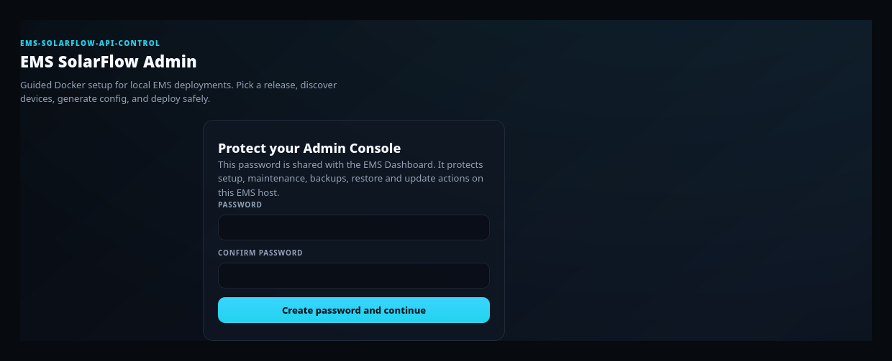
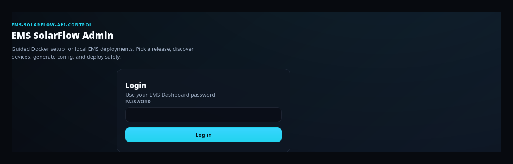
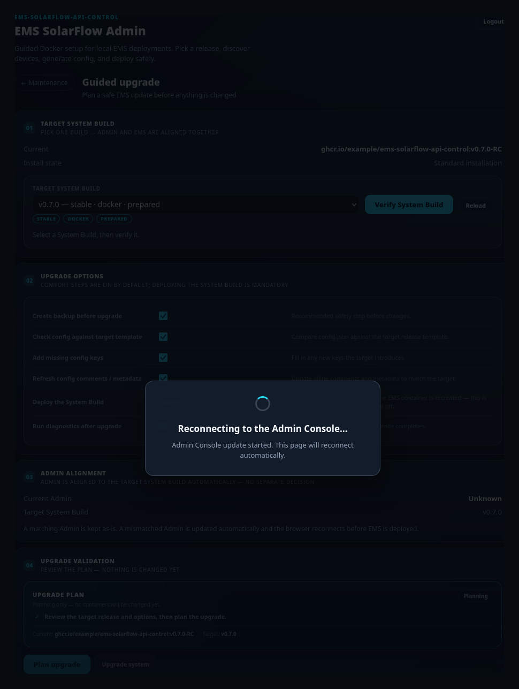

# First start and login

## Purpose

Get from a freshly installed Admin Console to the task-selection page, and know
what the session, reconnect and logout behaviour mean.

## When to use this workflow

- The very first time you open the Admin Console on a host.
- Any later login.
- When the browser suddenly shows a login screen or a reconnect overlay and you
  want to know whether something broke.

## Prerequisites

- The Admin Console container is installed and running. See
  [Admin Console](../admin-console.md#start) for the install command.
- A browser on the same machine or the same trusted LAN.
- Nothing else: no EMS container, no `config/config.json` and no password are
  needed yet.

## Step-by-step instructions

### 1 — Open the console

Open:

```text
http://127.0.0.1:8090
```

From another device on your LAN, use `http://<host-ip>:8090` (host networking is
the default).

**Expected result:** the page loads and shows either the password-creation card,
the login card, or the task selection if your session is still valid.

**If it differs:** nothing loads at all → the container is not running. Check
`docker compose -f docker-compose.admin.yml ps` and the logs. A certificate
warning means you opened the optional HTTPS port `8091` instead — see
[Optional HTTPS](../admin-console.md#optional-https).

### 2 — Create the password (first start only)



**What you see:** *Protect your Admin Console*, with **Password** and **Confirm
password**.

**What you enter:** a password you choose. There is no default and no recovery
question.

**What it changes:** the password is written to `config/dashboard-auth.json` on
the EMS host. This is a **shared** secret: the same password later unlocks the
EMS Dashboard's protected areas.

**Expected result:** you are logged in and land on the task selection.

**If it differs:** *Passwords do not match* → retype both fields. *Password is
already configured. Please log in.* → someone (or an earlier attempt) already
created it; use the login card instead.

> The first browser to reach a console with no password set is the one that
> creates it. On an untrusted LAN, create the password immediately after install.

### 3 — Log in



**What you see:** *Login* — *Use your EMS Dashboard password.*

**What you enter:** the shared password from step 2.

**What it changes:** it starts a session. No configuration is touched.

**Expected result:** the task selection appears.

**If it differs:** *Password file needs repair* means
`config/dashboard-auth.json` exists but cannot be read. Repair or remove that
file on the EMS host, then reload. The console will not guess and will not
overwrite it for you.

### 4 — Pick a task


**What you see:** a *Recommended:* banner naming the flow that fits your current
install state and why, then **Guided setup** and **Maintenance**.

**What you select:** the recommended flow, unless you deliberately want the
other one.

**What it changes:** nothing yet. This only opens a workflow.

**Expected result:**

- [Guided setup](guided-setup.md) — the five-step install wizard.
- [Maintenance](maintenance.md) — the hub with Guided upgrade, Manual
  configuration and Backup / restore.

**If it differs:** choosing **Guided setup** while an installation already exists
asks for an explicit confirmation before anything can be replaced. Cancel it if
you only meant to change a setting — use Maintenance for that.

## What happens in the background

- The console reads the install state (is there a `config/config.json`, a
  `docker-compose.yml`, a running EMS container?) and turns it into the
  recommendation. It never starts a flow for you.
- Authentication is server-side. Hiding a button in the browser is never what
  protects an action; the server checks the session and a CSRF token on every
  change.
- No config, runtime state or container is touched by logging in.

## Session expiry, reconnect and logout

These three look similar in the browser and mean very different things.

| What you see | What it means | What to do |
| --- | --- | --- |
| The login card comes back | Your session expired or you logged out | Log in again. Nothing was lost — running workflows are stored on the server, not in the tab. |
| A full-screen **reconnect overlay** | The Admin Console container itself is being replaced | Wait. The page reconnects on its own and the workflow continues. |
| A progress box *inside* a workflow panel | A normal workflow step is running | Wait for that step. The rest of the console stays usable. |

### The reconnect overlay



**What you see:** a full-screen overlay — *Admin Console update started. This page
will reconnect automatically.*

**Why:** during a [Guided Upgrade](guided-upgrade.md), Admin and EMS are aligned
to the same System Build. If the Admin has to change, the container serving your
page is replaced. The overlay is the console telling you it is coming back.

**What it changes:** the Admin container is recreated on the target image. Your
EMS, config and data are untouched at this point — the backup and preflight
already ran under the old Admin.

**Expected result:** the page reconnects by itself and the upgrade continues from
where it stopped. Completed steps are not repeated.

**If it differs:** if you are asked to log in again, use the same password — this
is normal. If the page does not come back after a few minutes, the new Admin
container may have failed to start:

```bash
docker compose -f docker-compose.admin.yml logs
docker compose -f docker-compose.admin.yml up -d
```

> The overlay is **global** — it covers the whole console because the console
> itself is being replaced. A workflow's own progress box is **local** and never
> takes over the screen. If the whole screen is covered, wait; do not start
> anything else.

### Logging out and returning safely

**Logout** (top right) ends the session only. It does not cancel a workflow, roll
anything back, or stop a running upgrade — server-side work keeps running and you
can log back in to watch it.

To leave a workflow without ending it, use the **← Back** / **← Maintenance**
links in the panel header. They return you to the task selection or the
Maintenance hub while the workflow stays exactly as it was.

To *end* a workflow deliberately, use its own action — **Restart setup** /
**Discard setup** in Guided Setup, **Cancel upgrade** in Guided Upgrade. Those are
described in [Guided Setup](guided-setup.md#warnings-and-common-problems) and
[Guided Upgrade](guided-upgrade.md#recovery-or-next-steps).

## Warnings and common problems

- **Do not expose ports 8090/8091 to the internet.** A deployment-capable Admin
  container controls the host Docker engine. Trusted local machine or trusted LAN
  only — see [Safety](../admin-console.md#safety).
- **Two browser windows are allowed, one workflow is current.** The stale window
  says its session was replaced and offers to open the current one or discard its
  own draft. It never silently acts on the newer workflow.
- **Bridge mode makes discovery less reliable.** If you installed with
  `--bridge`, a LAN scan may only see Docker networks; enter your LAN CIDR
  manually.

## Recovery or next steps

- First install → [Guided Setup](guided-setup.md)
- Existing install → [Maintenance](maintenance.md)
- Locked out because `config/dashboard-auth.json` is unreadable → repair or
  remove that file on the host and reload. You can also set a new password from
  the CLI with `python3 emsctl.py dashboard set-password`.
