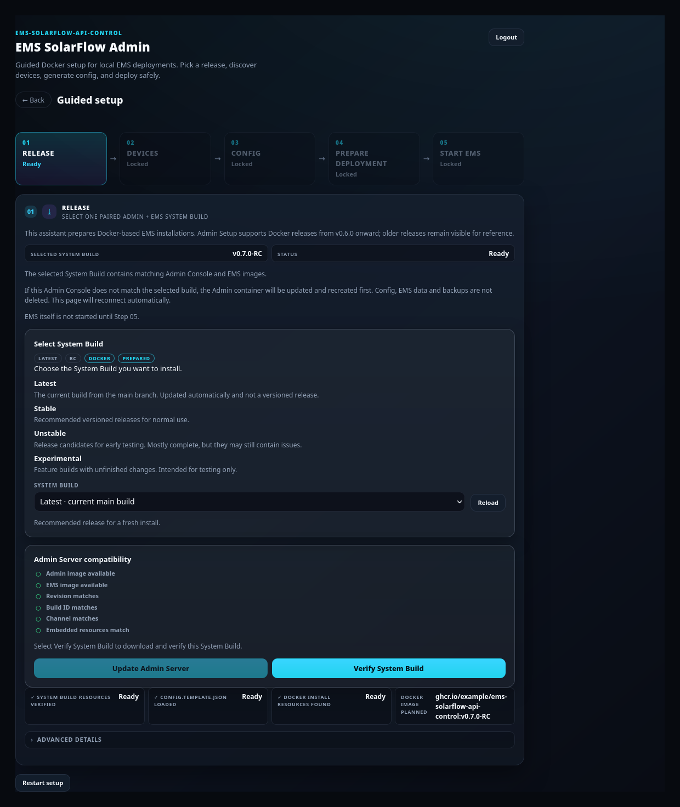
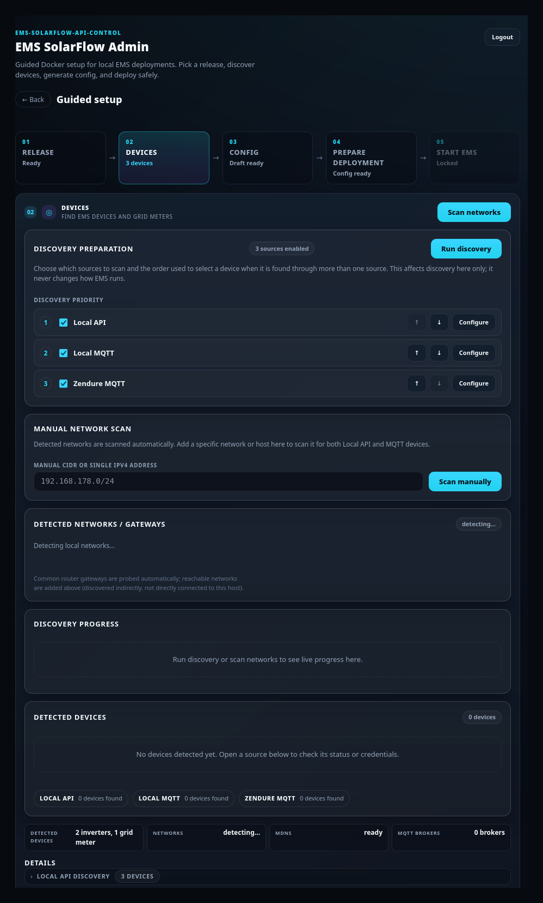
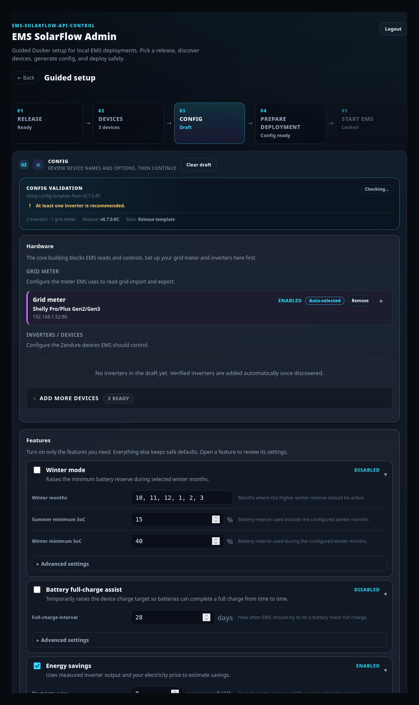
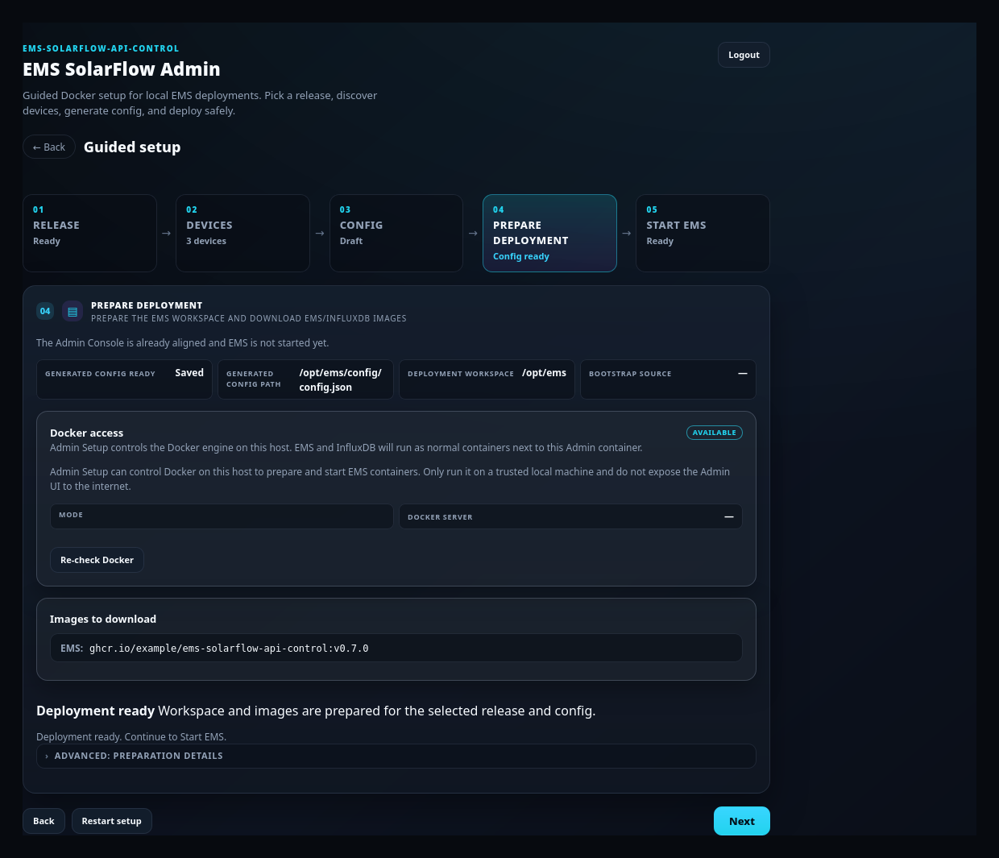
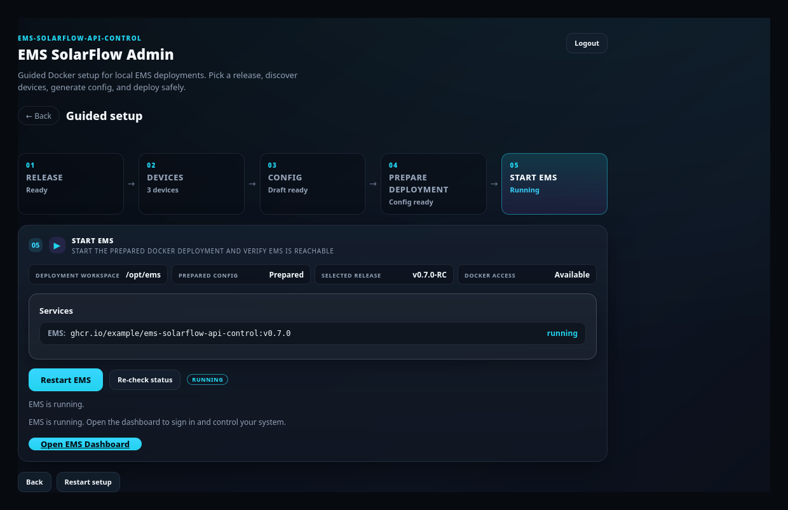

# Guided Setup — install a new system

## Purpose

Install EMS from nothing: pick a paired Admin + EMS build, find your hardware,
generate `config/config.json`, deploy the containers, and start EMS.

## When to use this workflow

- First installation on this host.
- A deliberate clean reinstall.

**Not** for changing an installed system. To update a version, add a device or
edit a setting, use [Maintenance](maintenance.md) — it changes less and previews
everything.

## Prerequisites

- Admin Console running and logged in — see [First start](first-start.md).
- Docker available to the Admin container.
- Your inverters powered on and on the same LAN (or reachable through a broker,
  for MQTT).
- A grid meter (Shelly, everHome EcoTracker, Tasmota, or a Zendure meter). See
  [Supported setups](../supported-setups.md).
- Internet access once, to download the images.

## The five steps

Guided Setup runs as a stepper. Steps 02–05 stay **Locked** until the step
before them is genuinely complete — that lock is enforced by the server, not by
the browser.

```text
01 Release → 02 Devices → 03 Config → 04 Prepare deployment → 05 Start EMS
```

### 01 — Select and verify the System Build



**What you see:** *Select System Build* with four channels — **Latest**,
**Stable**, **Unstable**, **Experimental** — a **SYSTEM BUILD** dropdown, and an
*Admin Server compatibility* checklist.

**What you select:** one build. **Stable** is the normal choice.

**What it changes:** *selecting downloads nothing.* You can browse builds without
contacting the container registry. Only **Verify System Build** downloads.

**Expected result:** after **Verify System Build**, the compatibility checklist
turns green (Admin image available, EMS image available, revision, build ID,
channel, embedded resources) and **Continue** opens step 02.

**If it differs:**

- *Update Admin Server* appears instead of *Continue* → the running Admin does
  not match the build you picked. Run it; the page reconnects on its own, then
  continue. See [the reconnect overlay](first-start.md#the-reconnect-overlay).
- *GitHub Container Registry rate limit reached* → nothing was changed. Wait,
  then **Verify System Build** again.
- You change the build afterwards → the previous verification is cleared on
  purpose. Verify the new one once.

> **Selecting is not verifying.** A build marked *Resources cached* or *prepared*
> only means files are already on disk. That is not a verified pair.

### 02 — Discover devices



**What you see:** *Discovery preparation* with a **Discovery priority** list
(Local API, Local MQTT, Zendure MQTT), a **Manual network scan** box, detected
networks, and a *Detected devices* list.

**What you select:** which sources to scan, and their order. Then **Run
discovery**.

**What it changes:** nothing on your hardware and nothing in any config. This is
a read-only scan. Priority affects *discovery only* — it never changes how EMS
runs.

**Expected result:** your inverters and grid meter appear. One physical device
found over several connections is listed **once**, on the highest-priority
connection that can still control it.

**If it differs:**

- **No devices found** → open a source to see its status. In bridge mode, enter
  your LAN CIDR under *Manual network scan*. Check that the inverter's local API
  is enabled.
- **Looks like duplicates** → it usually is not. See
  [Device management](device-management.md#one-inverter-several-connections).
- **A Zendure MQTT device is missing** → add it manually in step 03; see
  [MQTT](mqtt.md).

> Priority only moves a device on its own when the new connection **keeps output
> control**. If it cannot write, the device is not switched silently — step 03
> asks you, naming both connections.

### 03 — Review and complete the config



**What you see:** *Hardware* (grid meter, inverters), *Features*, *Advanced /
System settings*, and a *Config validation* box.

**What you enter:**

- **Grid meter** — type and address. Only one grid meter can be active.
- **Inverters** — each gets a short EMS name (`INV_1`, `INV_2`, …). This is the
  identifier used in `config.json`, logs and the dashboard. Edit it now if you
  want a different one.
- **Features** — winter mode, energy savings, full-charge assist and so on.

**What it changes:** still nothing on disk. This builds a draft, and the
validation box is a **preview** of it.

**Expected result:** validation shows no errors and **Continue** is enabled.

**If it differs:**

- **Continue is disabled after an edit** → this is intended. Any change to the
  draft invalidates the preview; wait for it to refresh. What you saw previewed
  is exactly what gets applied.
- **A connection question appears** naming two connections and what happens to
  output control → answer it. Nothing changes until you do.
- **Output control is not available for a device** → it follows the model and the
  write route, not a checkbox. See
  [Device management](device-management.md#why-a-device-is-read-only).

### 04 — Prepare the deployment



**What you see:** the deployment workspace, the generated config path, *Images to
download* and a *Progress* box.

**What you select:** **Prepare deployment**.

**What it changes:** **this is the first write.** The Admin Console writes
`config/config.json` (backing up any existing config first) and prepares the
Compose file plus the EMS image and resources. `data/` and your runtime databases
are not touched.

**Expected result:** the generated config is saved and the deployment is
prepared; step 05 unlocks.

**If it differs:** *conflict* → `config/config.json` changed after you generated
the draft (Maintenance, a restore or another session edited it). Nothing was
overwritten. Reopen **03 Config**, review the current configuration and generate
again.

### 05 — Start EMS



**What you see:** the deployment workspace, prepared config, selected release,
Docker access, and a *Services* list.

**What you select:** **Start EMS** (or **Restart EMS**).

**What it changes:** the EMS container is created and started with your config.
EMS begins reading your meter and devices.

**Expected result:** the service shows **running**, the status reads *EMS is
running*, and **Open EMS Dashboard** appears. It points at
`http://<host>:8080`.

**If it differs:** use **Re-check status**. If EMS does not come up, run
diagnostics — see [Diagnostics and recovery](diagnostics-recovery.md).

## What happens in the background

- Steps 01–03 are read-and-draft only. The first disk write is **04 Prepare
  deployment**.
- Every apply is bound to the exact preview you saw and to the exact
  `config/config.json` that existed when the preview was made. If either moved,
  the apply is refused rather than guessing.
- Device identity comes from the backend (trusted serial plus scoped route),
  never from what the browser displays.
- Discovery, verification and preparation are tracked as one server-side setup
  workflow. Closing the tab does not cancel it.

## Expected result

- `config/config.json` written in the standard layout.
- `docker-compose.yml` prepared with the verified EMS image.
- EMS container running and the dashboard reachable on port 8080.

## Warnings and common problems

| Symptom | Meaning | What to do |
| --- | --- | --- |
| No devices found | Scan could not reach them | Add your LAN CIDR under *Manual network scan*; check the inverter's local API; in bridge mode discovery is less reliable |
| Two entries look like the same inverter | Usually two *connections*, not two devices | See [Device management](device-management.md#one-inverter-several-connections) |
| Output control unavailable | Model or write route not proven | [Why a device is read-only](device-management.md#why-a-device-is-read-only) |
| *Stale device plan* | Discovery found different devices since you answered | Re-answer the connection question |
| Config preview out of date | You edited the draft | Wait for the preview to refresh; Continue re-enables |
| Prepare stops with a conflict | `config/config.json` changed meanwhile | Reopen 03 Config, review, generate again |
| Full-screen reconnect | The Admin is being replaced | Wait — [reconnect overlay](first-start.md#the-reconnect-overlay) |
| Rate limit on download | GHCR throttled you | Wait, then **Verify System Build** again. Nothing was changed |

## Recovery or next steps

**To stop a setup:** **Restart setup** / **Discard setup** cancels the pending
System Build transition and deletes the generated config and deployment marker it
created. Your installed EMS, live config, data, containers and backups are left
alone.

A discard is **refused** while an operation the setup started is still running
(Admin update, resource verification, config apply, deployment, EMS start). It
tells you which one; wait and discard afterwards. Nothing is half-discarded.

**After a successful setup:**

1. Work through the [first-run checklist](../../first-run-checklist.md).
2. Read [Safety](../safety.md) before enabling live hardware writes.
3. Open the [EMS Dashboard guides](../dashboard/index.md).
4. Use [Maintenance](maintenance.md) for everything from here on.

**Full behavioural reference**, including every refusal and ownership rule:
[Admin Console: Set up a new system](../admin-setup.md).
