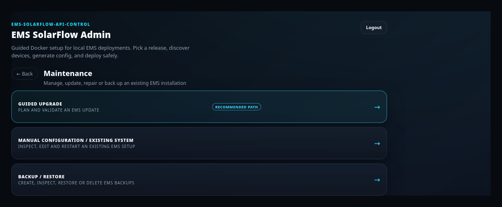
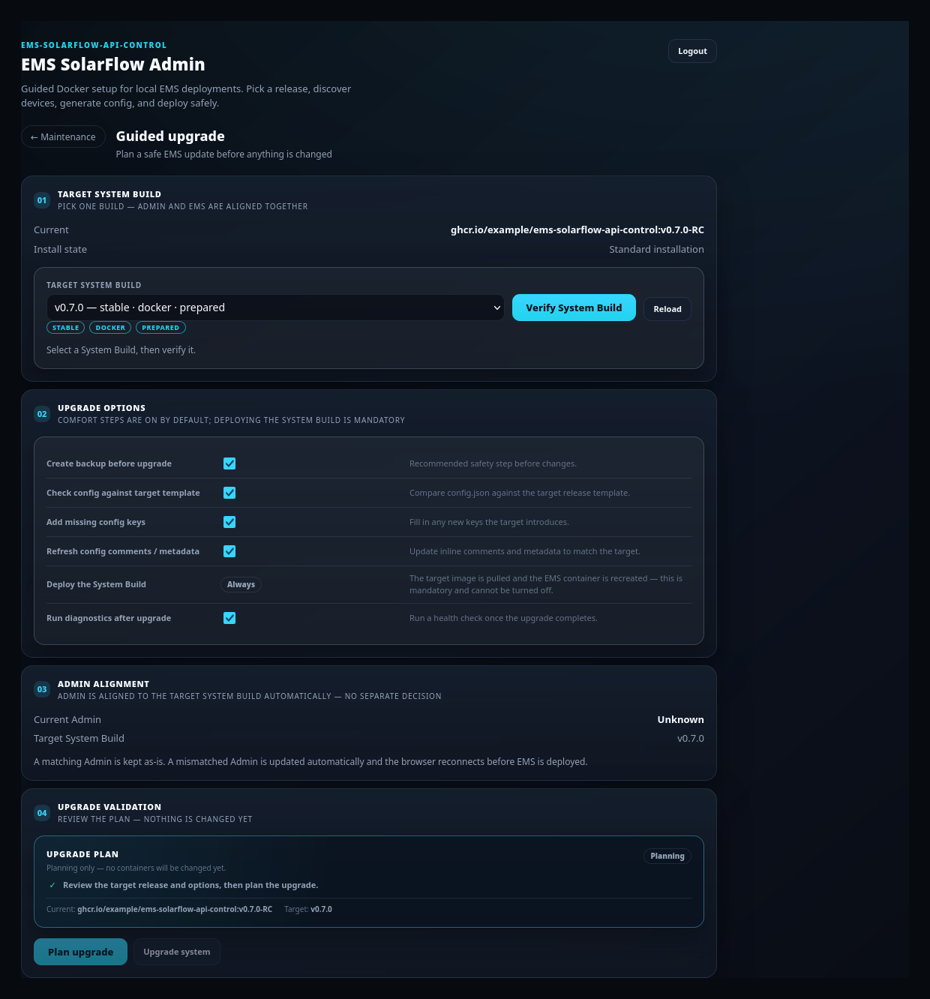
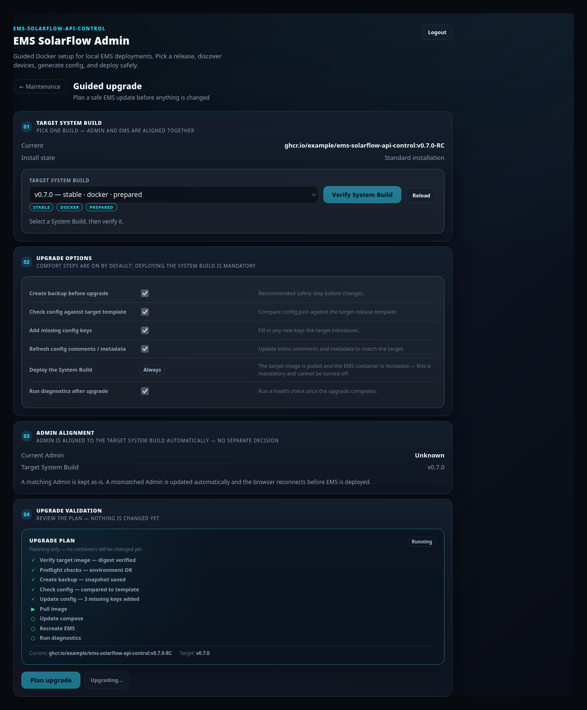
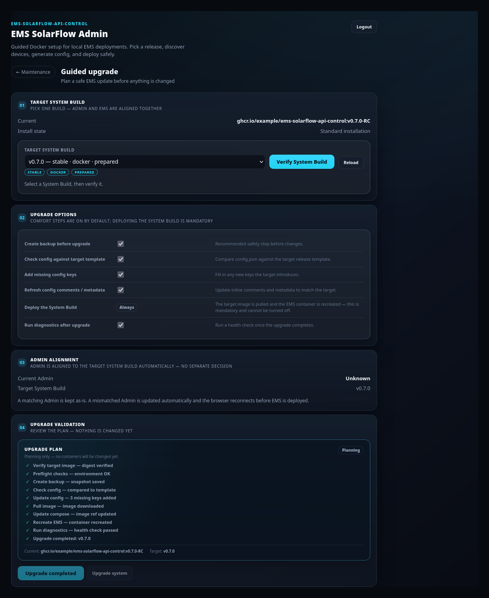
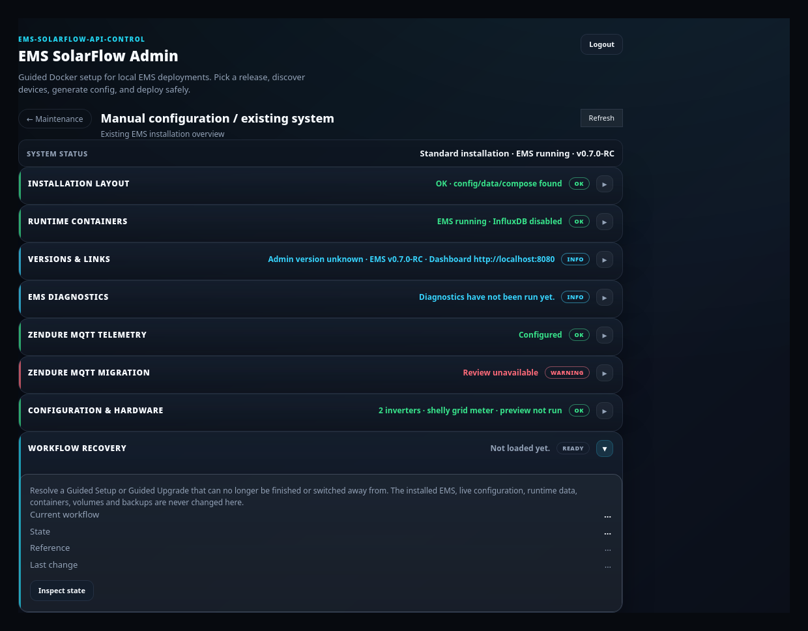

# Guided Upgrade — update an installed system

## Purpose

Move an installed EMS to a newer version safely: verify a paired Admin + EMS
build, back up first, migrate config, recreate the EMS container, and health-check
the result.

## When to use this workflow

- A new release is out and you want it.
- You need a fix that landed in a later build.

**Not** for going backwards. Guided Upgrade only moves **forward**. Downgrades
belong to [Backup and restore](backup-restore.md).

## Prerequisites

- An installed, running EMS (Maintenance is the recommended flow on the start
  page).
- Disk space for a backup and one more image.
- Internet access, unless the target image is already on disk.
- A few minutes without interrupting the host.

## Step-by-step instructions

### 1 — Open Maintenance → Guided upgrade



**What you see:** the Maintenance hub. **Guided upgrade** carries the
*Recommended path* badge.

**What it changes:** nothing. It opens the panel.

### 2 — Review the current state and pick the target



**What you see:**

- **01 Target System Build** — your **Current** image and install state, and a
  **TARGET SYSTEM BUILD** dropdown grouped Latest / Stable / Unstable /
  Experimental.
- **02 Upgrade options** — see the table below.
- **03 Admin alignment** — current Admin and target build.
- **04 Upgrade validation** — empty until you plan.

**What you select:** one target build, then **Verify System Build**.

**What it changes:** selecting downloads nothing. **Verify System Build**
downloads (or reuses) the Admin and EMS images, verifies the exact pair, and
returns a **selection fingerprint** of the resolved pair. The plan you build next
is bound to that fingerprint.

**Expected result:** the build verifies and the plan can be built.

**If it differs:** *Resources cached* is not verified — press Verify. On a GHCR
rate limit nothing was changed; wait and Verify again. The button reads
*Verifying…* with a spinner while it works; the first run can take a while.

### 3 — Check the upgrade options

| Option | Default | What it does |
| --- | --- | --- |
| Create backup before upgrade | **On** | A verified backup before anything changes |
| Check config against target template | On | Compares `config.json` with the target's template |
| Add missing config keys | On | Fills in keys the new version introduces |
| Refresh config comments / metadata | On | Updates inline comments to match the target |
| Deploy the System Build | **Always** | Mandatory; cannot be turned off |
| Run diagnostics after upgrade | On | Health check once the upgrade completes |

**Leave *Create backup* enabled.** It is the thing that lets you go back. It runs
under the Admin that is running *now*, before any Admin alignment.

### 4 — Review the plan

**What you see, in step 04:** the ordered pipeline. Nothing has changed yet — the
box says *Planning only — no containers will be changed yet.*

1. Resolve the target and re-check the verified fingerprint.
2. Inspect the current installation.
3. Review the Zendure MQTT migration, including devices that would lose control.
4. Create and verify a backup.
5. Apply the reviewed Zendure MQTT migration.
6. Run the generic config upgrade.
7. Validate the final config with target-compatible EMS code.
8. Align the Admin to the target build, reconnect, verify its identity.
9. Prepare the target EMS image and resources.
10. Recreate EMS.
11. Health check.
12. Diagnostics.
13. Mark the Known-Good state.

**MQTT migration:** if you run Zendure MQTT devices, step 3 names which devices
the migration affects and which would **lose control**. Read it before
confirming. Details: [MQTT](mqtt.md#zendure-mqtt-migration-during-an-upgrade).

**Config changes:** steps 6–7 add missing keys and refresh comments, then
validate the result with the *target* version's code — so a config the new EMS
would reject is caught before the container is recreated.

**Container recreation:** step 10 recreates the **EMS container only**. Volumes,
`data/`, backups and your history databases are not removed. Guided Upgrade never
deletes containers, volumes or data.

### 5 — Start the upgrade and follow progress



**What you select:** **Upgrade system**, and confirm once. There is no second,
Admin-specific confirmation.

**What it changes:** everything in the plan, in order.

**Expected result:** the live tracker highlights the current step, pulses it and
labels it *Working…*. Completed steps get a green check.

**If it differs:** a long step (image download, health check) stays visibly
active rather than frozen — that is the pulse doing its job.

> Immediately before any change, the target is re-resolved and the fingerprint
> re-checked. If the image moved since you verified — a mutable `latest` tag
> re-pushed to a new digest — the upgrade is **rejected before** preflight,
> backup, migration or deployment. Verify again.

### 6 — Handle the Admin reconnect


**What you see:** a full-screen overlay if the Admin itself must change.

**What it changes:** the Admin container is recreated on the target image.

**Expected result:** the page reconnects on its own and the upgrade resumes from
the saved transition. The completed backup and preflight are **not** repeated.

**If it differs:** you may be asked to log in again — normal, same password. If
the console does not return:

```bash
docker compose -f docker-compose.admin.yml logs
docker compose -f docker-compose.admin.yml up -d
```

### 7 — Confirm completion



**What you see:** every step green, and the health check and diagnostics results.

**Expected result:** EMS runs the new build; the Known-Good state is marked.

**Verify for yourself:** the Maintenance overview shows the installed release, and
the [EMS Dashboard](../dashboard/index.md) should show live telemetry again.

## What happens in the background

- **Admin and EMS are one build.** You make one version decision. Admin alignment
  is an automatic stage, not a separate choice — a matching Admin is kept as-is, a
  stale Compose tag is corrected, a mismatched Admin is replaced.
- **The tag names the build; the digest is what runs.** After verification the
  release tag is only a label. The EMS image is pulled and written into
  `docker-compose.yml` by its exact verified digest
  (`…@sha256:…`), so a later registry change to that tag cannot alter your
  installed EMS or what a restart runs.
- **A running EMS container is the authoritative baseline.** If its image identity
  cannot be read, the installed release is shown as **unknown** with a warning
  rather than guessing from Compose.
- **A merely prepared release is never shown as installed**, so downloading a
  newer build does not make a real upgrade look like a downgrade.
- **The backup and preflight run under the current Admin**, before alignment. The
  target Admin is never assumed first.

## Expected result

- EMS running the target build, by digest.
- A verified backup from before the change.
- Config migrated and validated against the target.
- `data/`, volumes, backups and history unchanged.

## Warnings and common problems

| Symptom | Meaning | What to do |
| --- | --- | --- |
| Upgrade rejected right at the start | The resolved pair moved since Verify | **Verify System Build** again, then re-plan |
| GHCR rate limit | Registry throttled you | Nothing changed; wait and retry. The verified target stays selected |
| Pull failed (network / digest missing) | Typed failure preserved | **No Compose change was written and EMS was not recreated.** Fix connectivity, retry |
| Asked to log in mid-upgrade | The Admin was replaced | Same password; the upgrade resumes |
| A device would lose control | MQTT migration review says so | Decide before confirming — see [MQTT](mqtt.md) |
| Setup files still present | An unfinished Guided Setup exists | **Discard setup** first; an upgrade never deploys over a setup |
| *failed_recoverable* | A step failed, state is recoverable | See below |

## Recovery or next steps



A failed upgrade does not throw the workflow away. **Workflow recovery** under
Maintenance offers:

- **Resume** — retry from the exact point it is safe to retry from.
- **Return to running build** — put the Admin Console back on the build your EMS
  is actually running. (This is offered for an upgrade; deliberately *not* during
  a setup.)
- **Cancel upgrade** — ends the upgrade only. Your running system, live config and
  last known-good build stay exactly as they are.

**Retry vs recovery:** retry the same step when the cause was transient (network,
rate limit). Use recovery when the state itself is inconsistent — for example the
Admin was replaced but the transition did not finish.

**Rolling back:** if the new version misbehaves, restore the backup the upgrade
made. Restore does **not** silently downgrade the EMS image — see
[Backup and restore](backup-restore.md#no-hidden-ems-downgrade).

**Full behavioural reference:** [Admin Maintenance](../admin-maintenance.md).
