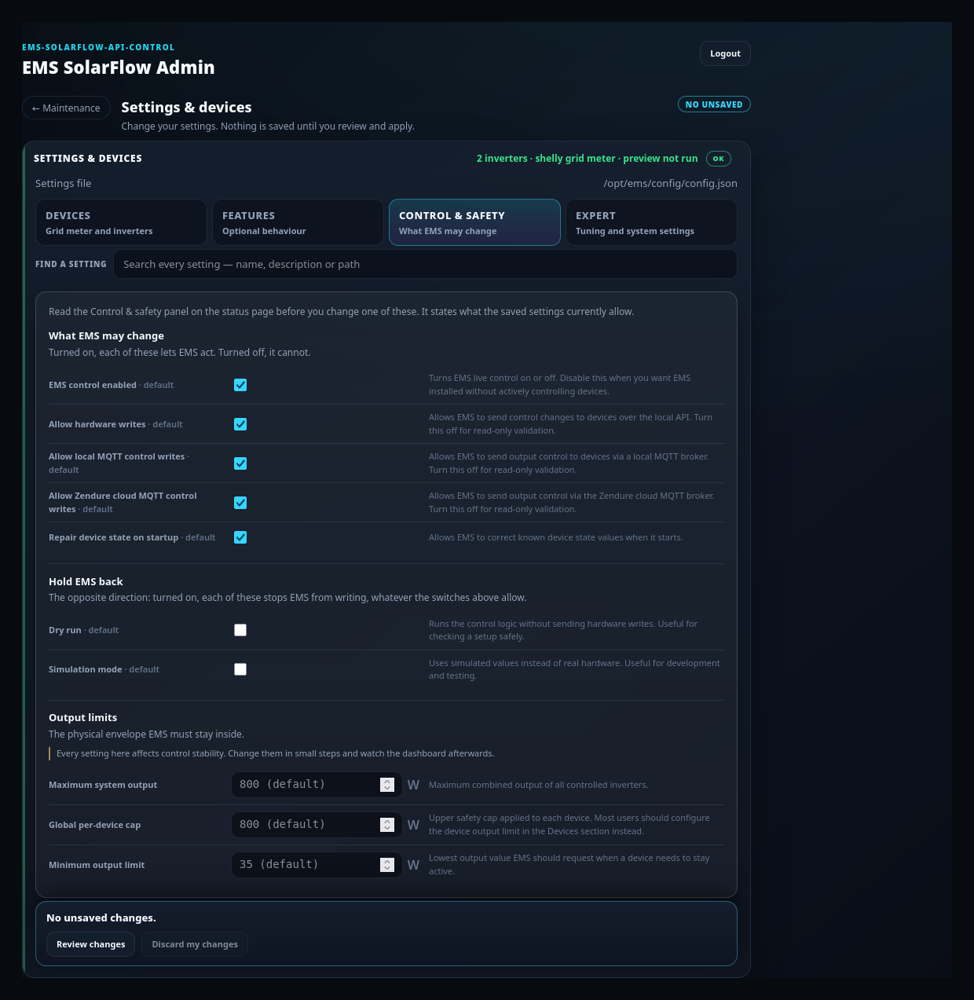

# Maintenance — manage an installed system

## Purpose

Inspect, change, update, back up and repair an EMS installation that already
exists, changing as little as possible each time.

## When to use this workflow

Any time after the first install: version updates, config and device changes,
diagnostics, backups, restore, and recovery from an interrupted workflow.

Use [Guided Setup](guided-setup.md) only for a first install or a deliberate
clean reinstall.

## Prerequisites

- An installed EMS (`config/config.json` and `docker-compose.yml` present).
- Admin Console logged in — see [First start](first-start.md).

## The four paths

| Card | Use it for | Guide |
| --- | --- | --- |
| **Guided upgrade** | Move EMS + Admin to a newer System Build | [Guided Upgrade](guided-upgrade.md) |
| **System status** | See what is installed and running, run checks, fix a stuck workflow | This page |
| **Settings & devices** | Change devices, features and the safety switches | This page |
| **Backup / restore** | Create, inspect, restore or delete backups | [Backup and restore](backup-restore.md) |

Each card carries the one fact that decides whether to open it: whether EMS is
running, whether you have unsaved changes, and when the last backup was made.
The unsaved marker appears only once you have actually edited something. A card
whose state could not be read says so rather than showing an all-clear.

One card is marked as the place to start, and which one depends on what the hub
found. An installation that is incomplete, stopped, unreadable or carrying a
warning points at **System status**; only a healthy, running installation with
nothing to report points at **Guided upgrade**.

Use **← Maintenance** in a page header to return to this hub without ending
anything.

> Reading and changing are two pages. The status page never edits anything, and
> the settings page never restarts anything. The older address
> `#maintenance-manual` still opens the status page, so existing links and
> bookmarks keep working.

Every maintenance page has its own address and can be bookmarked, including a
single settings tab (`#maintenance-settings-safety`). Opening such a bookmark
goes straight to that page. Guided Setup deliberately does not open from an
address: an unfinished setup resumes from what the server recorded, never from
what a browser tab remembered.

## What each area changes

Read this before clicking something you are unsure about.

| Area | Read-only | Writes config | Recreates containers |
| --- | --- | --- | --- |
| Control & safety | Yes | No | No |
| System status (files, services, version) | Yes | No | No |
| Restart EMS now (EMS services) | No | No | Yes |
| Something looks wrong? | Yes | No | No |
| Device telemetry | Yes | No | No |
| Settings & devices — editing and searching | Yes | No | No |
| Settings & devices — preview | Yes | No | No |
| Settings & devices — apply | No | Yes, after preview | Optional |
| Older MQTT device setup — review | Yes | No | No |
| Older MQTT device setup — apply | No | Yes | No |
| Guided upgrade | No | Yes | Yes |
| Create backup | Yes | No | No |
| Restore preview | Yes | No | No |
| Restore (confirmed) | No | Yes | Possibly |
| Unfinished setup or update | Depends on the action chosen | Possibly | Possibly |

Nothing in the write rows happens without a preview and an explicit
confirmation.

## System status — read-only

**What you see:** first the answer to the page's own question — what needs your
attention, worst first, each entry with a next step. Then a **CONTROL & SAFETY**
panel, then a **SYSTEM STATUS** line (install kind and EMS state), then collapsed
cards, each with a one-line summary and an OK / INFO / ACTION / WARNING pill:

- **EMS services** — what is running, whether InfluxDB is enabled, and whether
  the running EMS already has the settings as they are saved. If that cannot be
  determined it says so rather than guessing.
- **Something looks wrong?** — health checks.
- **Files on this machine** — where config, data and compose live.
- **Version & dashboard** — Admin and EMS versions (the exact image tags), dashboard URL.
- **Device telemetry** — MQTT brokers and devices.
- **Older MQTT device setup** — pending migration review.
- **Unfinished setup or update** — stuck or failed workflow state.

The last three exist for a system that needs repair, so the screenshot above —
a healthy installation — shows only the first five. They appear when they have
something to report: a configured MQTT broker or device, a pending migration, a
workflow that cannot finish. A card whose state could **not** be read stays on
the page: hidden always means "we asked and the answer was no", never "we could
not tell".

**What it changes:** nothing. Opening and closing cards is display only. The
one action on this page is **Restart EMS now**, in *EMS services*.

### What needs your attention

The list at the top of the page is the ranked answer, not a second opinion: it
is built from the same read-only overview the cards below show, and it says
"nothing needs your attention" when that is what the overview proves. Each entry
names what is wrong, why it matters and what to do next.

Errors come before warnings, warnings before notes. One entry is easy to miss
and worth knowing about: **saved settings are newer than the running EMS**.
Saving settings writes the file; EMS reads it when it starts. Until you restart
EMS, part of what you saved is not in effect.

If the overview itself cannot be read, the list says so. It never reports a
healthy system on missing information.

### Control & safety

The panel at the top answers the one question this page exists for: **may EMS
change your inverters right now?**

- A sentence naming the effective state — allowed to change your inverters, only
  calculating, running on simulated data, switched off, or nothing may write.
- One row per connection (**Local connection**, **Your own MQTT broker**,
  **Zendure cloud**) saying whether it is allowed and how many devices it covers.
- The maximum output and charge window your devices are held to.
- The standing warning that only one controller may change inverter output.
- Whether EMS may restore device settings it expects, such as the minimum charge.
- **Change these settings →**, which opens the settings page on the matching tab.

Two limits are stated on the panel itself and are not a defect:

- It reads your **saved settings**, so a change reaches the running EMS only
  after a restart.
- It does not observe the EMS container. It says what your configuration
  *allows*, never that EMS is currently running.

If any part of it cannot be read, the whole panel reads **unknown** in a warning
tone rather than showing a partial answer.

**Expected result:** you can read your whole installation state without touching
it. Use **Refresh** to re-read.

> Every summary here is read from the running system, not from a cached Admin
> guess. The write permissions in **Control & safety** come from the same EMS
> gate logic the controller itself applies, projected onto your saved config —
> the Admin Console does not decide them. If a fact cannot be proven — for example an image whose build labels are
> missing — it is shown as **unknown** with a warning rather than filled in from
> a weaker source.

## Something looks wrong?

**What you see:** *Read-only EMS checks from the installed system*, an **Execution
mode** fact, and **Run the checks**.

**What you select:** **Run the checks**.

**What it changes:** nothing. Checks are read-only, and the config upgrade is
checked in **dry-run mode only** — no config file is written.

**Expected result:** a list of checks with their outcomes.

**If it differs:** for deeper evidence and a support bundle, use the CLI — see
[Diagnostics and recovery](diagnostics-recovery.md).

## Settings and devices

**What you see:** four tabs over one draft, a search box across every setting,
and one footer that stays with you on all four tabs.

| Tab | Holds |
| --- | --- |
| **Devices** | Grid meter, inverters, the optional local MQTT broker, and adding a device |
| **Features** | Winter mode, full-charge assist, savings, dashboard, long-term analytics |
| **Control & safety** | The switches that decide whether EMS may change your inverters, and the output limits |
| **Expert** | Control tuning, system settings, the settings file preview |

Switching a tab only changes what is shown. It never reloads and never touches
your unsaved changes, so an edit made under one tab is still there after
visiting another.

**Find a setting** searches names, descriptions and config paths across all four
tabs at once, and each tab reports how many matches it holds.

**What you enter:** the change you want.

**What it changes:** nothing until you preview and apply. Then
`config/config.json` is written and a config backup is made first.

**Expected result:** *Config applied*, and a prompt if EMS needs a restart.

**Unsaved changes survive a refresh.** Your edits live in the browser until you
apply them, so nothing that reloads this page throws them away — including
*Refresh* on the status page. When that happens the page says so and the summary
reads *unsaved changes kept*. Use **Discard my changes** to drop them and load
the saved settings again.

**Review changes** splits what you changed into two groups: *Takes effect
immediately* and *Needs an EMS restart*. It is a grouping, not a filter — every
change is listed. Most settings, and **every** safety switch, are in the second
group.

**If it differs:** see [Device management](device-management.md), which covers
adding, editing, disabling and removing devices, and switching connections.

### Control & safety — the switches that let EMS act

This tab holds the settings that decide whether EMS may change your inverters at
all, plus the output limits it must stay inside. Nothing here is hidden behind a
disclosure: a switch you cannot find is a switch you cannot check.

The switches come in two groups, because they point in opposite directions:

| Group | On means |
| --- | --- |
| **What EMS may change** | allowed — EMS may act over that connection |
| **Hold EMS back** | blocked — dry run and simulation mode suppress every hardware write, whatever the group above allows |

Read the group heading before the checkbox. Both groups are checkboxes, but a
tick means the opposite thing in each.

**These switches are on by default.** A fresh installation controls your
inverters without you enabling anything; the switches exist to *stop* it, for
read-only validation or while you are testing. A switch your settings file does
not mention is shown at that default and marked **· default** — the box shows
what EMS will actually do, not what the file happens to contain. Nothing is
written to your settings file until you toggle it yourself.

Read the **Control & safety** panel on the [status page](#system-status--read-only)
before changing one: it states what your saved settings currently allow, and how
many devices each connection covers.

### What the markers on a setting mean

Some settings carry a small marker next to their description. It names the
consequence of changing that value, so you can see it before you edit:

| Marker | What it means |
| --- | --- |
| *affects control stability* | Can make the control loop oscillate or react too slowly. Change it in small steps and watch the dashboard afterwards. |
| *can discard stored data* | Can drop history or analytics data that is already stored. |
| *secret* | A credential. It is stored outside the config file and never shown back in full. |
| *deprecated* | On its way out and may be removed in a later release. |

Most settings need an EMS restart to take effect and carry no marker for it.
**Review changes** names which of *your* changes are in that group, so you see
it for the change you are actually making.

### How your answers are read

Guided Setup and Maintenance read a field the same way, so the same answer stores
the same setting in either flow:

- Leading and trailing spaces are removed.
- **Emptying a field removes the setting** rather than storing a blank, so EMS
  falls back to its own default.
- List fields (such as Shelly channels) accept a comma-separated entry.
- **Passwords are the exception:** leaving a password box blank *keeps* the stored
  secret, because the console never shows one back to you. Use the explicit clear
  control to remove one.
- Changing a grid meter's type removes fields the new type cannot use; keys you
  added to the config by hand are left alone.

## Device telemetry

**When it appears:** only when this installation has any Zendure MQTT at all — a
configured broker, a telemetry device, or a device with a problem.

**What you see:** connection state, broker address, device counts, the offline
threshold, and a card per broker and per device.

**What it changes:** **nothing — this panel is read-only and does not send
commands.** Configured MQTT control devices may still be controlled by the EMS
runtime; that is the runtime's job, not this panel's.

Full guide: [MQTT](mqtt.md).

## Manual tools and Admin Server

Container-level actions (restart EMS, apply a config change that needs a restart)
sit with the areas that own them — the config card prompts for a restart when one
is required, and the containers card reports what is running.

**Admin Server** alignment is not a standalone task in the normal flow: Admin and
EMS move together as one System Build during a
[Guided Upgrade](guided-upgrade.md). A standalone Admin repair exists only under
recovery, for restoring an inconsistent Admin after a failed transition.

## Unfinished setup or update

**When it appears:** only when a workflow did not finish cleanly, or when its
state could not be read. On a healthy console the card is not on the page — the
screenshot above deliberately shows a blocked Guided Setup so the card has
something to display.

**What you see:** the lifecycle verdict for the workflow that did not finish
cleanly, and the actions that are actually allowed for it. The pill on the
collapsed row matches that verdict: **Action** while something is blocked,
**Info** while an operation is still running, **Warning** when the state cannot
be read.

**What it changes:** depends on the action — **Resume** retries, **Discard
setup** removes files a setup created, **Return to running build** puts the Admin
back on the build EMS is running.

**What recovery never touches:** your live `config/config.json`, `data/`, runtime
databases, backups, volumes, or a container it cannot prove it owns. A file whose
ownership cannot be proven is **kept for review**, not deleted.

Details: [Diagnostics and recovery](diagnostics-recovery.md).

## What happens in the background

- Maintenance reads authoritative state — Docker, the config file, the EMS
  diagnostics service — rather than an Admin-side cache.
- Every write goes through the same validated EMS/Core path the CLI uses, so an
  Admin apply and a CLI apply mean the same thing.
- Guided workflows are durable server-side records. Closing the browser does not
  cancel or corrupt one.

## Warnings and common problems

- **Config-only edits are not automatically live.** Some settings need an EMS
  restart to take effect. **Review changes** sorts your changes into *Takes
  effect immediately* and *Needs an EMS restart*, and *EMS services* on the
  status page names which case your installation is in: the settings file
  changed after EMS started, EMS is running the settings as saved, or it could
  not be determined.
- **The safety switches are always in the restart group.** Turning a write gate
  off is not in force until EMS has been restarted.
- **Do not run a second controller.** EMS must not run in parallel with anything
  else writing Zendure `outputLimit`.
- **An unfinished Guided Setup blocks an upgrade.** Discard it first.
- **Two browser windows:** only the window on the current workflow can change it.
  A stale window says so and offers to open the current one.

## Recovery or next steps

- Update the version → [Guided Upgrade](guided-upgrade.md)
- Change devices → [Device management](device-management.md)
- Set up MQTT → [MQTT](mqtt.md)
- Save or roll back → [Backup and restore](backup-restore.md)
- Collect evidence → [Diagnostics and recovery](diagnostics-recovery.md)

**Full behavioural reference:** [Admin Maintenance](../admin-maintenance.md).
