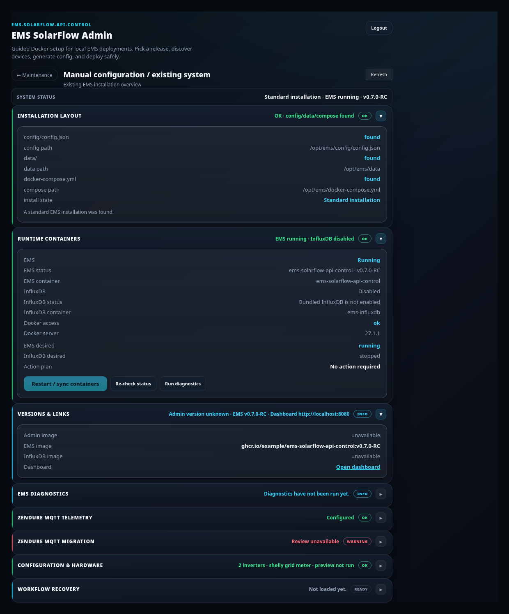
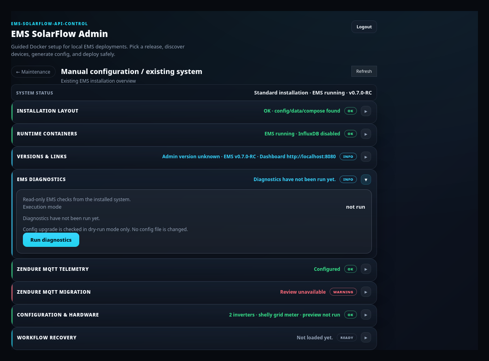
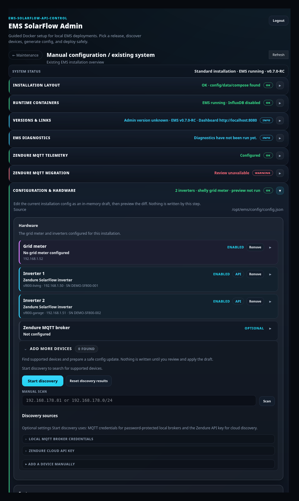
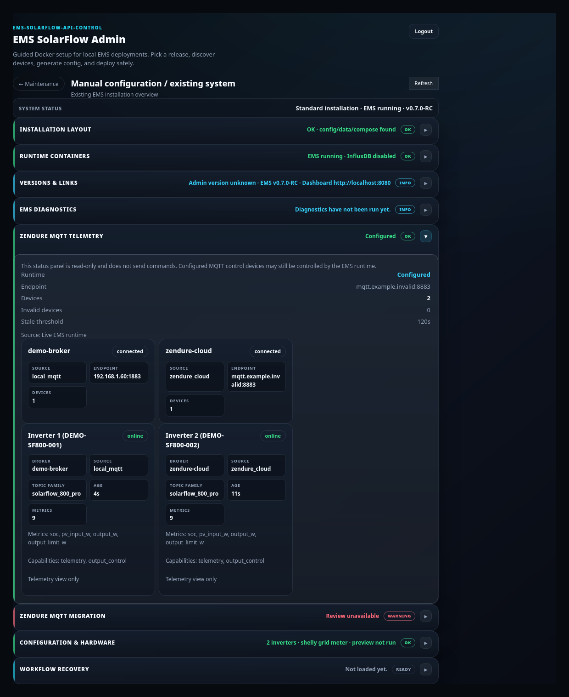

# Maintenance — manage an installed system

## Purpose

Inspect, change, update, back up and repair an EMS installation that already
exists, changing as little as possible each time.

## When to use this workflow

Any time after the first install: version updates, config and device changes,
diagnostics, backups, restore, and recovery from an interrupted workflow.

Use [Guided Setup](guided-setup.md) only for a first install or a deliberate
clean reinstall.

## Prerequisites

- An installed EMS (`config/config.json` and `docker-compose.yml` present).
- Admin Console logged in — see [First start](first-start.md).

## The three paths

| Card | Use it for | Guide |
| --- | --- | --- |
| **Guided upgrade** | Move EMS + Admin to a newer System Build | [Guided Upgrade](guided-upgrade.md) |
| **Manual configuration / existing system** | Inspect state, run diagnostics, edit config and hardware, recover a workflow | This page |
| **Backup / restore** | Create, inspect, restore or delete backups | [Backup and restore](backup-restore.md) |

Use **← Maintenance** in a panel header to return to this hub without ending
anything.

## What each area changes

Read this before clicking something you are unsure about.

| Area | Read-only | Writes config | Recreates containers |
| --- | --- | --- | --- |
| Overview (status, layout, containers, versions) | Yes | No | No |
| EMS diagnostics | Yes | No | No |
| Zendure MQTT telemetry | Yes | No | No |
| Configuration & hardware — preview | Yes | No | No |
| Configuration & hardware — apply | No | Yes, after preview | Optional |
| Zendure MQTT migration — review | Yes | No | No |
| Zendure MQTT migration — apply | No | Yes | No |
| Guided upgrade | No | Yes | Yes |
| Create backup | Yes | No | No |
| Restore preview | Yes | No | No |
| Restore (confirmed) | No | Yes | Possibly |
| Workflow recovery | Depends on the action chosen | Possibly | Possibly |

Nothing in the write rows happens without a preview and an explicit
confirmation.

## Overview — read-only

**What you see:** a **SYSTEM STATUS** line (install kind, EMS state, version) and
collapsed cards, each with a one-line summary and an OK / INFO / WARNING pill:

- **Installation layout** — where config, data and compose live.
- **Runtime containers** — what is running, and whether InfluxDB is enabled.
- **Versions & links** — Admin and EMS versions, dashboard URL.
- **EMS diagnostics** — health checks.
- **Zendure MQTT telemetry** — MQTT brokers and devices.
- **Zendure MQTT migration** — pending migration review.
- **Configuration & hardware** — the config editor.
- **Workflow recovery** — stuck or failed workflow state.

**What it changes:** nothing. Opening and closing cards is display only.

**Expected result:** you can read your whole installation state without touching
it. Use **Refresh** to re-read.

> Every summary here is read from the running system, not from a cached Admin
> guess. If a fact cannot be proven — for example an image whose build labels are
> missing — it is shown as **unknown** with a warning rather than filled in from
> a weaker source.

## Diagnostics

**What you see:** *Read-only EMS checks from the installed system*, an **Execution
mode** fact, and **Run diagnostics**.

**What you select:** **Run diagnostics**.

**What it changes:** nothing. Checks are read-only, and the config upgrade is
checked in **dry-run mode only** — no config file is written.

**Expected result:** a list of checks with their outcomes.

**If it differs:** for deeper evidence and a support bundle, use the CLI — see
[Diagnostics and recovery](diagnostics-recovery.md).

## Configuration and hardware

**What you see:** *Hardware* (grid meter, inverters, optional **Local MQTT
broker**), *Features*, and *Advanced / System settings*. The collapsed summary
reads e.g. *2 inverters · shelly grid meter · preview not run*.

**What you enter:** the change you want.

**What it changes:** nothing until you preview and apply. Then
`config/config.json` is written and a config backup is made first.

**Expected result:** *Config applied*, and a prompt if EMS needs a restart.

**If it differs:** see [Device management](device-management.md), which covers
adding, editing, disabling and removing devices, and switching connections.

### How your answers are read

Guided Setup and Maintenance read a field the same way, so the same answer stores
the same setting in either flow:

- Leading and trailing spaces are removed.
- **Emptying a field removes the setting** rather than storing a blank, so EMS
  falls back to its own default.
- List fields (such as Shelly channels) accept a comma-separated entry.
- **Passwords are the exception:** leaving a password box blank *keeps* the stored
  secret, because the console never shows one back to you. Use the explicit clear
  control to remove one.
- Changing a grid meter's type removes fields the new type cannot use; keys you
  added to the config by hand are left alone.

## Zendure MQTT telemetry

**What you see:** runtime state, endpoint, device counts, stale threshold, and a
card per broker and per device.

**What it changes:** **nothing — this panel is read-only and does not send
commands.** Configured MQTT control devices may still be controlled by the EMS
runtime; that is the runtime's job, not this panel's.

Full guide: [MQTT](mqtt.md).

## Manual tools and Admin Server

Container-level actions (restart EMS, apply a config change that needs a restart)
sit with the areas that own them — the config card prompts for a restart when one
is required, and the containers card reports what is running.

**Admin Server** alignment is not a standalone task in the normal flow: Admin and
EMS move together as one System Build during a
[Guided Upgrade](guided-upgrade.md). A standalone Admin repair exists only under
recovery, for restoring an inconsistent Admin after a failed transition.

## Workflow recovery

**What you see:** the lifecycle verdict for any workflow that did not finish
cleanly, and the actions that are actually allowed for it.

**What it changes:** depends on the action — **Resume** retries, **Discard
setup** removes files a setup created, **Return to running build** puts the Admin
back on the build EMS is running.

**What recovery never touches:** your live `config/config.json`, `data/`, runtime
databases, backups, volumes, or a container it cannot prove it owns. A file whose
ownership cannot be proven is **kept for review**, not deleted.

Details: [Diagnostics and recovery](diagnostics-recovery.md).

## What happens in the background

- Maintenance reads authoritative state — Docker, the config file, the EMS
  diagnostics service — rather than an Admin-side cache.
- Every write goes through the same validated EMS/Core path the CLI uses, so an
  Admin apply and a CLI apply mean the same thing.
- Guided workflows are durable server-side records. Closing the browser does not
  cancel or corrupt one.

## Warnings and common problems

- **Config-only edits are not automatically live.** Some settings need an EMS
  restart to take effect; the console says so when they do.
- **Do not run a second controller.** EMS must not run in parallel with anything
  else writing Zendure `outputLimit`.
- **An unfinished Guided Setup blocks an upgrade.** Discard it first.
- **Two browser windows:** only the window on the current workflow can change it.
  A stale window says so and offers to open the current one.

## Recovery or next steps

- Update the version → [Guided Upgrade](guided-upgrade.md)
- Change devices → [Device management](device-management.md)
- Set up MQTT → [MQTT](mqtt.md)
- Save or roll back → [Backup and restore](backup-restore.md)
- Collect evidence → [Diagnostics and recovery](diagnostics-recovery.md)

**Full behavioural reference:** [Admin Maintenance](../admin-maintenance.md).
