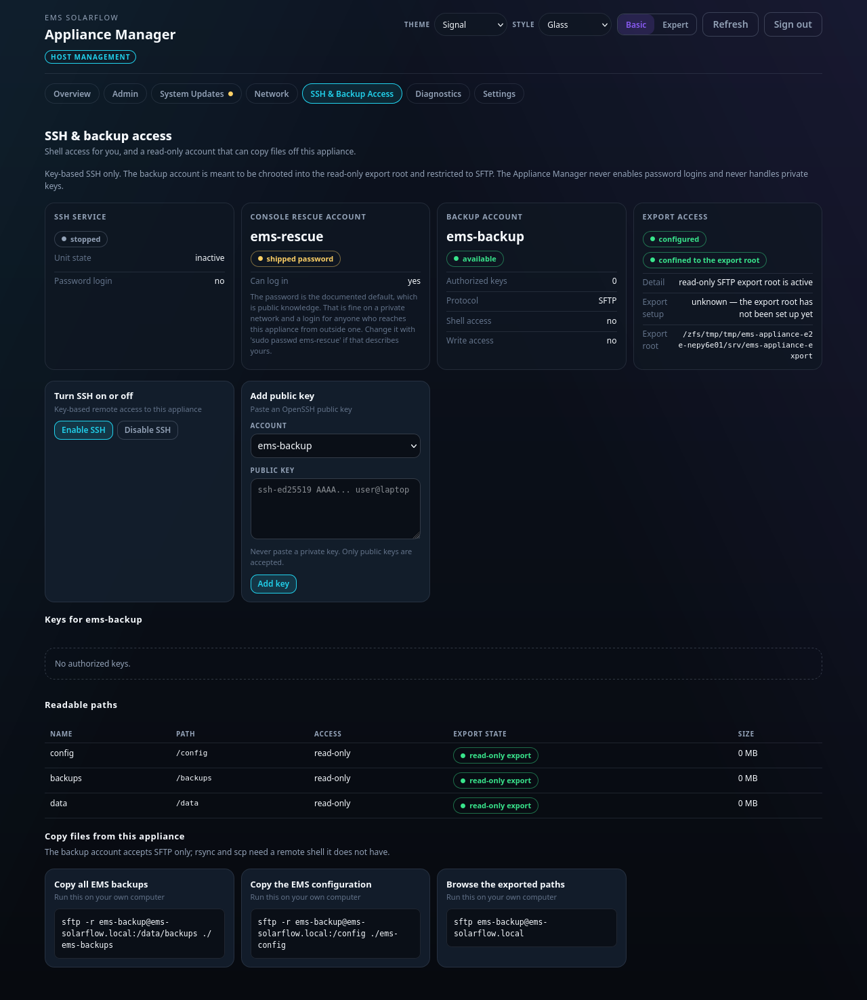

# Backups

Getting your configuration and data off the appliance.

## What there is to save

| | |
| --- | --- |
| **Configuration** | Your devices, limits and control settings |
| **Runtime state** | What the controller currently believes |
| **Backups** | Snapshots the Admin Console made |

An operating-system update does not touch any of it: `apt` patches the system
packages around it.

**Re-flashing the card is a different matter, and it erases all of it.** A
backup protects against that, and against the card failing, which no software
mechanism can.



## Turning the export on

1. Open **SSH & Backup Access**.
2. Press **Enable SSH**.
3. Press **Add key** and paste the public half of an SSH key. The appliance
   never asks for a private key and never generates one for you.

The read-only export root itself is set up by the appliance, not by a button;
the **Export access** card on that page reports whether it is in place.

The account it enables is **read-only and confined**: it can see three
directories and nothing else, it has no shell, and it cannot write. If any part
of that confinement cannot be proved, activation switches the account off rather
than leaving it half-open.

## Getting the files

**SFTP only.** Not `scp`, not `rsync` — the account is confined to an SFTP
session and other tools are refused.

```bash
sftp -i ~/.ssh/your-key ems-backup@ems-solarflow.local
```

Once connected:

```text
get -r /config
get -r /data
get -r /backups
```

A graphical client works too: FileZilla, WinSCP or Cyberduck, protocol **SFTP**,
user `ems-backup`, and your key file.

## Turning it off

Press **Disable SSH**. The key material stays, so turning it on again does not
need a new key. Disabling is deliberately fail-closed: if it cannot prove the
account is off afterwards, it reports failure rather than success.

Revoking the export itself is a console command rather than a button, because it
must work when the browser does not:

```bash
sudo ems-appliance backup-access disable
```

## What this is not

It is a copy, not a restore mechanism. Putting a configuration back is done from
the Admin Console, which understands what the files mean.

## Related

- [SSH backup access, in technical detail](../../appliance/ssh-backup-access.md)
