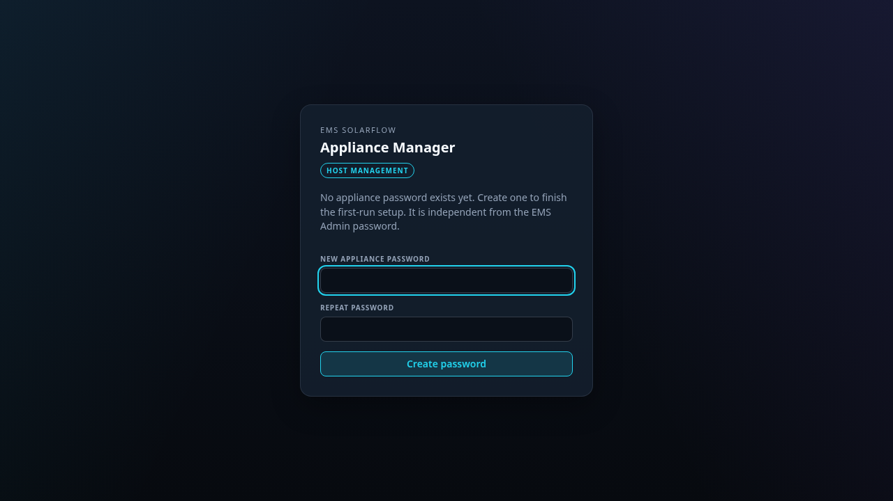
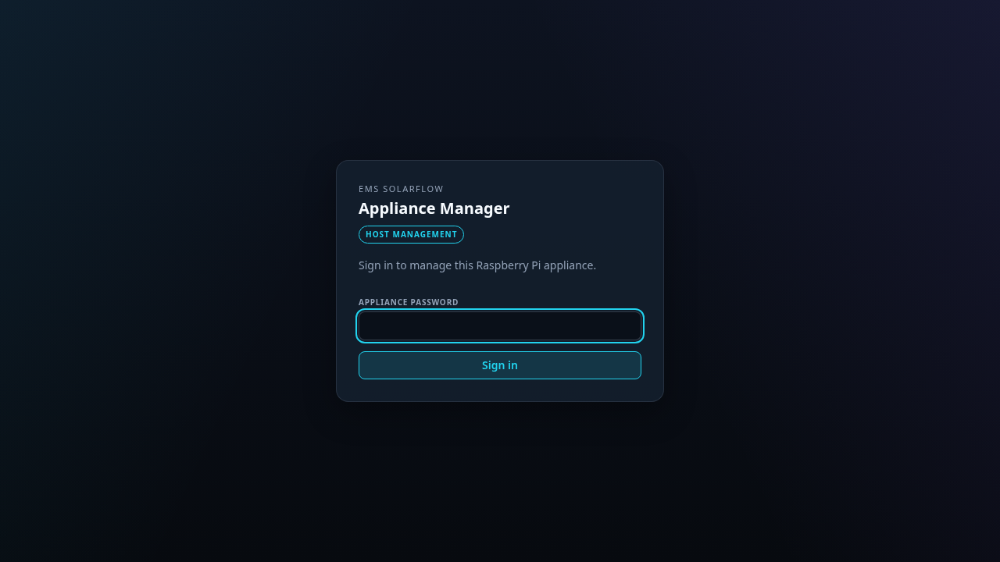

# First start

Finding the appliance on your network and setting its password. Five minutes.

## Before you start

The card is written, the Ethernet cable is in, and the Pi has been powered for
at least three minutes. See [Flashing the card](install.md).

## 1. Open it in a browser

Try this address first:

```text
http://ems-solarflow.local:8088
```

That name is announced on your network by the appliance itself. It works out of
the box on macOS and on most Linux desktops, and on Windows 10 and 11.

**If the name does not resolve**, find the address instead:

- Open your router's admin page and look for a device called `ems-solarflow` in
  its list of connected clients.
- Then use `http://<that address>:8088`.

Both routes reach the same page. The name is more convenient; the address
always works.



## 2. Set the password

The first page asks you to choose a password, twice. There is no default
password and no account name — one password protects the whole interface. It is
the same password the EMS Admin console and the dashboard will ask for later,
and changing it in any of the three changes it everywhere.

Choose something you can find again. There is no email recovery, and the image
ships no login account to fall back on — if it is lost, the way back is writing
the card again. Your configuration and data survive that; the password does not.

> The appliance serves plain HTTP on your local network. Anyone who can reach
> port 8088 sees the login page, so a real password matters even at home.

Every visit after this one asks for that password once, without the second
field:



## 3. Look around

You land on the overview. What each tile means is explained in
[Overview page](overview.md).

Two things are worth doing now:

1. **Set up WLAN**, if you do not want to keep the cable — see
   [Network](network.md). Do this before you move the box.
2. **Install the Admin Console**, which is what actually manages EMS. The
   appliance offers a single **Install Admin** button while nothing is
   installed; it downloads the version you pick and starts it. EMS itself is
   then set up from Admin's own guided setup, not from here.

## What this page is not

The appliance manager looks after the *box*: the operating system, the network,
updates of the system image, backups of the whole installation. It does not
configure your inverter, your grid meter or your control settings — that is the
Admin Console, on port 8090, once it is installed.

## If you cannot get in

| What you see | What to try |
| --- | --- |
| The name does not resolve | Use the IP address from your router |
| Connection refused on the address | Give it another two minutes; the first start reboots once |
| The page loads but the password is rejected | The password is set once, on the very first visit. If someone already set one and it is unknown, see [When it stops working](recovery.md) |
| Nothing on the network at all | [When it stops working](recovery.md) |

## One password for everything

The password you set here is the same one you will use for the EMS Admin
console and the dashboard. You set it once, and you can change it later from
either side — in the appliance under **Access**, or on the EMS host with
`emsctl dashboard set-password`. There is no second password to remember.
