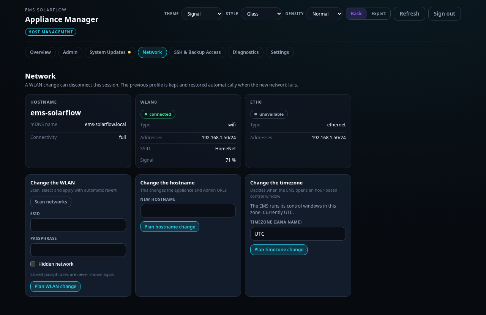

# Network

Moving the appliance onto WLAN, and naming it.

## WLAN

The first start needs a cable. Once the appliance is running, you can move it
onto WLAN from its own interface.

1. Open **Network**.
2. Press **Scan**. Nearby networks appear with their signal strength.
3. Pick yours and enter the passphrase.
4. Read the plan and confirm.

### It puts itself back if it goes wrong

A wrong passphrase would otherwise leave a box you cannot reach and cannot fix
without a keyboard. So the appliance treats the change as a trial: it connects,
and if it has not confirmed connectivity within about ninety seconds, it returns
to the previous connection on its own.

That means the honest way to do this is **with the cable still plugged in**.
Confirm the WLAN works, then unplug.

Your passphrase is held in memory between planning and applying, and never
written to the operation record, a log, or the state directory.

## Hostname

The appliance answers to `ems-solarflow.local` by default.

**On a two-slot appliance image the name cannot be changed.** The system area
belongs to the running slot and is read-only, so a new name could not be
written, and one that somehow stuck would be gone at the next system update. The
manager refuses the change rather than accepting it and failing later.

On a single-slot appliance image, and on a manager installed onto your own
Raspberry Pi OS, the name can be changed normally — that root is writable.

## If the name does not resolve

`ems-solarflow.local` relies on mDNS, which some networks block and some
Windows configurations do not answer.

- Use the IP address from your router instead: `http://<address>:8088`.
- Give the appliance a fixed address in your router's DHCP settings, so the
  address does not move.

## Ports

| Port | What answers |
| --- | --- |
| 8088 | Appliance manager — the box itself |
| 8090 | Admin Console — EMS management, once installed |
| 8091 | Admin Console over HTTPS, if enabled |
| 8080 | The EMS dashboard, once EMS runs |

## Related

- [Network recovery](../../appliance/network-recovery.md) — what to do with a
  keyboard and screen when it is unreachable

## Timezone

The appliance keeps its own clock on UTC, which never changes. What you can set
is the zone the EMS uses, and that matters: a charge window you set for midday
only happens at midday if the EMS agrees what midday means where you live.

Open **Network**, scroll to **Timezone**, and enter the name of your zone —
`Europe/Berlin`, `Europe/Vienna`, `America/New_York`. These are IANA names; the
appliance refuses one it does not carry rather than quietly staying on UTC.

The new zone takes effect the next time the EMS containers start.
