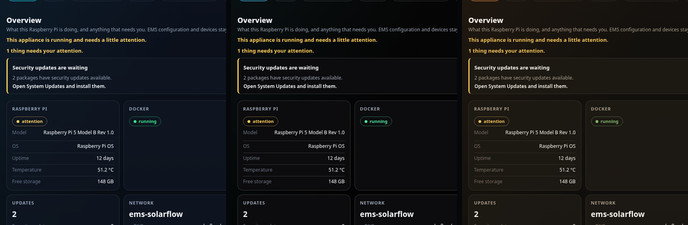
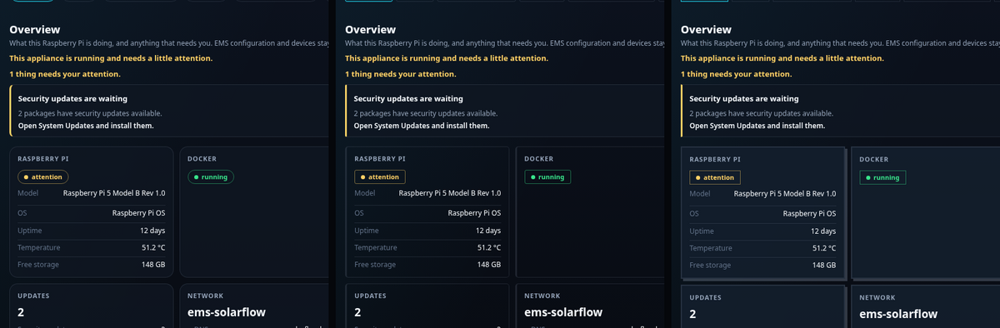
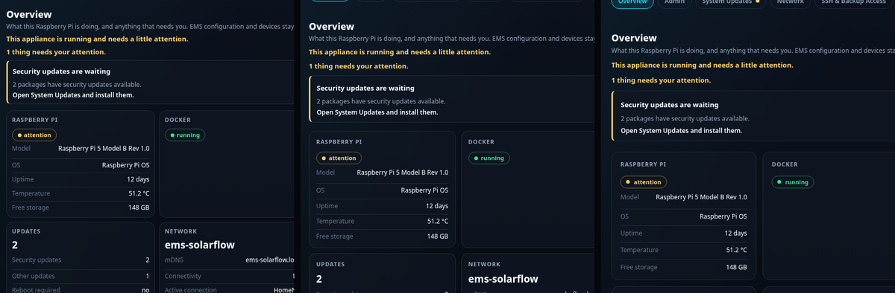

# Overview page

What the main page tells you, and what you can do from it.

## The page, top to bottom

The overview answers three questions in order, and the order is the point.

### 1. One verdict

A single line says what this appliance is: healthy, running with something
waiting for you, or not working. That sentence is the appliance's own judgement,
not a colour you have to interpret.

### 2. What needs your attention

Below it, anything wrong is listed worst first. Each entry says what it is, what
was observed, and what to do about it — and carries a button to the page that
can act on it, so you are never told to "open System Updates" and left to find
it. An appliance with nothing to report shows nothing here at all.

The navigation carries the same information: a section with something waiting
gets a dot, and the button also says "needs attention" for anyone not reading
colour.

If the appliance could not be read at all, that is itself the first entry, and
it says that nothing below it came from the appliance. The tiles underneath
still appear, filled with dashes — but you are told why before you read them,
instead of being left to guess whether an empty tile means empty or unknown.

### 3. What the box currently reads

Six tiles, in this order:

| Tile | Reading it |
| --- | --- |
| **Raspberry Pi** | Board model, operating system, uptime, temperature and free storage. A temperature above 80 °C throttles the board; check ventilation |
| **Docker** | Whether the container engine is running. The containers themselves are the next two tiles |
| **EMS Admin** | The EMS Admin Console: installed version, health, container state. Says *not installed* until you install it |
| **EMS** | The EMS container itself: whether it is running |
| **Updates** | How many security and other package updates are pending, and whether a reboot is required |
| **Network** | Address, connectivity, active connection, whether the `.local` name is being announced |

Two things are deliberately *not* here, because they belong to a page that can
act on them: the pending package updates and the Appliance Manager's own
version are on **System Updates**, and the read-only file export is on
**SSH & Backup Access**.

A tile is never coloured alone. Every state also carries a word, so a colour you
cannot distinguish is never the only signal.

## The operation banner

Anything that changes the box runs as an *operation*, and one appears at the top
while it runs: what it is doing, named in words rather than by its internal
identifier, which step it reached, and what it ended as.

The important property: **nothing starts without you confirming a plan.** You
press an action, the appliance works out what it would do, shows you that, and
only acts once you agree. A plan is not a promise that it will succeed — it is a
statement of what will be attempted.

When an operation ends, its result stays on the page until you acknowledge it.
That is deliberate: a result nobody read is a result nobody acted on.

## Actions

Three groups at the bottom of the page. They are alternatives, not steps — do
the one that applies.

| Action | What it does |
| --- | --- |
| **Restart Admin** | Restarts the Admin container. First thing to try when Admin is unreachable but the box is fine |
| **Repair Admin** | Inspects the Admin deployment and previews what it would fix |
| **Install Admin** | Replaces the two above while no Admin is installed; there is nothing to restart yet |
| **Install security updates** | The pending security packages, without the rest |
| **Restart** / **Shut down** | The whole box. EMS control stops while it is down |

Always use **Shut down** before pulling power. A card that loses power
mid-write is the most common way an appliance breaks.

## Basic and Expert

The switch at the top right changes how much is shown. Expert adds digests,
container IDs, exact release tags and the recovery details. It does not unlock
anything — the same actions are available in both.

## Appearance

A **Theme** menu sits in the header, next to Basic/Expert. The twelve palettes
are the same ones the Admin Console offers, all dark:

| | |
| --- | --- |
| **Signal** | the default, and what the Manager has always looked like |
| **Instrument**, **Graphite** | neutral greys, no colour cast in the background |
| **Fjord**, **Blueprint**, **Indigo** | cool blues, from slate to deep violet |
| **Viridian**, **Phosphor** | green: an instrument panel, and a CRT |
| **Copper**, **Oxide** | warm metal and rust |
| **Contrast** | the hardest separation between text and background |
| **Void** | near-black, with the accent carrying the light |

Beside it sits a **Style** menu. It changes how things are built, not what
colour they are, and the two are independent -- any of the twelve palettes can
be worn with any of these thirteen:

| | |
| --- | --- |
| **Glass** | the default, and what the product has always looked like |
| **Console** | a terminal: hairline frame, no fill, a rail down the left |
| **Instrument** | a panel front: raised fill, a thin crown along the top |
| **Rail** | no frame at all; the left edge and a divider carry the structure |
| **Tab** | a filing tab: a fill with a heavier crown above it |
| **Underline** | a list rather than a stack of cards: one rule between rows |
| **Bracket** | a technical drawing: corner ticks instead of a frame |
| **Inset** | pressed into the page rather than laid on it |
| **Slab** | solid blocks, no frame, no rounding |
| **Halo** | lifted, with the light coming from underneath |
| **Soft** | further from the corner, and floating |
| **Outline** | the frame does all the work |
| **Brutal** | a heavy frame and a hard shadow, square everywhere |

A style never moves anything. Padding, spacing and text size are the same in
all thirteen, so a layout that fits in one fits in all of them.

Third is a **Density** menu. It changes neither colour nor shape but how much
room everything takes -- one setting that multiplies every distance on the page
at once:

| | |
| --- | --- |
| **Compact** | three quarters of the spacing; more on screen at a time |
| **Normal** | the default, and what the product has always looked like |
| **Roomy** | a quarter more spacing, for a screen you read from further away |

Density moves things; that is what it is for. It does not change type size, and
it leaves the pills and badges alone, because those are fitted to the words
they hold rather than to the rhythm of the page.

The three menus are independent: any of the twelve palettes can be worn with
any of the thirteen styles at any of the three densities.

### What the three choices look like

Each strip below is the same page three times, with one axis changed and the
other two left at their defaults.

**Palettes** — left to right: **Signal**, **Void**, **Copper**. Only colour
changes; nothing moves and nothing changes shape.

**Object styles** — left to right: **Glass**, **Console**, **Brutal**. The
colours are identical in all three; what changes is the frame, the fill and the
corners.

**Densities** — left to right: **Compact**, **Normal**, **Roomy**. Same colour,
same shape, different amount of room. Compact fits more on the screen at once;
Roomy is easier to read from further away.

All three choices are remembered by the browser you made them in, and all three
apply to the sign-in screen as well. None of them is appliance state: another
browser, or another device, starts at Signal, Glass and Normal again. Choosing
one in the Admin Console does not carry over here either — they are separate
addresses, and a browser keeps such a preference per address.

## Next

- [Updates](updates.md)
- [Network](network.md)
- [Backups](backup.md)

## While the appliance is down

The EMS is what tells your battery and inverter what to do, and they keep the
last instruction until they get a new one. Whenever the appliance restarts —
a reboot, a shutdown, an operating-system update — that instruction stays in
force and nothing replaces it with a safe default. An `apt` update is short,
but a kernel or firmware package among them still means a reboot.

Nothing is damaged by this; the hardware simply carries on doing what it was
last told. It is worth knowing before you start an update at a moment when the
setpoint matters.
