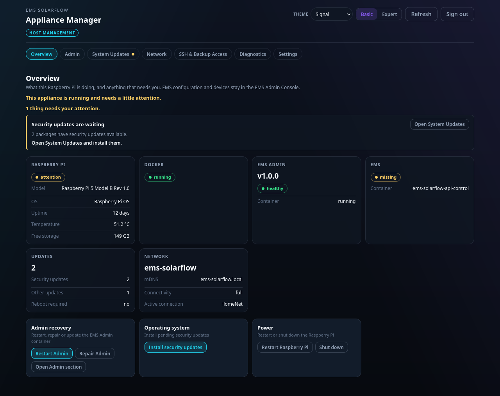

# Overview page

What the main page tells you, and what you can do from it.

## The tiles

Six of them, in this order:

| Tile | Reading it |
| --- | --- |
| **Raspberry Pi** | Board model, operating system, uptime, temperature and free storage. A temperature above 80 °C throttles the board; check ventilation |
| **Docker** | Whether the container engine is running. The containers themselves are the next two tiles |
| **EMS Admin** | The EMS Admin Console: installed version, health, container state. Says *not installed* until you install it |
| **EMS** | The EMS container itself: whether it is running |
| **Updates** | How many security and other package updates are pending, and whether a reboot is required |
| **Network** | Address, connectivity, active connection, whether the `.local` name is being announced |

Two things are deliberately *not* here, because they belong to a page that can
act on them: the pending package updates and the Appliance Manager's own
version are on **System Updates**, and the read-only file export is on
**SSH & Backup Access**.

A tile is never coloured alone. Every state also carries a word, so a colour you
cannot distinguish is never the only signal.

## The operation banner

Anything that changes the box runs as an *operation*, and one appears at the top
while it runs: what it is doing, which step it reached, and what it ended as.

The important property: **nothing starts without you confirming a plan.** You
press an action, the appliance works out what it would do, shows you that, and
only acts once you agree. A plan is not a promise that it will succeed — it is a
statement of what will be attempted.

When an operation ends, its result stays on the page until you acknowledge it.
That is deliberate: a result nobody read is a result nobody acted on.

## Quick actions

| Action | What it does |
| --- | --- |
| **Restart Admin** | Restarts the Admin container. First thing to try when Admin is unreachable but the box is fine |
| **Repair Admin** | Inspects the Admin deployment and previews what it would fix |
| **Install Admin** | Appears only while no Admin is installed |
| **Reboot** / **Shut down** | The whole box. EMS control stops while it is down |

Always use **Shut down** before pulling power. A card that loses power
mid-write is the most common way an appliance breaks.

## Basic and Expert

The switch at the top right changes how much is shown. Expert adds digests,
container IDs, exact release tags and the recovery details. It does not unlock
anything — the same actions are available in both.

## Next

- [Updates](updates.md)
- [Network](network.md)
- [Backups](backup.md)

## While the appliance is down

The EMS is what tells your battery and inverter what to do, and they keep the
last instruction until they get a new one. Whenever the appliance restarts —
a reboot, a shutdown, an operating-system update — that instruction stays in
force and nothing replaces it with a safe default. An `apt` update is short,
but a kernel or firmware package among them still means a reboot.

Nothing is damaged by this; the hardware simply carries on doing what it was
last told. It is worth knowing before you start an update at a moment when the
setpoint matters.
