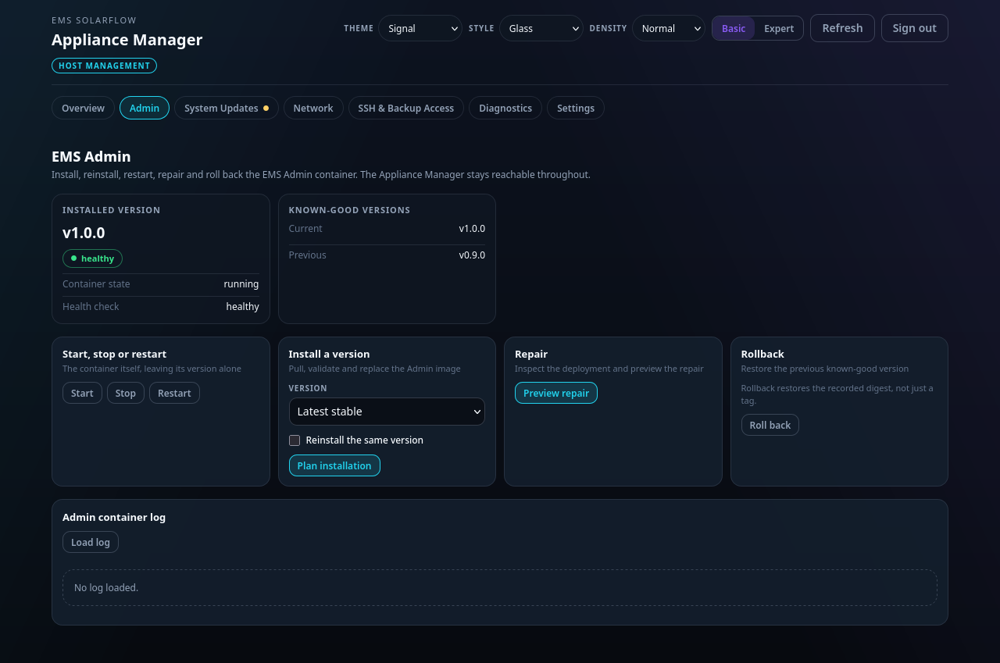

# When it stops working

Start at the top and work down. Each step is safe to try.

## The web page does not load

**Give it three minutes first.** The first start has work to do before it
answers — it grows the card to its full size, generates its own SSH host keys
and starts the containers. And an update asks you for a reboot when a kernel or
firmware package was among the changes. A page that is missing for two minutes
is usually a box that is coming back.

Then, in order:

1. **Try the address instead of the name.** Look up `ems-solarflow` in your
   router's list of connected devices and open `http://<address>:8088`. If that
   works, the name lookup is the problem, not the appliance — see
   [Network](network.md).
2. **Check the lights.** No activity LED at all means power or the card, not
   software. Try the official power supply; try re-seating the card.
3. **Check the cable.** A different switch port, or a different cable.
4. **Power-cycle it — but shut it down first if you can reach it at all.**
   Pulling power from a running appliance is how cards get corrupted.

If none of that helps: **plug in a keyboard and a screen.** The appliance has a
rescue account for exactly this — user `ems-rescue`, password `rescue-me` — and
it can become root with `sudo`. That password is written down here and in the
source, so it is public knowledge: fine on a home network, and worth changing
with `sudo passwd ems-rescue` if your appliance can be reached from outside one.
The console reports which of the two it is; it does not insist.

The full order of attempts, down to reading the card in another computer, is in
[the console recovery guide](../../appliance/console-recovery.md).

Two things are also readable without logging in, and between them they usually
say what happened.

### Read the card on your computer

Power the appliance off, take the card out, and put it in your computer. The
card's `boot` partition is FAT, so Windows, macOS and Linux all read it without
extra software. You may be asked to format the other one — **say no**; that is
only your computer failing to read a Linux filesystem, not a damaged card.

| File | What it tells you |
| --- | --- |
| `cmdline.txt` on the `boot` partition | which root the kernel was asked to find |
| `config.txt` beside it | the board settings the firmware applied |

Nothing there needs interpreting to be useful — copying both files into an issue
is enough.

### Watch it boot

The appliance narrates its whole start-up on a serial line, from the firmware
onwards, and it does so whether or not the network ever comes up. This is the
only way to see *why* a boot failed rather than that it did.

You need a USB-to-serial adapter for 3.3 V (about €10, sold as "USB TTL" or
"FTDI"). Connect **GND, RX and TX only — never the power pin**, and open the
port at **115200 baud, 8N1**:

| Board | Where | Notes |
| --- | --- | --- |
| Raspberry Pi 5 | the 3-pin **UART** connector next to the power socket | a JST-SH debug cable, the connector the board is designed for |
| Raspberry Pi 4 | GPIO header: GND = pin 6, TXD = pin 8, RXD = pin 10 | the adapter's RX goes to the Pi's TX |
| Raspberry Pi 3 / 3B+ | the same GPIO pins as the Pi 4 | the image sets `enable_uart=1`, which is what a Pi 3 needs for a usable console |

Then power the appliance on and copy everything the terminal prints. A root
that will not mount says so there, and nowhere else.

You can also log in on this line, with the same rescue account as at a keyboard.
Anyone who can attach an adapter is already holding your appliance, which is the
threshold this account was written for.

If the boot never gets far enough to say anything, what is left is re-flashing
the card — and that **erases everything on it**: your configuration, your data
and the on-box backups alike. A backup you took earlier and kept somewhere else
is what you restore from. The paths are listed in
[network recovery](../../appliance/network-recovery.md#whether-you-have-a-shell-at-all).

## The page loads but EMS is not running

The appliance manager and EMS are separate. A working manager page with a
stopped EMS means the box is fine and the application is not.

1. Open the **Admin** section.
2. If Admin is not installed, install it — the page offers a single action.
3. If Admin is installed but unhealthy, press **Restart Admin**.
4. If it stays unhealthy, press **Preview repair**. It inspects the deployment
   and shows what it would change before changing anything.

## An update failed

Read the reason before retrying, whichever kind it was. An update that failed
because the card is full or the download was truncated will fail again the same
way.

**An operating-system update.** Nothing was undone: `apt` patches the system in
place. If the appliance still boots, the Updates page will say what failed and
you can try again. If it does not, this page's
[first section](#the-web-page-does-not-load) is the route — screen and keyboard
first, reflash and restore last.

**An Appliance Manager update.** The appliance puts the previous package back by
itself when the new one does not report in on time, and the Appliance Manager
card then says *reverted*. If it says *revert unavailable* or *revert failed*,
it stopped and is waiting for you: sign in at the console and run
`sudo ems-appliance rollback-manager`. See
[Updates](updates.md#if-the-new-one-does-not-come-up).

## "The Admin console is replacing itself"

Two things can manage the Admin container, and they refuse to fight. If the
Admin Console is in the middle of updating itself, the appliance declines to
touch it and says which stage it reached.

Wait for it to finish. If it never does, the message names the file holding that
state and you can remove it.

## The password is lost

There is no email recovery and no reset button in the browser. There is a
console login: sign in as `ems-rescue` at a keyboard and run
`sudo ems-appliance password-reset`.

If that is not available to you either, write the card again — but understand
what that costs: re-flashing replaces every partition on the card, on either
shape, so your EMS configuration, data and on-box backups go with it. Take a
[backup](backup.md) first if you can still reach the box at all. It is the only
thing that comes back.

## What not to do

- **Do not pull power to "reset" it.** Shut it down from the page.
- **Do not install packages on it by hand.** Nothing stops you, and what you
  install stays — but it becomes yours to keep working, and yours to undo at
  the console when an upgrade trips over it.
- **Do not run a second controller against the same inverter.** Two things
  writing an output limit is worse than either alone.

## Getting help

Open an issue with: what you were doing, what the page said, the model of your
Pi, the build id the **System** page shows, and whether you flashed the appliance
image or installed the package on your own Raspberry Pi OS. If the appliance is
reachable, its **Support archive** collects the
relevant logs and state with secrets redacted, and attaching that answers most
questions in one round.
