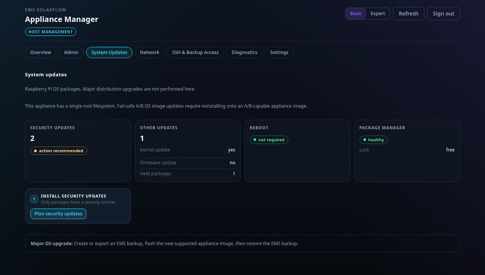
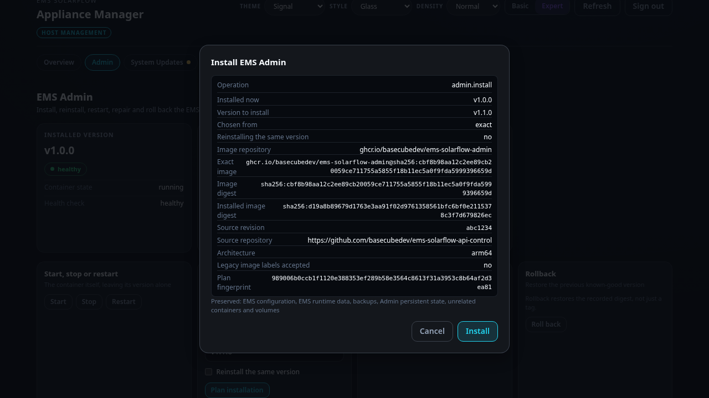
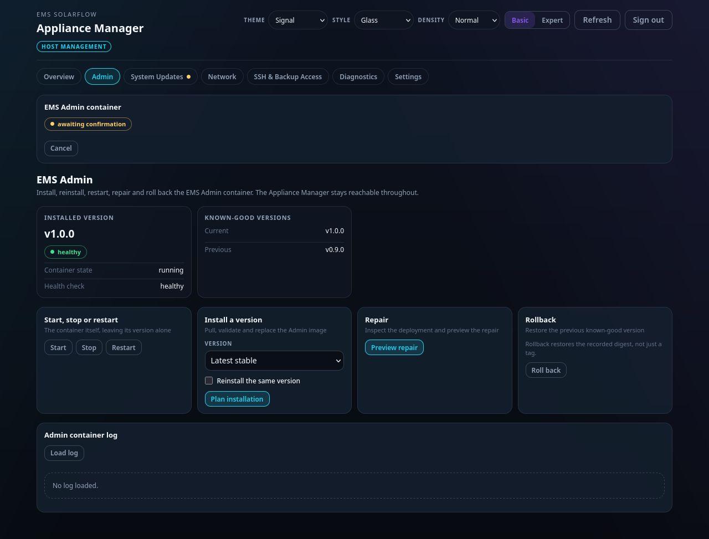

# Updates

Two different things get updated on an appliance, and they behave differently.

| What | Where | The same on every appliance? |
| --- | --- | --- |
| The operating system underneath | **System Updates** | No — it depends on which image you flashed |
| The Appliance Manager, the console you are looking at | **System Updates → Appliance Manager** | Yes |
| The EMS and Admin containers | the Admin console, not here | Yes |

## The operating system

Which half of this section applies to you was decided when you flashed the card.
The page detects it and says so; it never asks you to choose, and there is no
setting that moves an appliance from one to the other. Changing your mind means
flashing the other image and restoring a backup onto it.

### If you flashed the two-slot (`-ab`) image

The card carries **two complete system slots**. One runs; the other is spare.
An update writes the new system into the spare slot and never touches the one
you are running.

The new slot then gets **one trial boot**. If it comes up and proves itself
healthy, it becomes the permanent choice. If it does not, the next ordinary boot
returns to the slot you were on, unchanged.

Your configuration, data and backups live on a third area shared by both slots,
so they survive either outcome.

> This is the part that has never run on real hardware. The mechanism is tested
> in full offline, but the firmware's one-shot trial boot is a Raspberry Pi
> behaviour that only a Pi can confirm. See
> [what "not confirmed" means](index.md#what-not-confirmed-means).

#### Before you can update

The **Updates** page lists prerequisites and marks each one. All of them have to
hold before it will plan anything — there is no override.

Two are worth explaining:

- **Release keyring** — an image is only installed if it carries a signature this
  appliance trusts, and the appliance ships this project's release key, so an
  official image verifies out of the box. The same key is what verifies an
  Appliance Manager package, on either shape of appliance. If you sign your own
  releases you replace that file — but it is a trust anchor rather than a
  setting, so an update puts the project's key back: bake yours into the image
  you build instead of editing it on the box.
- **EMS deployment** — a trial slot has to be able to rebuild your application.
  If the appliance cannot prove what you are running, there is nothing to
  rebuild, and it says so rather than guessing.

#### Getting an image onto the box

Two ways:

- **Download it.** If a release index is configured, **Download an OS release**
  lists what it offers. The index only names candidates; what may actually be
  installed is decided by the signature on each release.
- **Copy it in.** Place the release files in the release directory yourself.
  Nothing about the installation differs afterwards.

If no index is configured, the page says so rather than implying an update could
arrive on its own.

#### Doing the update

1. Open **Updates**.
2. Pick a release and press **Plan**.
3. Read the plan. It names the target version, the slot it will write, and what
   it preserves.
4. Confirm. Writing takes several minutes; the page follows along — a banner
   names the stage it is in, and it survives a reload or a closed browser.

   

5. The appliance reboots into the trial slot on its own.
6. Wait. The health check runs after the system has come up and settled — up to
   half an hour on a slow card, because everything it judges has to have had its
   chance to start first.

#### How you know it worked

The Updates page shows the current slot and its version. After a successful
commit, the version is the new one and no trial is pending.

If the trial failed, you are back on the old slot with the old version, and the
page reports the fallback. Nothing is retried on its own — you acknowledge it
and decide.

#### Rolling back on purpose

**Roll back** returns to the previous known-good slot. It is not an arbitrary
version list: with two slots, the only thing to go back to is the other one, and
only if its exact build was recorded when it was good.

### If you flashed the single-slot (`-single`) image

This is every Raspberry Pi 3, and any Pi 4 or Pi 5 where you chose the
`-single` file. There is one root filesystem and it is patched in place by
`apt`, the way an ordinary Raspberry Pi is.

The page shows what is pending rather than a slot state: security updates,
other package updates, whether a kernel or firmware upgrade is among them,
whether a reboot is required afterwards, and whether the package manager is
healthy. The check itself changes nothing.

- **Install security updates** is the basic action. Only the packages the
  appliance itself found are upgraded — your browser never names a package.
- **Install all available OS updates** is the same path in Expert mode, for
  everything that is upgradable rather than only the security archive.

Kernel and firmware upgrades are **not** held back or singled out for a separate
approval. If `apt` offers one, installing updates installs it. That is the
deliberate choice for this image: an appliance that quietly skips kernel
security fixes is worse than one that occasionally needs you at the machine.

**There is nothing to fall back to.** If an update leaves the board unable to
start, the way back is a keyboard and screen at the appliance
([when it stops working](recovery.md#the-web-page-does-not-load)), and failing that,
flashing the card again and restoring a backup. This is the trade you made when
you took this image; it is not a defect.

A major OS generation change (for example Bookworm → Trixie) is not offered as
an update at all. Back up, flash the newer image, restore.

## The Appliance Manager

The Appliance Manager is the software this console *is*. It is updated on its
own, from **System Updates → Appliance Manager**, and nowhere else — `apt` does
not offer it, because it is not in any package archive.

> Like the rest of the appliance, this has never run on hardware. No appliance
> has fetched and installed a manager package over a real network, and the
> deadline described below has never expired on a board. It is tested in full
> offline; that is not the same claim. See
> [what "not confirmed" means](index.md#what-not-confirmed-means).

Nothing here happens on a schedule. There is no automatic update, no nightly
check that installs something, and no way for a newer version to arrive because
time passed. It moves when you press the button.

### Doing it

1. Open **System Updates** and scroll to **Appliance Manager**.
2. Pick a version and press **Install**. The plan names the version, says
   whether it moves forward or back, and lists everything that could refuse.
3. Confirm. The console goes briefly unreachable while the package is unpacked —
   the update restarts the very services answering your browser. Reload after a
   minute.

Before anything is installed, the appliance fetches the package over HTTPS and
checks it against the same signing keyring it uses for operating-system
releases. An unsigned package, one whose contents do not match its signed
description, one built for another architecture, or one whose manager could not
read the settings already on this appliance, is refused *before* the install
begins.

### Installing an older version is allowed

Deliberately. The same control installs an older package as readily as a newer
one, and the plan tells you which direction it is going.

On a single-slot appliance, reinstalling the previous manager **is** the
recovery — refusing to go backwards would take it away. What is refused instead
is a version that could not read the state already on the disk, which is the
question "is this number bigger" never answered.

### If the new one does not come up

Unlike an operating-system slot, **doing nothing here does not undo anything** —
an installed package stays installed. So the appliance sets itself a deadline
before it unpacks anything.

Once a minute, it checks whether the version now installed is the one the update
promised, and whether the manager's two services are running. The window is
fifteen minutes, and it survives a reboot inside it — rebooting is exactly what
you would try when a console stops answering, so a deadline a reboot cancelled
would be no deadline at all.

| What happens | What the appliance does |
| --- | --- |
| Those checks pass | The deadline is retired and the new version stays. |
| The deadline expires first | The previous package is installed again, by itself, and the page reports it. |
| There is no previous package to go back to | It says so, and waits for you. A first install has nothing behind it. |
| Even the previous package refuses to install | It says so, and waits for you. |

The undo is a copy taken out of the package being *replaced*, saved before the
new one is unpacked, so the thing deciding whether to keep the update is not
part of the update.

**This is a timer, not a safety net in firmware.** It covers the Appliance
Manager and nothing else: not the kernel, not the firmware, not the operating
system. If a manager update somehow leaves the machine unable to boot, the
deadline never gets to run. The reasoning, and what it does not buy you, is in
[the decision record](../../appliance/adr/manager-self-update.md).

### After a power cut, wait before downloading

The Raspberry Pi has no battery-backed clock. After a cold start it believes it
is somewhere in the past until it reaches a time server. Certificate checks and
signature validity both depend on the time, so a download started too early
fails with errors that mention everything except the clock. The appliance
refuses to start one — an OS release or a manager package — until the time is
confirmed.

## Related

- [When it stops working](recovery.md)
- [A/B updates, in technical detail](../../appliance/ab-os-updates.md)
- [Operating-system and manager updates, in technical detail](../../appliance/os-updates.md)
