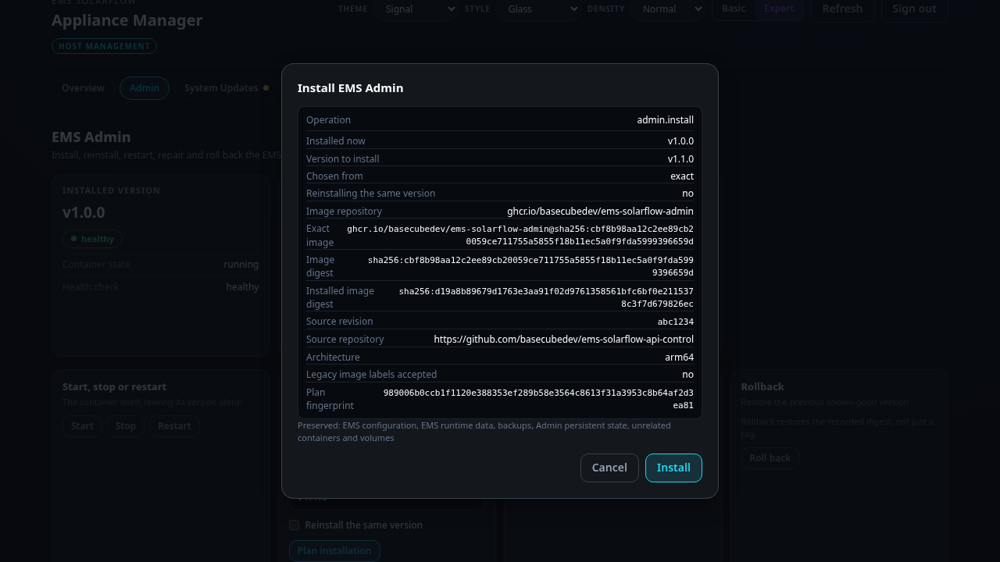
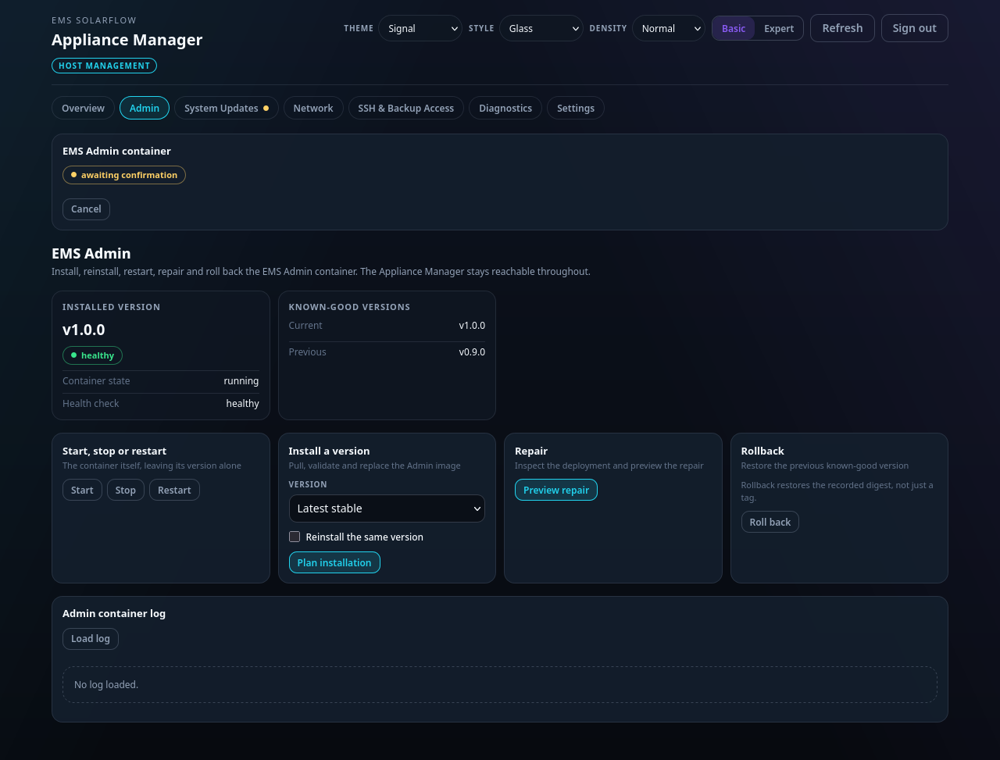

# Updates

Everything on the appliance that has a version is updated from one page,
**Updates**, the second entry in the navigation.

| What | Where |
| --- | --- |
| The Appliance Manager, the console you are looking at | **Updates → Appliance Manager package** |
| The EMS Admin container | **Updates → EMS Admin versions** |
| The operating system underneath | **Updates → Operating system** |
| The EMS container | the Admin console, not here |

## At a glance

The top of the page has one card each for the Appliance Manager, EMS Admin and
Raspberry Pi OS. Each says what is installed, what the newest stable version
is, and whether that is an update. When it is, the card carries one button —
**Update to 0.2.0**, **Update to v1.1.0**, **Install security updates** — that
opens the plan for exactly that version. Nothing is installed by the button
itself: the plan comes first, and it waits for your confirmation like every
other change on this appliance.

Three cases are not called up to date:

- When a candidate or test build newer than the latest stable is running, the
  card says *newer than the latest stable*: current on its own track, not on
  the recommended one.

- When the installed version cannot be read — a feature build, an image
  without a version label — the card says *installed version cannot be
  compared* and offers no button: whether that install is an update is exactly
  what is unknown, so you choose from the list below.
- When the operating-system counts are not an answer — the update check did not
  finish, or the package manager needs recovery — the OS card names that
  problem instead of the counts and offers no one-click install. A package
  index that is merely old still lists real security updates, so those are
  offered; with none waiting, the card says the index is out of date.

## Stable, Unstable and Experimental

Below the summary, the Appliance Manager and EMS Admin each have a version
list, **Choose a Manager version** and **Choose an Admin version**. Both use
the group names and explanations of the Admin console's System Build list:

| Group | What it holds |
| --- | --- |
| **Stable** | Recommended versioned releases for normal use. |
| **Unstable** | Release candidates for early testing. Mostly complete, but they may still contain issues. |
| **Experimental** | Feature builds with unfinished changes. Intended for testing only. |

The appliance decides the group from the version itself, never from the
browser, and by the Admin console's rule for both lists: a release is Stable,
every pre-release (`-rc1`, `~rc2`, `-beta`, `~test1`, …) is Unstable, and
Experimental is a development build — for the Appliance Manager the untagged
`0.0.0~dev…` builds. A version the appliance cannot read in full is
Experimental, never Stable.

The running Admin version is marked *installed*; a Manager package of the
running version is marked *same version as installed*. A group with nothing in
it is left out, and a version this appliance will not install stays listed,
greyed out with the reason.

## The operating system

The appliance runs Raspberry Pi OS, and its packages are patched in place by
`apt`. **Updates** shows what is pending: security updates, other package
updates, whether a kernel or firmware upgrade is among them, whether a reboot is
required afterwards, and whether the package manager is healthy. A check that
could not reach its mirrors is reported as exactly that, and the counts then
describe nothing. The check itself changes nothing.

- **Install security updates** is the basic action. Only the packages the
  appliance itself found are upgraded — your browser never names a package.
- **Install all available OS updates** is the same path in Expert mode, for
  everything that is upgradable rather than only the security archive.

The plan is written to be read: every line is named in words, a field with no
value is left out rather than shown as a dash, and what is about to happen comes
before which image it happens with. Expert adds the image identity — digest,
exact reference, architecture — and the fingerprint that binds your confirmation
to the plan you were shown.

Confirm, and the page follows along — a banner names the stage it is in, and it
survives a reload or a closed browser.

Kernel and firmware upgrades are **not** held back or singled out for a separate
approval. If `apt` offers one, installing updates installs it. That is
deliberate: an appliance that quietly skips kernel security fixes is worse than
one that occasionally needs you at the machine.

### There is nothing to fall back to

If an update leaves the board unable to start, the way back is a keyboard and
screen at the appliance
([when it stops working](recovery.md#the-web-page-does-not-load)), and failing
that, writing the card again and restoring a backup.

This is the one thing worth understanding about this appliance's updates, and it
is why the backup matters more than the update does: **keep a backup somewhere
other than the card.** [SSH & Backup Access](backup.md) is how you get one off
the box.

A major OS generation change (for example Bookworm → Trixie) is not offered as
an update at all. Back up, flash the newer image, restore.

## The Appliance Manager

The Appliance Manager is the software this console *is*. It is updated on its
own, from **Updates → Appliance Manager package**, and nowhere else — `apt` does
not offer it, because it is not in any package archive.

> Like the rest of the appliance, this has barely run on hardware. One
> appliance has now fetched and installed a manager package over a real
> network, and the deadline described below expired on that board without
> deciding -- a defect since fixed. The rest is tested in full offline; that is
> not the same claim. See
> [what "not confirmed" means](index.md#what-not-confirmed-means).

Nothing here happens on a schedule. There is no automatic update, no nightly
check that installs something, and no way for a newer version to arrive because
time passed. It moves when you press the button.

The list you are choosing from names **every version ever published**, not only
newer ones. That is on purpose: installing an earlier package is the whole way
back from a bad update, so the older entries stay listed for as long as they
exist. How far back you can go is bounded by whether the older Manager can still
read the state on your disk, and the plan says so before you confirm rather than
after.

### Doing it

1. Open **Updates**. To go to the newest stable version, press **Update to …**
   on the Appliance Manager card and skip to step 3.
2. Otherwise, under **Choose a Manager version**, pick a version and
   press **Install selected version**.
3. Read the plan. It names the version, says whether it moves forward or back,
   and lists everything that could refuse.
4. Confirm. The console goes briefly unreachable while the package is unpacked —
   the update restarts the very services answering your browser. Reload after a
   minute.

Before anything is installed, the appliance fetches the package over HTTPS and
checks it against the signing keyring it ships. An unsigned package, one whose
contents do not match its signed description, one built for another
architecture, or one whose manager could not read the settings already on this
appliance, is refused *before* the install begins. So is a package whose
signed version is not the version the package index named, because that name
is what the list and the **Update to …** button showed you.

### Installing an older version is allowed

Deliberately. The same control installs an older package as readily as a newer
one, and the plan tells you which direction it is going.

Reinstalling the previous manager **is** the recovery — refusing to go
backwards would take it away. What is refused instead is a version that could
not read the state already on the disk, which is the question "is this number
bigger" never answered.

### If the new one does not come up

**Doing nothing here does not undo anything** — an installed package stays
installed. So the appliance sets itself a deadline before it unpacks
anything.

Once a minute, it checks whether the version now installed is the one the update
promised, and whether the manager's two services are running. The window is
fifteen minutes of the appliance running — the board has no real-time clock,
so the deadline is counted in the checks themselves rather than in wall-clock
time — and it survives a reboot inside it: rebooting is exactly what you would
try when a console stops answering, so a deadline a reboot cancelled would be
no deadline at all.

| What happens | What the appliance does |
| --- | --- |
| Those checks pass | The deadline is retired and the new version stays. |
| The deadline expires first | The previous package is installed again, by itself, and the page reports it. |
| There is no previous package to go back to | It says so, and waits for you. A first install has nothing behind it. |
| Even the previous package refuses to install | It says so, and waits for you. |
| The record of the deadline cannot be read | Nothing is installed and nothing is undone. It says so, and waits for you. |

The undo is a copy taken out of the package being *replaced*, saved before the
new one is unpacked, so the thing deciding whether to keep the update is not
part of the update.

**This is a timer, not a safety net in firmware.** It covers the Appliance
Manager and nothing else: not the kernel, not the firmware, not the operating
system. If a manager update somehow leaves the machine unable to boot, the
deadline never gets to run. The reasoning, and what it does not buy you, is in
[the decision record](../../appliance/adr/manager-self-update.md).

### After a power cut, wait before downloading

The Raspberry Pi has no battery-backed clock. After a cold start it believes it
is somewhere in the past until it reaches a time server. Certificate checks and
signature validity both depend on the time, so a download started too early
fails with errors that mention everything except the clock. The appliance
refuses to start a manager download until the time is confirmed.

## Related

- [When it stops working](recovery.md)
- [SSH & Backup Access](backup.md) — getting a backup off the box
- [Operating-system and manager updates, in technical detail](../../appliance/os-updates.md)
