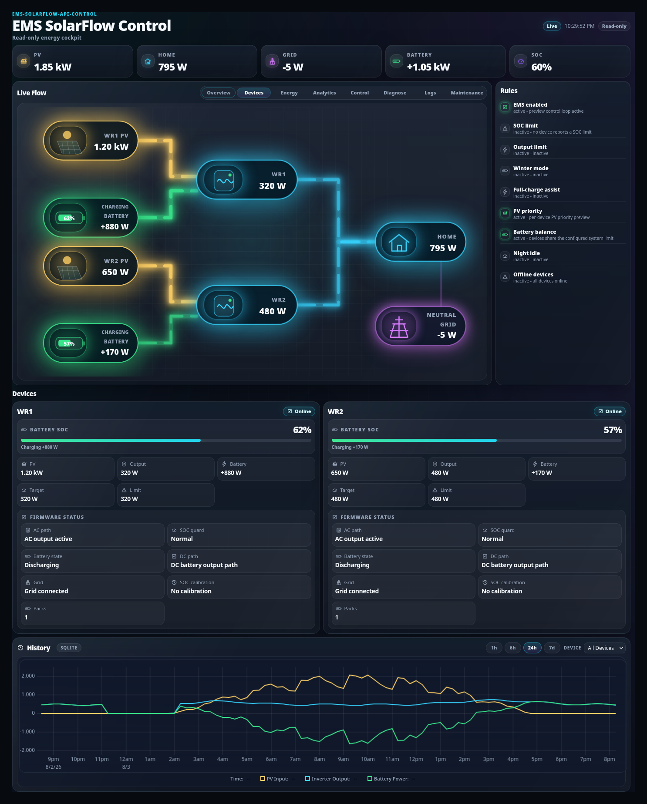
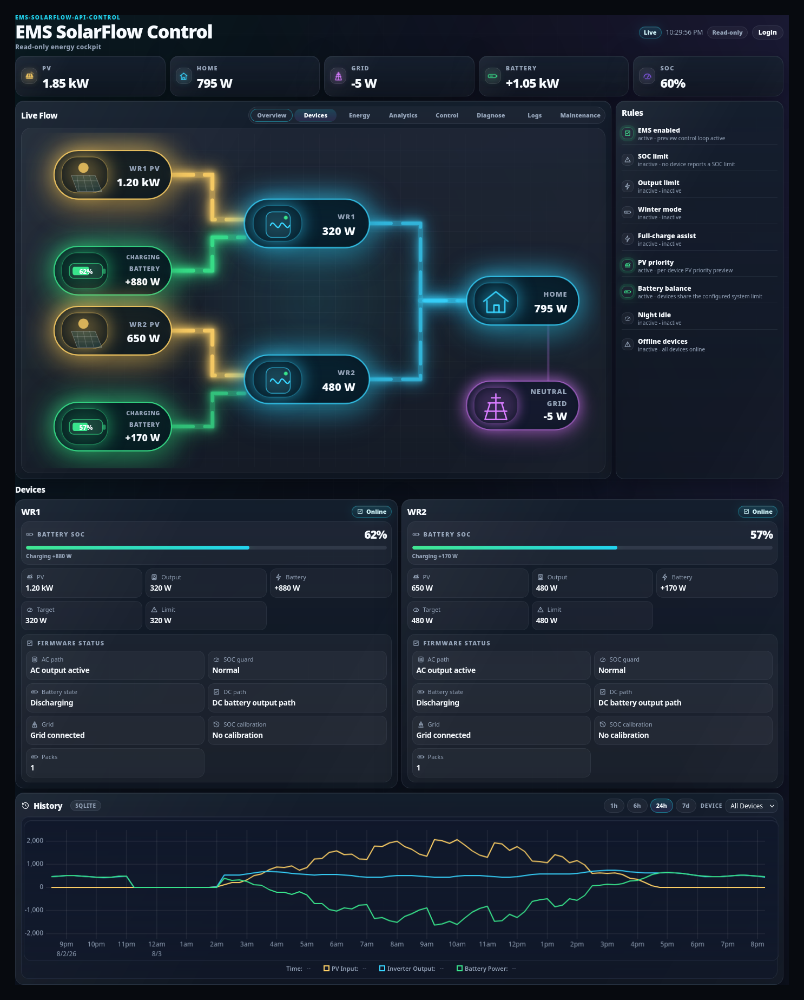
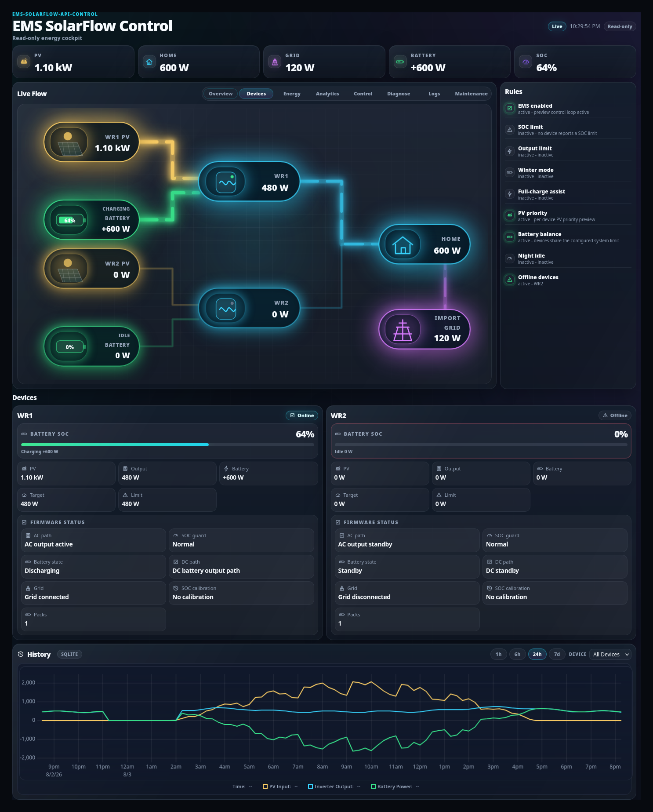

# Device cards

## Purpose

Read one inverter's live state: what it is producing, storing and delivering, how
it is connected, whether EMS can control it, and — if not — why not.

## When to use this workflow

- One device behaves differently from the others.
- A device stopped contributing.
- You want to confirm a transport change took effect.
- You want to know whether EMS may write to a device.

## Prerequisites

- EMS running and the dashboard open. No login needed to read.

## What you see

### The card header

The device's EMS name (`WR1`, `INV_1`, …) and a status pill:

| Pill | Meaning |
| --- | --- |
| **Online** | Reporting fresh telemetry |
| **Offline** | Not reporting, or older than the stale threshold |

A **SEND** marker on the card indicates that this device is part of the current
write decision.

### Battery SoC

A bar with the percentage, and a one-line state underneath — `Charging +600 W`,
`Discharging −400 W`, or `Idle 0 W`.

### The measurement row

| Field | Meaning |
| --- | --- |
| **PV** | Solar input into this inverter |
| **Output** | AC power this inverter is currently delivering |
| **Battery** | `+` charging, `−` discharging |
| **Target** | What EMS wants this device to deliver |
| **Limit** | The output limit currently in force |

**Target vs Output** is the useful comparison. They should converge within a
ramp. A persistent gap means something is limiting the device — the
[Control pipeline](control.md) names which stage.

### Firmware status

Reported by the device itself, not inferred:

| Field | Example values |
| --- | --- |
| **AC path** | `AC output active`, `AC output standby` |
| **Battery state** | `Discharging`, `Standby` |
| **Grid** | `Grid connected`, `Grid disconnected` |
| **SOC guard** | `Normal` |
| **DC path** | `DC battery output path`, `DC standby` |
| **SOC calibration** | `No calibration` |
| **Packs** | Number of battery packs |

## Connection and control readiness

Which transport a device uses is configured in the Admin Console — see
[Device management](../admin/device-management.md). What matters here is what the
dashboard tells you about it:

| Transport | Typical behaviour on this card |
| --- | --- |
| **Local API** | Lowest latency; full state reconciliation available |
| **Local MQTT** | Low latency, no cloud dependency; output control only |
| **Zendure MQTT (cloud)** | Higher, less predictable latency; output control only |

**MQTT control devices are output-only.** State reconciliation (`minSoc`,
`socSet`, `smartMode`, `gridOffMode`, winter `inputLimit`, full-charge assist) is
API-only, so those fields do not change for an MQTT-controlled device.

## Read-only and write-blocked devices

A device can be shown but not written to. The reasons, and where to fix them:

| Reason | Meaning | Fix |
| --- | --- | --- |
| You are not logged in | The **dashboard** is read-only; EMS itself still controls normally | Nothing — this is display only |
| Device disabled | Deliberately excluded from regulation | Re-enable in [Device management](../admin/device-management.md) |
| Telemetry stale | EMS will not act on old data | Restore the transport |
| No output control | Model or write route not proven | [Why a device is read-only](../admin/device-management.md#why-a-device-is-read-only) |
| Write gate off | The transport's gate is disabled | [MQTT write gates](../admin/mqtt.md#write-safety-gates) |
| Dry run / simulation | EMS is deliberately not writing | Configuration choice |

> The header's **Read-only** pill describes *your browser session*, not EMS. EMS
> keeps controlling your hardware whether or not you are logged in.

## Offline and stale devices

**What you see:** the offline device's pill turns **Offline**, its measurements
read `0 W`, its SoC bar empties, and the **Rules** panel shows *Offline devices —
active*, naming the device.

**What EMS does:** it does **not** guess. A device whose telemetry is stale is
excluded from the write decision rather than being commanded on old data. The
remaining devices carry the load, so you will usually see grid import rise — in
the screenshot above, `GRID 120 W` instead of the usual near-zero.

**What to check, in order:**

1. Is the device powered and on the network?
2. For MQTT: is it still publishing to its broker? See
   [Maintenance → Zendure MQTT telemetry](../admin/mqtt.md#3--check-the-result)
   for age and metric counts.
3. For Local API: is the device's local API still enabled?
4. Run `diagnose --hardware` — see [Diagnostics](diagnostics.md).

## Several inverters

With more than one inverter, EMS **allocates** the system target across them
rather than driving each independently:

- **PV-first**: a device with its own PV input is preferred, so solar is used
  where it is produced.
- **`pv_priority_factor`** weights that preference.
- **Battery balance** lets devices share the configured system limit, which is
  why the Rules panel may show it as active.

The per-device split is shown as *TARGET SPLIT* in the
[Control pipeline](control.md#03--distribution). A device contributing less than
you expect is usually correct behaviour, not a fault — check the allocation
before changing anything.

## What happens in the background

- All values come from EMS telemetry. The dashboard renders; it does not measure.
- Firmware-status fields are what the device reports, not EMS interpretation.
- Whether a device may be written to is decided by EMS write gates and
  capability detection, never by the browser.

## Expected result

For each device you can state: online or not, what it is producing and
delivering, whether it is on target, and if not, which limit is responsible.

## Warnings and common problems

| Symptom | Meaning | What to do |
| --- | --- | --- |
| Output stays below Target | A limit or ramp is active | [Control pipeline](control.md) |
| Device online but Output `0 W` | Allocation gave it nothing, or it is disabled | Check the target split and the enabled state |
| SoC bar empty, values zero | Offline | See above |
| Values look right but hardware disagrees | Possibly a second controller | Nothing else may write `outputLimit` |
| Firmware fields all standby | Device not in an energy path | See [observed firmware behavior](../../observed-firmware-no-energy-path.md) |

## Recovery or next steps

- Why this value → [Control pipeline](control.md)
- Change limits or enabled state → [Runtime settings](runtime-settings.md)
- Change transport or identity →
  [Device management](../admin/device-management.md)
- Evidence for a report → [Diagnostics](diagnostics.md)
