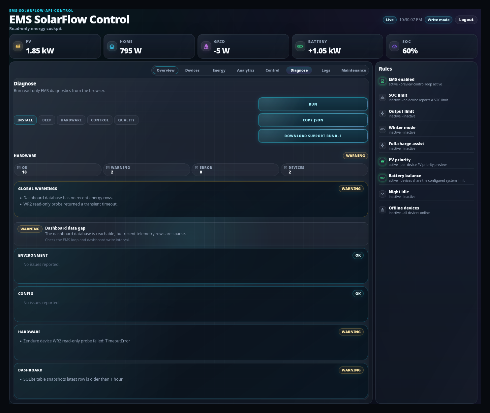
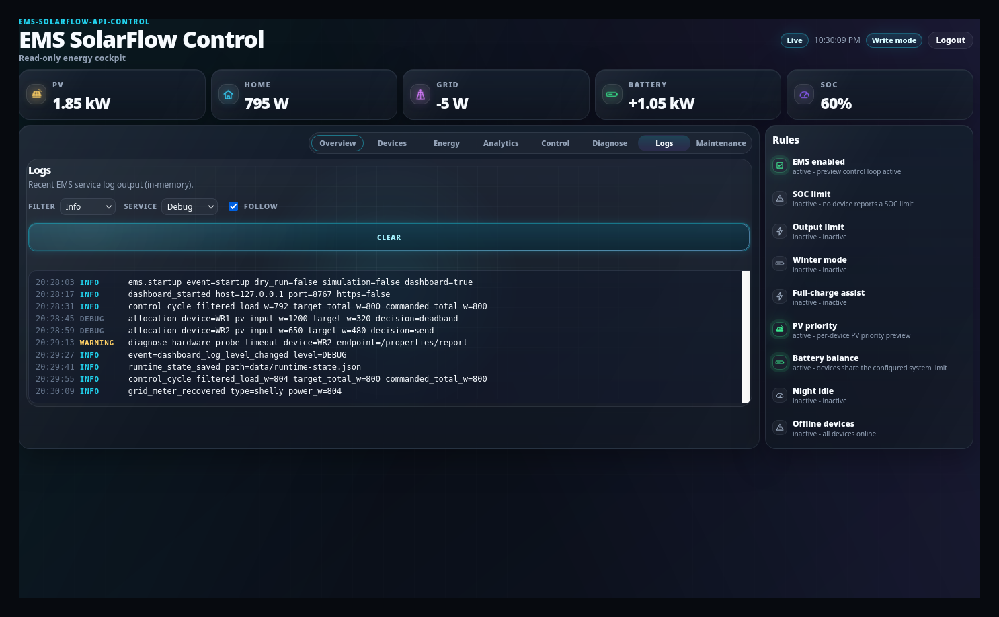
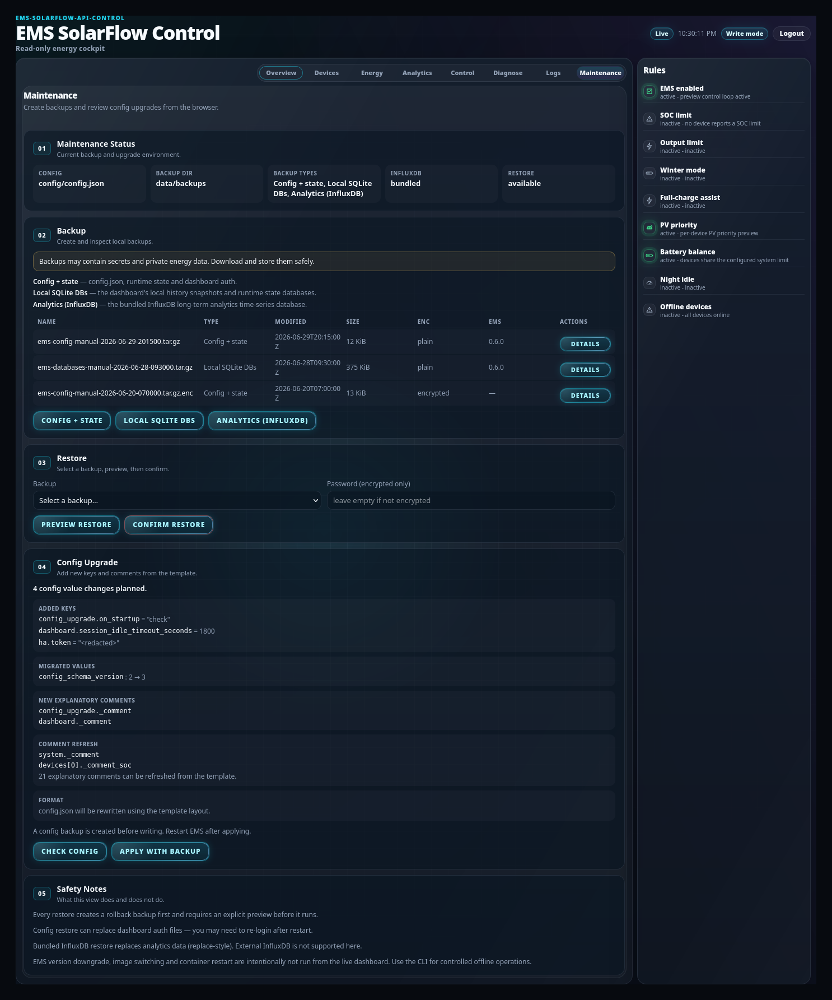

# Diagnostics, logs and maintenance

## Purpose

Run EMS diagnostics from the browser, read recent service logs, and create or
restore a backup — without a shell.

## When to use this workflow

- Something is wrong and you want evidence.
- You need a support bundle for an issue report.
- You want a quick backup before changing something.

## Prerequisites

- A dashboard **login**. All three tabs here are operator-only; without a session
  they render a compact "login required" message.

These tabs use the **Control / Energy stage** style — the same numbered cards and
tone pills as the control pipeline.

## Diagnose



**What you see:** *Diagnose* — *"Run read-only EMS diagnostics from the
browser."* — with a profile selector and three actions.

### 1 — Pick a profile

| Profile | What it checks | CLI equivalent |
| --- | --- | --- |
| **Install** | Install-level health: config, paths, clients, reachability | `diagnose` |
| **Deep** | The above plus deeper runtime inspection | `diagnose --deep` |
| **Hardware** | Device reachability and reported capabilities | `diagnose --hardware` |
| **Control** | Measurements, target, allocation, write eligibility | `diagnose --control` |
| **Quality** | Control quality sampled over a window | `diagnose --control-quality` |

### 2 — Run

**What you select:** **Run**.

**What it changes:** **nothing. Every profile is read-only.** No config, runtime
state or hardware write happens.

**Expected result:** a result list with tone pills for status, and root causes
where the checks found something.

**If it differs:** *Hardware* needs the devices to be reachable; a failure there
is itself the finding.

### 3 — Export

| Button | What it does |
| --- | --- |
| **Copy JSON** | Copies the report as JSON — a versioned public contract, stable across releases |
| **Download support bundle** | Downloads the full bundle |

The bundle contains a fixed file list: `diagnosis.json`,
`control-diagnostics.json`, `control-quality.json`, `redacted-config.json`,
`runtime-state.json`, `bundle-metadata.json`, plus `.txt` variants.

> **The config in the bundle is redacted, but the bundle still describes your
> installation.** Before attaching one to a public issue, remove serial numbers,
> API keys, MQTT credentials, tokens, backup passwords, public IPs, personal
> hostnames and exact private paths. See
> [Diagnostics and recovery](../admin/diagnostics-recovery.md#support-bundles).

## Logs



**What you see:** *Logs* — *"Recent EMS service log output (in-memory)."*

**What you select:** a **Filter** level (All / Debug / Info / Warning / Error,
default Info) and optionally a **Service** level.

**What it changes:** the filter is display only. Changing the *service* level
changes what EMS emits from here on.

**Expected result:** a compact monospace region, colour-accented by level.

**If it differs:** **the buffer is in memory.** It shows *recent* output, not the
full history, and it does not survive an EMS restart. For anything older, read the
container logs:

```bash
docker compose logs ems
```

EMS logs are structured `event=...` lines, which is why they filter and grep
cleanly.

## Maintenance tab



**What you see:** *Maintenance* — *"Create backups and review config upgrades from
the browser."*

| # | Section | What it does |
| --- | --- | --- |
| 01 | **Maintenance Status** | Config path, backup directory, available backup types, InfluxDB mode, restore availability |
| 02 | **Backup** | Create **Config + state**, **Local SQLite DBs** or **Analytics (InfluxDB)**; lists existing backups with **Details** |
| 03 | **Restore** | Pick a backup, optional password, **Preview restore** then **Confirm restore** |
| 04 | **Config Upgrade** | Shows planned added keys, migrated values, new comments and format changes; **Check config** or **Apply with backup** |
| 05 | **Safety Notes** | What this view does and does not do |

### What it will not do

The Safety Notes are worth reading in full. In short:

- Every restore **creates a rollback backup first** and requires an explicit
  preview before it runs.
- A config restore can replace dashboard auth files — **you may need to log in
  again** after a restart.
- Bundled InfluxDB restore is replace-style. **External InfluxDB is not supported
  here.**
- **EMS version downgrade, image switching and container restart are
  intentionally not run from the live dashboard.** Use the CLI for controlled
  offline operations, or the [Admin Console](../admin/backup-restore.md).

> Backups may contain secrets and private energy data. Download and store them
> safely.

## Dashboard vs Admin Console vs CLI

Three surfaces, same underlying EMS/Core implementation.

| | Dashboard | Admin Console | CLI |
| --- | --- | --- | --- |
| Diagnostics | Yes, read-only | Yes, read-only | Yes, full |
| Support bundle | Yes | — | Yes |
| Logs | Recent, in-memory | — | Full, via Docker |
| Backup / restore | Yes | Yes | Yes |
| Config upgrade | Check and apply | Yes | Yes |
| EMS image change | **No** | Guided Upgrade | Yes |
| Add or remove a device | No | Yes | Config edit |

Pick the dashboard for a quick look while watching live values; the Admin Console
for guided, previewed changes; the CLI for anything offline or scripted.

## What happens in the background

- Diagnostics come from the EMS-owned diagnostics service — the same one the CLI
  and Admin Console use. One implementation, one answer.
- Backup and restore use the normal EMS backup archives and the normal restore
  rules.
- Every action here is authenticated and CSRF-protected server-side.

## Expected result

You can produce a shareable, sanitizable evidence bundle and a fresh backup from
the browser, and you know which operations deliberately are not available here.

## Warnings and common problems

| Symptom | Meaning | What to do |
| --- | --- | --- |
| Tabs show "login required" | Operator-only, no session | Log in — [Runtime settings](runtime-settings.md#1--log-in) |
| Logs look truncated | In-memory buffer | `docker compose logs ems` |
| Diagnose hardware profile fails | Devices unreachable | That *is* the finding — [Devices](devices.md) |
| Restore option unavailable | Status section says why | Read *01 Maintenance Status* |
| Analytics backup greyed out | Bundled InfluxDB not enabled | Expected |

## Recovery or next steps

- Guided recovery for a failed workflow →
  [Diagnostics and recovery](../admin/diagnostics-recovery.md)
- Full backup workflow → [Backup and restore](../admin/backup-restore.md)
- Command-level detail → [CLI reference](../../cli.md) ·
  [Troubleshooting reference](../../technical/troubleshooting-reference.md)
- Report hardware behaviour → [Supported setups](../supported-setups.md)
