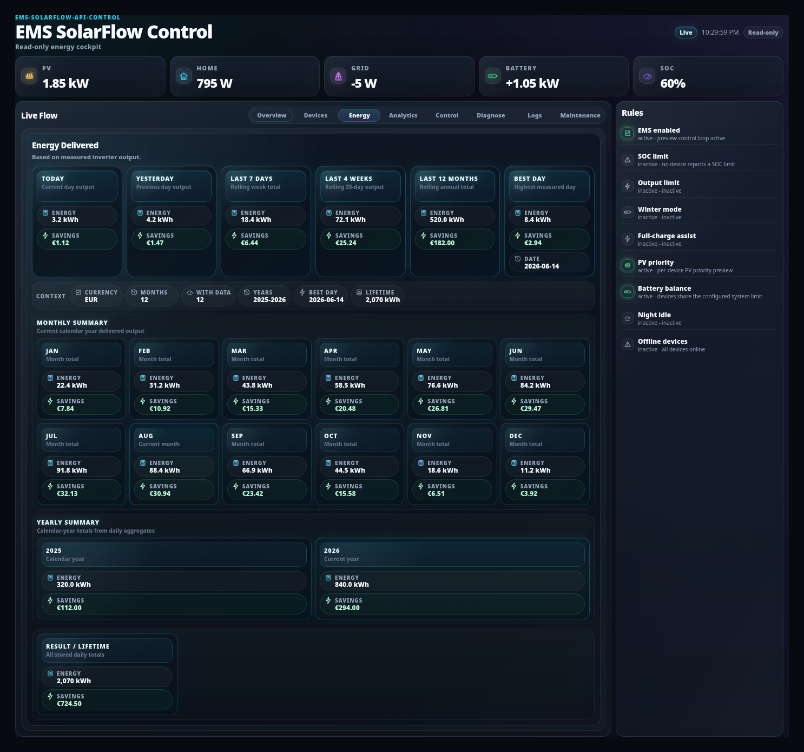
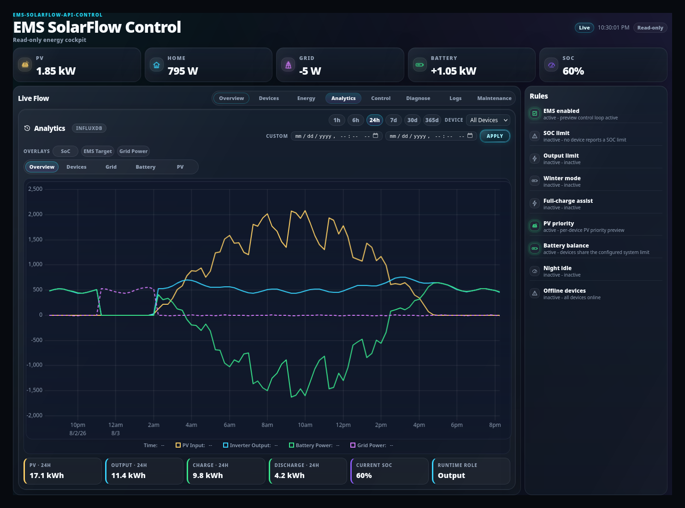

# Energy and analytics

## Purpose

See how much energy was actually delivered over time, and — if you enabled
long-range analytics — look further back than the local history keeps.

## When to use this workflow

- "How much did the system deliver today?"
- Comparing days, weeks or seasons.
- Checking whether a change actually improved anything.

## Prerequisites

- EMS running and the dashboard open.
- For the **Analytics** tab only: InfluxDB configured. Everything else works
  without it.

## Two different history sources

This distinction matters, because the two tabs answer different questions.

| | Source | Always available | Range | Tab |
| --- | --- | --- | --- | --- |
| **Operational history** | Local SQLite | **Yes** | Short — `1h / 6h / 24h / 7d` | Overview *History* chart |
| **Long-range analytics** | InfluxDB | **Only if configured** | Long | *Analytics* |

The **Energy** tab summarises delivered energy and does not depend on InfluxDB.

Details: [Two history sources](../../dashboard.md#two-history-sources-sqlite-operational-vs-influxdb-analytics).

## The Energy tab

**What you see:** a panel headed **Energy Delivered** — *"Based on measured
inverter output."* — with the statistics board underneath.

**What it means:** this is **delivered AC energy, measured at the inverter
output**. It is not a modelled or estimated figure, and it is not a utility
bill.

**What it changes:** nothing. Reading is read-only.

**Expected result:** totals for the available periods, per device and combined.

**If it differs:**

- **A period reads zero or is missing** → EMS was not running, or telemetry was
  not arriving, for that period. Gaps are shown as gaps rather than interpolated.
- **Numbers look lower than your meter** → this counts inverter output only. It
  does not include what your PV fed directly to the house through another path,
  and it is not grid import/export.

### Reading production, consumption, battery and grid

The tiles on [Overview](overview.md#2--the-five-aggregate-tiles) give you the
instantaneous picture; the Energy tab gives you the accumulated one.

| Question | Where |
| --- | --- |
| How much am I producing *right now*? | Overview → **PV** tile |
| How much have I delivered *today*? | Energy → **Energy Delivered** |
| Am I importing or exporting right now? | Overview → **GRID** tile (negative = export) |
| Is the battery charging or discharging? | Overview → **BATTERY** tile (`+` = charging) |
| How did any of these move over the last day? | Overview → **History** chart |
| How did they move over months? | **Analytics** — needs InfluxDB |

## The Analytics tab

**What you see:** an **Analytics** panel with a source badge, and the long-range
chart.

**What it changes:** nothing.

**Expected result:** long-range series at coarser aggregation intervals than the
operational history.

**If analytics is not configured:** the tab shows *"InfluxDB analytics is not
configured"* — an explicit empty state, not an error and not a chart of zeros.

> **When analytics is disabled, there is no long-range history to show.** The
> dashboard says so rather than implying data exists. The short-range **History**
> chart on Overview still works, because it comes from the local SQLite store.

Enabling it: [Analytics / InfluxDB](../../technical/influxdb.md).

## Aggregation intervals

Longer ranges are aggregated into coarser buckets so a chart stays readable. A
7-day view is not sampled at the same resolution as a 1-hour view. Short spikes
visible at `1h` can therefore be averaged away at `7d` — that is aggregation, not
lost data.

## Missing or incomplete data

| Cause | What you see | Is it a bug? |
| --- | --- | --- |
| EMS was stopped | A gap | No |
| Device offline for a period | That device contributes nothing for it | No |
| Analytics not configured | Analytics tab shows its empty state | No |
| InfluxDB configured but unreachable | The source badge reflects it | Check the InfluxDB service |
| History retention passed | Old operational data is gone | No — use analytics for long ranges |

Gaps are shown as gaps. EMS does not fabricate data for a period it did not
observe.

## What happens in the background

- Energy figures are derived from measured inverter output that EMS recorded.
- Operational history is written to a local SQLite store; analytics ingestion into
  InfluxDB is a separate optional path.
- Reading either never writes anything.

## Expected result

You can state how much the system delivered over a period, and you can tell the
difference between "it delivered nothing" and "nothing was recorded".

## Warnings and common problems

| Symptom | Meaning | What to do |
| --- | --- | --- |
| Analytics tab empty-state | InfluxDB not configured | Expected. [Enable it](../../technical/influxdb.md) if you want long ranges |
| History chart empty | No operational history yet | Give EMS time to record |
| Totals seem too low | This is inverter output, not household consumption | Compare with the right thing |
| Two sources disagree slightly | Different resolutions and ingestion paths | Expected at coarse aggregation |

## Recovery or next steps

- Live values → [Overview](overview.md)
- Why output was limited during a period → [Control pipeline](control.md)
- Set up long-range analytics → [Analytics / InfluxDB](../../technical/influxdb.md)
