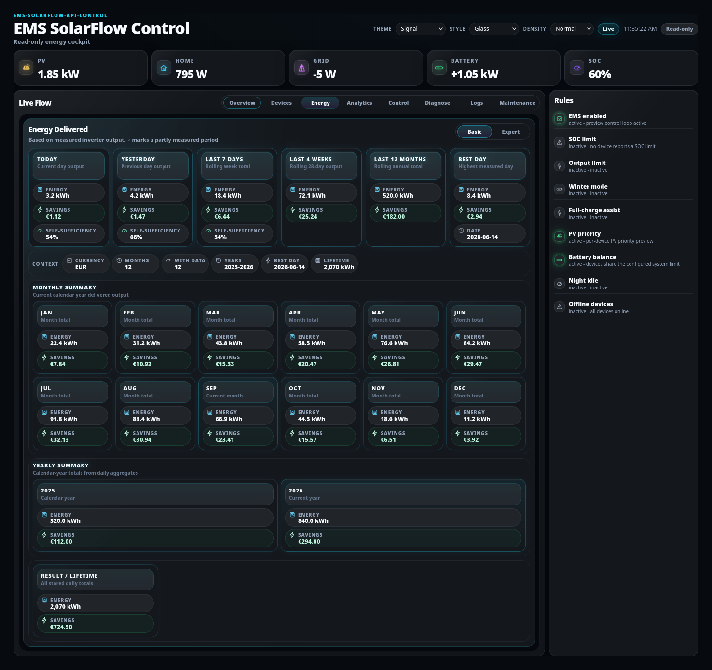
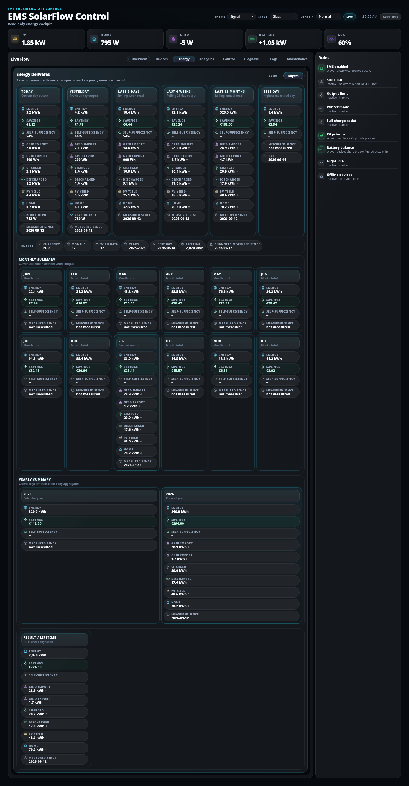
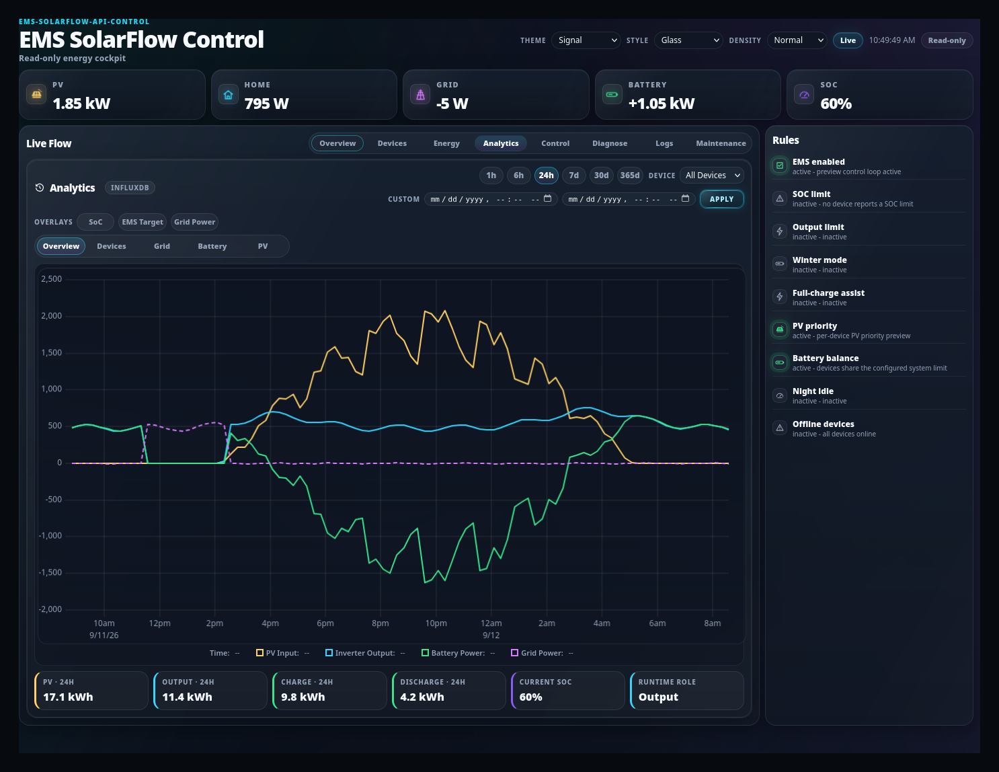

# Energy and analytics

## Purpose

See how much energy was actually delivered over time, and — if you enabled
long-range analytics — look further back than the local history keeps.

## When to use this workflow

- "How much did the system deliver today?"
- Comparing days, weeks or seasons.
- Checking whether a change actually improved anything.

## Prerequisites

- EMS running and the dashboard open.
- For the **Analytics** tab only: InfluxDB configured. Everything else works
  without it.

## Two different history sources

This distinction matters, because the two tabs answer different questions.

| | Source | Always available | Range | Tab |
| --- | --- | --- | --- | --- |
| **Operational history** | Local SQLite | **Yes** | Short — `1h / 6h / 24h / 7d` | Overview *History* chart |
| **Long-range analytics** | InfluxDB | **Only if configured** | Long | *Analytics* |

The **Energy** tab summarises delivered energy and does not depend on InfluxDB.

Details: [Two history sources](../../dashboard.md#two-history-sources-sqlite-operational-vs-influxdb-analytics).

## The Energy tab

**What you see:** a panel headed **Energy Delivered** — *"Based on measured
inverter output."* — with the statistics board underneath.

**What it means:** this is **delivered AC energy, measured at the inverter
output**. It is not a modelled or estimated figure, and it is not a utility
bill.

**What it changes:** nothing. Reading is read-only.

**Expected result:** totals for every available period, month and year. The
figures are for the whole installation, not per device.

**If it differs:**

- **A period reads zero or is missing** → EMS was not running, or telemetry was
  not arriving, for that period. Gaps are shown as gaps rather than interpolated.
- **Numbers look lower than your meter** → this counts inverter output only. It
  does not include what your PV fed directly to the house through another path.
  Grid import and export are their own figures, see below.

### Basic and Expert

The switch in the panel heading decides how much each card shows. It is
remembered per browser and changes nothing on the system.

| | What a card shows |
| --- | --- |
| **Basic** | Energy, savings, and self-sufficiency where the period is fully measured |
| **Expert** | The same, plus grid import/export, battery charge/discharge, PV yield, house consumption, peak output and since when the channels have been measured |

Expert applies everywhere on the tab: the period cards, the monthly summary,
the yearly summary and the lifetime total all carry the same rows in the same
order.

**Grid import** is energy drawn from the grid, **grid export** is energy fed
into it. **Charged** and **discharged** are the two directions of the battery.
They are measured separately, so a day with both reports both — a single netted
figure would hide half of what happened.

**Home** is what the house drew at the grid connection point. If the EMS
charges the battery from the grid — winter mode, full-charge assist — that
charging is part of this figure, because the meter cannot tell it apart from a
washing machine.

**Self-sufficiency** is the share of house consumption that did not come from
the grid. It appears for a period the channels measured from beginning to end,
with no day inside it missing; otherwise it would divide a half-measured number
by a whole one. A sample whose grid meter did not answer counts for nothing: an
unreachable meter reads as 0 W, and taking that at face value would report a
perfect autarky for a system that simply lost sight of the grid.

A single failed read is not a gap. The EMS keeps calculating with a device's
last reading for as long as it is current, and the statistics count it over
exactly the same window (`telemetry_max_age_seconds`), so one network hiccup does
not mark the day — let alone the month and the year that contain it. Commanding
that device stops immediately, on the first failed read; that is a separate
decision, because sending a value and measuring one are not the same risk.

If the grid meter does not answer, or a device has been silent past that window,
every figure on the tab stops for as long as that lasts — the delivered energy
and the savings estimate with them. A meter that never answered reads as 0 W and
a silent device keeps reporting its last value, and counting either would be
inventing energy. They stop together on purpose: taking the meter's reading
while ignoring the device's would divide two numbers measured at different
moments.
The Overview names an offline device under **Offline devices**; repairing it,
removing it, or **disabling** it is what starts the figures again — a device you
have switched off for the season is a decision, not a gap, so a disabled one
does not hold the statistics. While it stays silent it also drops out of the
totals, because a device that is off delivers nothing: counting its last reading
would keep adding energy it never produced.

Time inside a period that was not measured — a restart, an outage, a day the
EMS did not run — marks the figures with the `◦` instead of hiding the number.
Everything stops and resumes together, so the percentage describes the measured
part of the period. Withholding it for every restart would mean you never see
one for a month, a year or the lifetime.

### Since when a figure exists

Grid and battery energy are measured from the day this version started running.
For periods that begin before that day, the tab does not print a zero:

| What you see | What it means |
| --- | --- |
| `78 Wh` | Below a kilowatt-hour the figure is in watt-hours, so a small or freshly started total is readable |
| `28.9 kWh ◦` | The period is only partly measured; the figure covers the measured part |
| `not measured` | The period lies entirely before the channels existed |
| `Measured since 2026-09-12` | The first day the channels were measured |

The inverter output and the savings estimate are older than the channels, so a
card can show a full-year output next to channels marked `◦`. That is not a
defect: it is the difference between what was measured then and what is
measured now.

### Reading production, consumption, battery and grid

The tiles on [Overview](overview.md#2--the-five-aggregate-tiles) give you the
instantaneous picture; the Energy tab gives you the accumulated one.

| Question | Where |
| --- | --- |
| How much am I producing *right now*? | Overview → **PV** tile |
| How much have I delivered *today*? | Energy → **Energy Delivered** |
| Am I importing or exporting right now? | Overview → **GRID** tile (negative = export) |
| How much did I import or export *today*? | Energy → **Expert** → Grid Import / Grid Export |
| How much did the battery take and give back? | Energy → **Expert** → Charged / Discharged |
| Is the battery charging or discharging? | Overview → **BATTERY** tile (`+` = charging) |
| How did any of these move over the last day? | Overview → **History** chart |
| How did they move over months? | **Analytics** — needs InfluxDB |

## The Analytics tab

**What you see:** an **Analytics** panel with a source badge, and the long-range
chart.

**What it changes:** nothing.

**Expected result:** long-range series at coarser aggregation intervals than the
operational history.

**If analytics is not configured:** the tab shows *"InfluxDB analytics is not
configured"* — an explicit empty state, not an error and not a chart of zeros.

> **When analytics is disabled, there is no long-range history to show.** The
> dashboard says so rather than implying data exists. The short-range **History**
> chart on Overview still works, because it comes from the local SQLite store.

Enabling it: [Analytics / InfluxDB](../../technical/influxdb.md).

## Aggregation intervals

Longer ranges are aggregated into coarser buckets so a chart stays readable. A
7-day view is not sampled at the same resolution as a 1-hour view. Short spikes
visible at `1h` can therefore be averaged away at `7d` — that is aggregation, not
lost data.

## Missing or incomplete data

| Cause | What you see | Is it a bug? |
| --- | --- | --- |
| EMS was stopped | A gap | No |
| Device silent past `telemetry_max_age_seconds` | Every figure pauses, the period is marked `◦` | No |
| Analytics not configured | Analytics tab shows its empty state | No |
| InfluxDB configured but unreachable | The source badge reflects it | Check the InfluxDB service |
| History retention passed | Old operational data is gone | No — use analytics for long ranges |

Gaps are shown as gaps. EMS does not fabricate data for a period it did not
observe.

## What happens in the background

- Energy figures are derived from measurements EMS recorded itself: the
  inverter output, and the grid, battery, PV and house-load readings integrated
  over the time between samples. They are the EMS's own measurement, not a
  billing figure, and they will not match a utility meter to the digit.
- Operational history is written to a local SQLite store; analytics ingestion into
  InfluxDB is a separate optional path.
- Reading either never writes anything.

## Expected result

You can state how much the system delivered over a period, and you can tell the
difference between "it delivered nothing" and "nothing was recorded".

## Warnings and common problems

| Symptom | Meaning | What to do |
| --- | --- | --- |
| Analytics tab empty-state | InfluxDB not configured | Expected. [Enable it](../../technical/influxdb.md) if you want long ranges |
| History chart empty | No operational history yet | Give EMS time to record |
| Totals seem too low | This is inverter output, not household consumption | Compare with the right thing |
| Two sources disagree slightly | Different resolutions and ingestion paths | Expected at coarse aggregation |

## Recovery or next steps

- Live values → [Overview](overview.md)
- Why output was limited during a period → [Control pipeline](control.md)
- Set up long-range analytics → [Analytics / InfluxDB](../../technical/influxdb.md)
