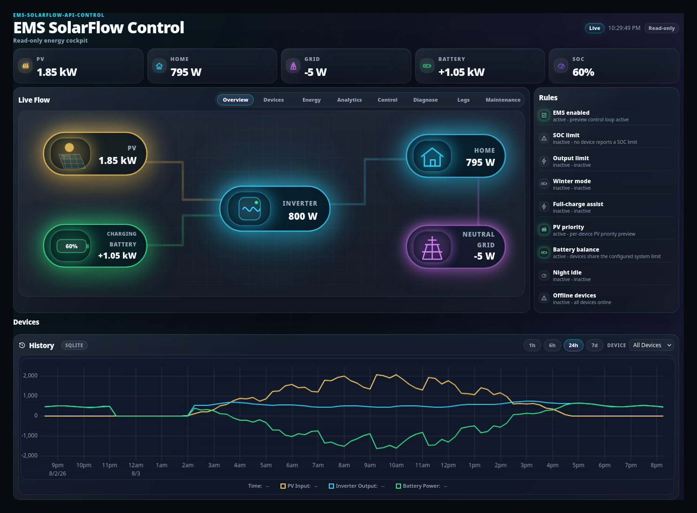
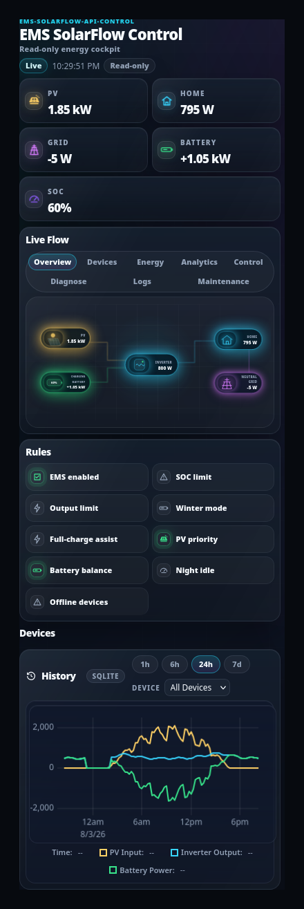

# Overview and navigation

## Purpose

Read the whole system at a glance: what is being produced, used, stored and
exchanged with the grid right now, and which EMS behaviours are currently active.

## When to use this workflow

Every day. This is the tab to leave open.

## Prerequisites

- EMS running, and the dashboard reachable at `http://<host>:8080`.
- No login needed for this tab.

## What you see



### 1 — The header

| Element | Meaning |
| --- | --- |
| **EMS SolarFlow Control** | The dashboard's name; the subtitle reads *Read-only energy cockpit* |
| **Live** pill | Telemetry is arriving. If it stops updating, the data is stale |
| Timestamp | When the shown snapshot was taken |
| **Read-only** / **Write mode** | Whether you are logged in — see [Runtime settings](runtime-settings.md) |
| **Logout** | Ends the session; the dashboard stays readable |

### 2 — The five aggregate tiles

These are **Aggregate / Device** style — measured values, no decisions.

| Tile | What it is | Sign convention |
| --- | --- | --- |
| **PV** | Total solar input across all inverters | Always positive |
| **HOME** | Measured house load | Always positive |
| **GRID** | Exchange with the grid | Negative = exporting, positive = importing |
| **BATTERY** | Battery power | `+` = charging, `−` = discharging |
| **SOC** | Combined state of charge | 0–100 % |

A **GRID** value close to zero is the normal healthy state: it means EMS is
matching the house load closely.

### 3 — Live Flow

An animated diagram of where the energy is going right now: PV → inverter →
house, battery charge/discharge, and grid import/export. Each edge carries its
current power.

Use it to answer "where is my power actually going" in one look. For per-device
numbers, use the [Devices tab](devices.md).

### 4 — Rules

The right-hand **Rules** panel lists the EMS behaviours and whether each is
**active** or **inactive** right now, with a one-line reason.

| Rule | Active means |
| --- | --- |
| EMS enabled | The control loop is running |
| SOC limit | A device reports a SoC limit that is constraining it |
| Output limit | An output limit is currently binding |
| Winter mode | The seasonal minSoc ramp is in effect |
| Full-charge assist | A full-charge cycle is being assisted |
| PV priority | Per-device PV-priority allocation is in effect |
| Battery balance | Devices are sharing the configured system limit |
| Night idle | Strict night/minSoc idle detected |
| Offline devices | At least one configured device is offline — it names which |

This panel is the fastest way to explain unexpected behaviour: if output is
capped, one of these will say why.

### 5 — Devices and History

Below the fold: a compact card per inverter (full detail in
[Devices](devices.md)) and a **History** chart with a source badge (`SQLITE`) and
`1h / 6h / 24h / 7d` range buttons plus a device selector.

The History chart is **operational history from the local SQLite store** — always
present. Long-range analytics is a separate, optional thing; see
[Energy and analytics](energy.md).

## Navigation

```text
Overview · Devices · Energy · Analytics · Control · Diagnose · Logs · Maintenance
```



On a narrow screen the tiles stack, the tab bar wraps onto two rows, and Live
Flow scales down. Nothing is hidden — the same information is reachable on a
phone.

The selected tab is remembered between visits.

Diagnose, Logs and Maintenance are **operator-only**. Without a session they show
a short "login required" message instead of empty panels.

## What happens in the background

- The dashboard polls EMS for a telemetry snapshot and renders it. It does not
  compute control decisions itself — everything shown comes from EMS.
- Reading the dashboard never writes anything.

## Expected result

You can tell, within a few seconds: is PV producing, is the house being covered,
is the battery charging or discharging, is anything being imported, and is any
rule limiting the system.

## Warnings and common problems

| Symptom | Meaning | What to do |
| --- | --- | --- |
| Timestamp stops advancing | Telemetry stalled | Check EMS is running; see [Diagnostics](diagnostics.md) |
| A device missing from Live Flow | Offline or disabled | [Devices](devices.md) |
| Grid consistently large | EMS is not covering the load | [Control pipeline](control.md) tells you which stage capped it |
| Rules shows *Offline devices — active* | A configured device is not reporting | [Devices](devices.md#offline-and-stale-devices) |

## Recovery or next steps

- Per-device detail → [Devices](devices.md)
- Why EMS chose that output → [Control pipeline](control.md)
- Totals over time → [Energy and analytics](energy.md)
- Change a live value → [Runtime settings](runtime-settings.md)
