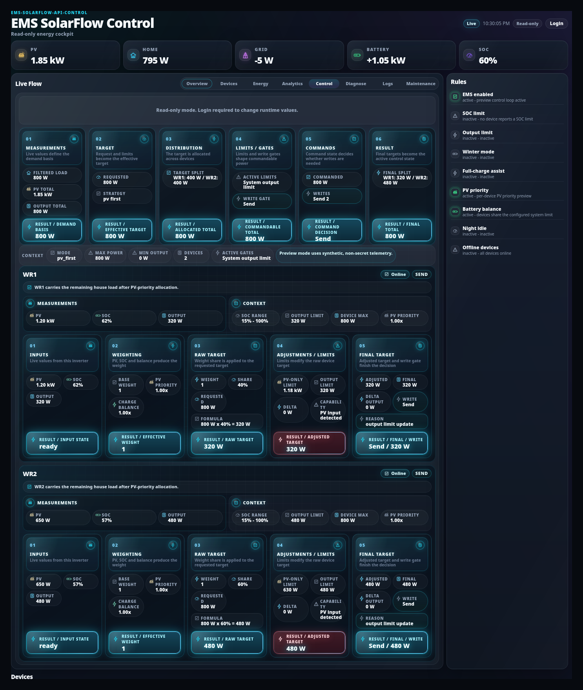
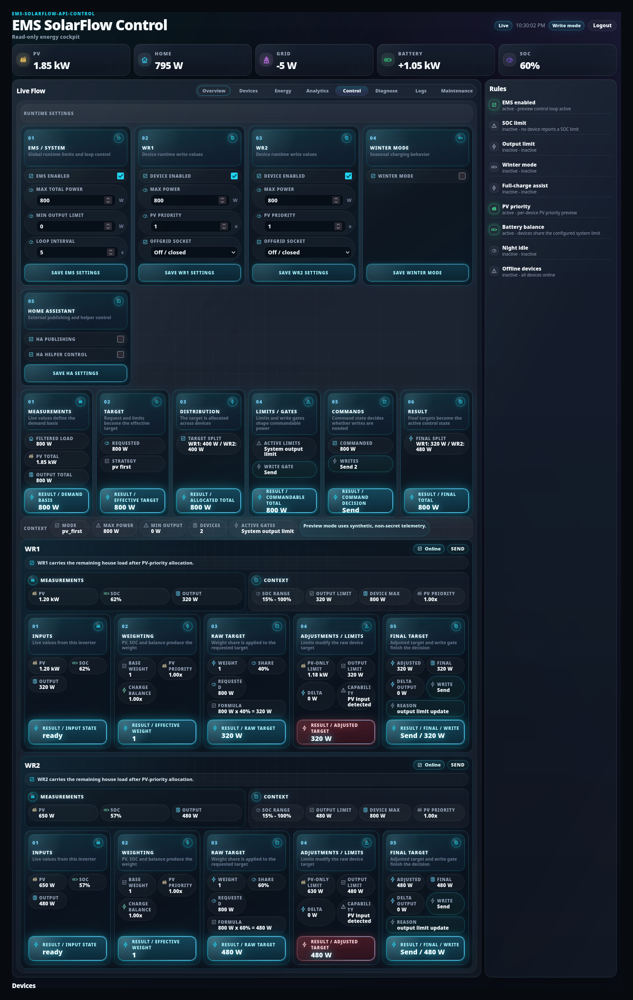

# Runtime settings

## Purpose

Change a small set of operating values live, from the browser, without editing
`config.json` or restarting EMS.

## When to use this workflow

- Cap or raise total output for a while.
- Take one inverter out of regulation temporarily.
- Turn winter mode or Home Assistant publishing on or off.
- Try a different loop interval or PV priority.

For anything structural — adding a device, changing a transport, changing the
grid meter — use the Admin Console instead:
[Device management](../admin/device-management.md).

## Prerequisites

- A dashboard **login**. The password is the same one the Admin Console uses,
  stored in `config/dashboard-auth.json`.
- If no password is configured yet, the panel says so instead of showing a form.

## Step-by-step instructions

### 1 — Log in

**What you see when logged out:** a compact read-only message. **No form controls
are rendered at all** — the dashboard does not show a disabled form and hope you
do not press it.

**What you enter:** the shared EMS/Admin password.

**Expected result:** the header pill changes from **Read-only** to **Write
mode**, and the runtime cards appear at the top of the **Control** tab.

**If it differs:** *auth not configured* means no password exists yet. Create one
in the Admin Console ([First start](../admin/first-start.md)) or with
`python3 emsctl.py dashboard set-password`.

### 2 — Find the runtime cards

**Where:** the **Control** tab, in a **RUNTIME SETTINGS** block *above* the
control pipeline.

They deliberately look like the pipeline below them — same **Control / Energy
stage** family, numbered headers, uppercase titles, compact fact rows. That is
the visual cue that these are decision-affecting controls, not read-outs.

### 3 — The cards

| # | Card | Subtitle | Fields |
| --- | --- | --- | --- |
| 01 | **EMS / System** | Global runtime limits and loop control | `EMS enabled`, `Max total power` (W), `Min output limit` (W), `Loop interval` (s) |
| 02/03 | **Device cards** (`WR1`, `WR2`, …) | Device runtime write values | `Device enabled`, `Max power` (W), `PV priority` (×), `Offgrid socket` |
| 04 | **Winter mode** | Seasonal charging behavior | `Winter mode` |
| 05 | **Home Assistant** | External publishing and helper control | `HA publishing`, `HA helper control` |

Each card has its own apply button: **Save EMS settings**, **Save WR1
settings**, **Save winter mode**, **Save HA settings**.

### 4 — Apply

**What you select:** the save button on the card you changed.

**What it changes:** the value is written to `data/runtime-state.json` through
the EMS-owned runtime writer, and the control loop picks it up on its next cycle.

**Expected result:** a confirmation on the card, and the change becomes visible in
the [Control pipeline](control.md) below within a loop interval.

**If it differs:** a validation error is shown on the card and **nothing is
written**. Out-of-range values are refused rather than clamped silently.

### 5 — Verify

Do not take the form's word for it. Scroll down to the pipeline:

- `Max total power` → the **ACTIVE LIMITS** fact in stage 04.
- `PV priority` → the per-device **02 WEIGHTING** card.
- `Device enabled` off → that device's stage 01 input state.
- `Min output limit` → the per-device **04 ADJUSTMENTS / LIMITS** card.

## What is live, what is persisted, what needs a restart

| Change | Live? | Persisted? | Restart? |
| --- | --- | --- | --- |
| EMS enabled | Yes, next cycle | Yes, runtime state | No |
| Max total power | Yes | Yes | No |
| Min output limit | Yes | Yes | No |
| Loop interval | Yes | Yes | No |
| Device enabled | Yes | Yes | No |
| Device max power | Yes | Yes | No |
| PV priority | Yes | Yes | No |
| Offgrid socket | Yes | Yes | No |
| Winter mode | Yes | Yes | No |
| HA publishing / helper control | Yes | Yes | No |
| Adding or removing a device | — | — | **Admin Console + restart** |
| Grid meter type or address | — | — | **Admin Console + restart** |
| Write gates, transports | — | — | **Admin Console / config** |

**Everything on this tab is live and persisted.** That is the point of the tab:
if it needs a restart, it is not here.

## Runtime state vs config.json

These are two different files with two different jobs.

| | `config/config.json` | `data/runtime-state.json` |
| --- | --- | --- |
| What | Static installation configuration | Mutable operator state |
| Owner | Admin Console apply / config path | EMS runtime writer, `emsctl.py`, this tab |
| Contains | Devices, transports, grid meter, write gates, features | Live overrides such as those above |
| Changing it | Usually needs an EMS restart | Takes effect next cycle |

They overlap on a whitelisted set of keys. When the Admin Console applies a
maintenance change, it mirrors those keys into runtime state so the two converge
— **config → runtime, one direction only**.

> A config-only edit that is not mirrored will not change a running system by
> itself. If you changed something in the Admin Console and nothing happened,
> check whether it needs a restart.

Reference: [Runtime state](../../technical/runtime-state.md) ·
[Configuration](../../technical/configuration.md).

## Safe defaults and safety

- Runtime settings **cannot enable a hardware write path that configuration has
  not already allowed.** Write gates, transports and per-device
  `write_output_limit` live in configuration, not here.
- Turning `EMS enabled` off stops regulation. It does not reset your hardware to
  a safe state by itself — decide deliberately.
- Lowering `Max total power` takes effect on the next cycle, subject to the normal
  ramp.
- Before enabling live writes at all, read [Safety](../safety.md).

## Security

- The runtime forms are rendered **only** for an authenticated session.
- Every write is checked server-side for authentication **and** a CSRF token. A
  button being visible in your browser is never what authorizes a write.
- The dashboard is a local-network tool. Do not expose it to the internet — see
  [Security hardening](../../dashboard.md#security-hardening).
- Sessions expire; you may be asked to log in again. The dashboard stays readable
  either way.

## What happens in the background

- The dashboard posts the change; EMS validates and writes it through its own
  runtime writer. The browser never edits state directly.
- Validation happens on the server. A rejected value is not written.
- The control loop reads the updated runtime state on its next cycle.

## Expected result

The value you set is stored, survives a restart, and visibly changes the control
decision within one loop interval.

## Warnings and common problems

| Symptom | Meaning | What to do |
| --- | --- | --- |
| No forms visible | Not logged in, or no password configured | Log in, or set a password |
| Validation error on save | The value is out of range | Nothing was written; correct it |
| Saved but nothing changed | Wait one loop interval, then check the pipeline | [Control pipeline](control.md) |
| Value reverts | Something else is writing runtime state | Check `emsctl.py`, HA helpers, a second controller |
| Device still not regulating | Enabled here, but blocked by config | [Devices](devices.md#read-only-and-write-blocked-devices) |

## Recovery or next steps

- Confirm the effect → [Control pipeline](control.md)
- Structural changes → [Device management](../admin/device-management.md)
- Same edits from the shell → [CLI reference](../../cli.md)
- Before going live → [Safety](../safety.md)
