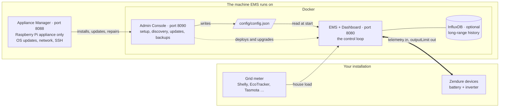
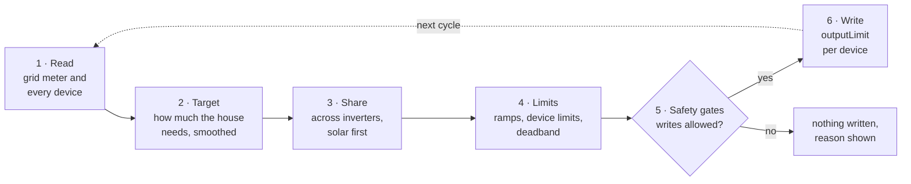
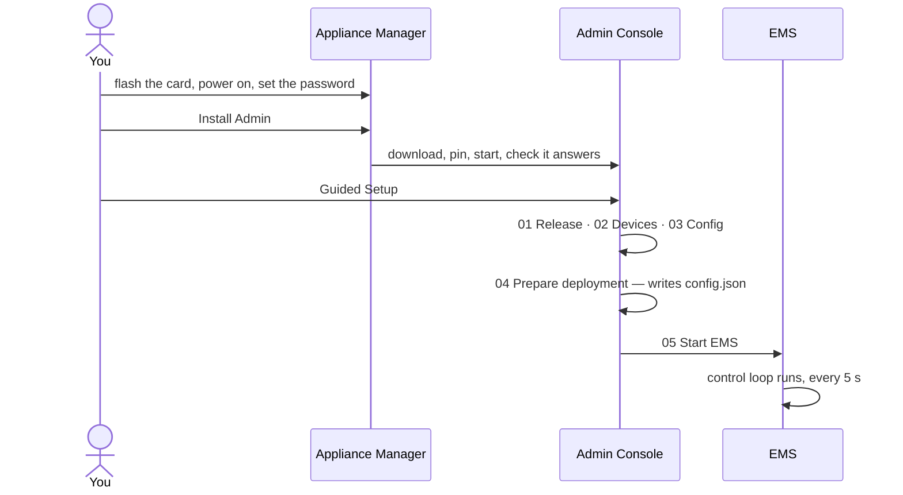

# How EMS SolarFlow fits together

EMS SolarFlow has grown into three pieces of software with three web pages.
This page shows which one does what, how they are set up one after the other,
and where your power is actually controlled.

## The short version

- **The EMS controls.** It reads your grid meter and your Zendure devices every
  few seconds and sets how much power each inverter delivers. Its dashboard
  shows what it is doing and why. It is the only part that ever sets an
  inverter's output.
- **The Admin Console sets the EMS up and keeps it maintained.** Device
  discovery, the configuration, updates, backups. It does not run the control
  loop.
- **The Appliance Manager looks after the Raspberry Pi**, and only exists on the
  [appliance image](appliance/index.md). Operating-system updates, network,
  SSH and backup access, and installing the Admin Console. It never touches
  EMS configuration or devices.

All three ask for the same password.

## The big picture

The thick arrow is the only connection that changes what your hardware does,
and it belongs to the EMS. Each part has its own page in your browser, at the
port shown.

On a machine you already run, there is no Appliance Manager: the
[Admin Console](admin-console.md) is installed with one script and takes it from
there. The rest of the picture is the same.

## Where the control happens

The EMS repeats one cycle, by default every five seconds. The loop interval can
be changed while the EMS runs, without a restart: in the Dashboard's **Control**
tab under the runtime settings, or with `emsctl system loop-interval`. See
[runtime settings](dashboard/runtime-settings.md).

- **Read.** The grid meter says what the house is taking from the grid; each
  Zendure device reports its battery, solar input and current output.
- **Target.** From that, the EMS works out how much the inverters should deliver
  so the meter sits near zero without running backwards, and smooths it so the
  output does not jump with every kettle.
- **Share.** The target is split across the inverters, preferring those with
  solar power available.
- **Limits.** Each device's ramp, minimum and maximum apply, and tiny changes
  are not written at all.
- **Safety gates.** A write happens only when writes are allowed for that
  device's connection — the local API, a local MQTT broker or Zendure cloud
  MQTT. [Safety](safety.md) explains the gates.
- **Write.** The new output limit goes to the device.

The Dashboard's **Control** tab shows this pipeline for the current cycle, so
you can see why the EMS chose exactly this value. The technical detail is in
[control logic](../technical/control-logic.md) and
[control flow](../technical/control-flow.md).

## What each part does

| | EMS + Dashboard | Admin Console | Appliance Manager |
| --- | --- | --- | --- |
| Runs as | Docker container `ems-solarflow-api-control` | Docker container `ems-solarflow-admin` | Two system services on the Raspberry Pi, outside Docker |
| Address | `http://<host>:8080` | `http://<host>:8090` | `http://ems-solarflow.local:8088` |
| Does | Controls the inverters, shows the live flow, devices, energy, history and diagnostics | Guided Setup, device discovery, writes `config/config.json`, deploys and upgrades the EMS, maintenance, backup and restore | OS updates, its own updates, network and WLAN, SSH and backup access, installs, updates, repairs and rolls back the Admin Console |
| Does not | — | Run the control loop or set an inverter's output | Edit EMS configuration, discover devices, or change the EMS container |
| Needed for control | **Yes** | No | No |

## How a system comes together

On the appliance, each part installs the next, and each one is started by you:

1. **The Appliance Manager** comes with the card. You open it, choose the
   password, and press **Install Admin**. See
   [first start](appliance/first-start.md).
2. **The Admin Console** walks you through
   [Guided Setup](admin/guided-setup.md): pick a system build, let it find your
   Zendure devices and grid meter, review the configuration. Nothing is written
   until step 04, and the EMS is not started until step 05.
3. **The EMS** starts and controls from then on. The Admin Console and the EMS
   always come from the same *system build*, which is why they are upgraded
   together with [Guided Upgrade](admin/guided-upgrade.md).

On a machine you already run, step 1 is one command instead: the
[Admin Console install script](admin-console.md). Steps 2 and 3 are identical.
[Docker Bootstrap](docker-bootstrap.md) skips the Admin Console altogether and
starts the EMS from the shell.

## What keeps running when something stops

| What stops | What happens to control |
| --- | --- |
| The Admin Console | Nothing. The EMS keeps controlling. |
| The Appliance Manager, for example during its own update | Nothing. The EMS keeps controlling. |
| The EMS | Control stops. The inverters keep the last output limit they were given until the EMS is back. |
| The whole machine, for example a reboot after an OS update | As above: the last output limit stays in force. See [while the appliance is down](appliance/overview.md#while-the-appliance-is-down). |

The Admin Console does change the EMS when you ask it to: it replaces the EMS
container during setup and upgrades, and it writes configuration when you apply
a change or restore a backup. Those are the only moments it affects control, and
each one waits for your confirmation.

## Where do I do what?

| I want to … | Go to |
| --- | --- |
| See what my system is doing right now | Dashboard (`:8080`) |
| Understand why the EMS wrote a value | Dashboard → **Control** |
| Add, change or remove a device | Admin Console (`:8090`) → **Maintenance** |
| Update EMS and Admin | Admin Console → **Guided Upgrade** |
| Back up or restore the EMS | Admin Console → **Backup / restore** |
| Update the operating system or the Appliance Manager | Appliance Manager (`:8088`) → **System Updates** |
| Install, update, repair or roll back the Admin Console | Appliance Manager → **Admin** |
| Change the network or WLAN of the Pi | Appliance Manager → **Network** |
| Copy backups off the Pi | Appliance Manager → **SSH & Backup Access** |
| Work from a terminal | `emsctl` — see the [CLI reference](../cli.md) |

## The command line

`emsctl` is the EMS's own command-line tool. It reads and changes the same
runtime state the Dashboard does: status, a full diagnosis, runtime settings
such as winter mode, and backups. In a Docker install it runs inside the EMS
container, for example `docker compose exec ems python3 emsctl.py status`. It is
optional; nothing in the browser needs it.

## Related

- [Project overview](project-overview.md) — what EMS SolarFlow does, feature by feature
- [Admin Console](admin-console.md) and its [step-by-step guides](admin/index.md)
- [EMS Dashboard guides](dashboard/index.md)
- [Appliance guides](appliance/index.md)
- [Architecture](../technical/architecture.md) — the technical boundaries behind this page
